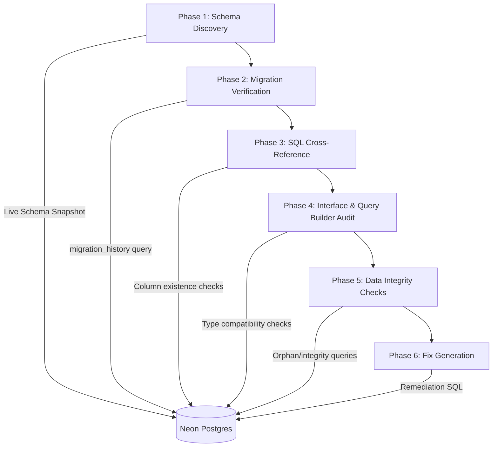
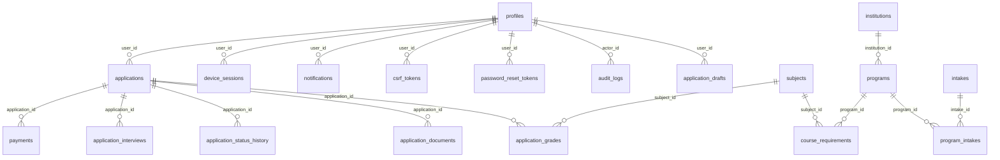

# Design Document: Deep Forensic Database Audit

## Overview

This design describes a systematic, multi-phase forensic audit of the MIHAS Application Portal's Neon Postgres database (project: `wild-bar-37055823`) and all code that interacts with it. The audit cross-references the live database schema against every SQL statement in 10 API source files (`api-src/*.ts`), 6 shared utility files (`lib/*.ts`), 15 TypeScript interfaces in `lib/queries.ts`, 9 query builder objects, and 23 migration files. The goal is to identify and fix every phantom column, interface mismatch, ghost migration, orphan record, and data quality issue across all 28 tables.

This is Round 4 — the deepest pass — building on fixes from Rounds 1-3 which addressed `country` column references, `channel`/`whatsapp_enabled` removals, `SubjectRecord`/`NotificationPreferencesRecord` fixes, and `entity_id` UUID casting.

### Design Decisions

1. **Neon MCP as ground truth**: All schema queries use the Neon MCP tool against the live database. The live schema is the single source of truth — not migration files, not TypeScript interfaces.
2. **Audit-then-fix ordering**: The audit runs all discovery phases first, collecting all issues into a categorized report, then generates fixes in dependency order (migrations → code → data cleanup).
3. **Idempotent migrations**: All generated SQL uses `IF NOT EXISTS` / `IF EXISTS` / `DO $$ ... $$` blocks for safe re-runs.
4. **No test data loss**: Since all DB data is test data, cleanup queries are safe to execute, but we still use WHERE clauses to avoid accidental production-style damage.
5. **Minimize testing**: Focus on implementation fixes, not writing new test suites. Only critical property tests where correctness is non-obvious.

## Architecture

The audit follows a pipeline architecture with 6 sequential phases:



### Phase Descriptions

**Phase 1 — Schema Discovery** (Requirements 1, 2): Query `information_schema.columns`, `information_schema.table_constraints`, `information_schema.key_column_usage`, and `pg_indexes` to build a complete column inventory of all 28+ tables. This snapshot becomes the ground truth for all subsequent phases.

**Phase 2 — Migration Verification** (Requirement 1): Cross-reference `migration_history` records against the 23 migration files in `migrations/`. Identify ghost migrations. Specifically verify the `normalize_data.sql` issue with `intakes.program_id` (Requirement 21).

**Phase 3 — SQL Cross-Reference** (Requirements 3-7): Parse every SQL statement (INSERT, SELECT, UPDATE, DELETE, JOIN) in all 10 `api-src/*.ts` files and 6 `lib/*.ts` files. Verify every column reference against the Phase 1 snapshot. Report phantom columns with file, line, table, and column details.

**Phase 4 — Interface & Query Builder Audit** (Requirements 8-9): Compare all 15 TypeScript interfaces in `lib/queries.ts` against the live schema. Verify all 9 query builder objects produce valid SQL. Check type compatibility (TypeScript types vs PostgreSQL types) and nullability alignment.

**Phase 5 — Data Integrity Checks** (Requirements 10-20): Run orphan record queries for all foreign key relationships. Validate enum values (status, payment_status, role, grade). Perform table-specific deep dives for the 10 highest-risk tables.

**Phase 6 — Fix Generation** (Requirement 22): Generate prioritized remediation: CRITICAL (runtime errors), HIGH (data corruption), MEDIUM (dead code/columns), LOW (documentation). Order: migrations first, then code fixes, then data cleanup.

## Components and Interfaces

### Component 1: Schema Snapshot Builder

**Purpose**: Queries the live Neon database to build a complete schema map.

**Interface**:
```typescript
// Conceptual — executed via Neon MCP, not as runtime code
interface SchemaSnapshot {
  tables: Map<string, TableSchema>;
  foreignKeys: ForeignKeyConstraint[];
  indexes: IndexInfo[];
}

interface TableSchema {
  tableName: string;
  columns: ColumnInfo[];
  primaryKey: string[];
  uniqueConstraints: string[][];
}

interface ColumnInfo {
  columnName: string;
  dataType: string;       // e.g., 'uuid', 'character varying', 'boolean'
  isNullable: boolean;
  columnDefault: string | null;
  maxLength: number | null;
}

interface ForeignKeyConstraint {
  constraintName: string;
  sourceTable: string;
  sourceColumn: string;
  targetTable: string;
  targetColumn: string;
  onDelete: string;       // CASCADE, SET NULL, RESTRICT
}

interface IndexInfo {
  indexName: string;
  tableName: string;
  columns: string[];
  isUnique: boolean;
}
```

**SQL Queries Used**:
```sql
-- Column inventory for all tables
SELECT table_name, column_name, data_type, is_nullable, column_default, character_maximum_length
FROM information_schema.columns
WHERE table_schema = 'public'
ORDER BY table_name, ordinal_position;

-- Foreign key constraints
SELECT tc.constraint_name, tc.table_name, kcu.column_name,
       ccu.table_name AS foreign_table_name, ccu.column_name AS foreign_column_name,
       rc.delete_rule
FROM information_schema.table_constraints tc
JOIN information_schema.key_column_usage kcu ON tc.constraint_name = kcu.constraint_name
JOIN information_schema.constraint_column_usage ccu ON tc.constraint_name = ccu.constraint_name
JOIN information_schema.referential_constraints rc ON tc.constraint_name = rc.constraint_name
WHERE tc.constraint_type = 'FOREIGN KEY' AND tc.table_schema = 'public';

-- Indexes
SELECT tablename, indexname, indexdef
FROM pg_indexes
WHERE schemaname = 'public';

-- Table list
SELECT table_name FROM information_schema.tables
WHERE table_schema = 'public' AND table_type = 'BASE TABLE';
```

### Component 2: Migration Verifier

**Purpose**: Cross-references migration files against `migration_history` and live schema effects.

**Interface**:
```typescript
interface MigrationVerificationResult {
  appliedMigrations: { name: string; appliedAt: Date }[];
  ghostMigrations: { fileName: string; expectedChanges: string; schemaState: string }[];
  migrationHistoryExists: boolean;
}
```

**Files Scanned**: All 23 files in `migrations/` (excluding `apply-migrations.ts` and `RLS_REPLACEMENT.md`).

**Key Verification**: The `normalize_data.sql` migration references `intakes.program_id` which does not exist in the core schema — this is a known issue that needs confirmation and remediation.

### Component 3: SQL Statement Extractor & Validator

**Purpose**: Parses SQL from TypeScript source files and validates column references.

**Files Scanned**:
| Category | Files | SQL Statement Types |
|----------|-------|-------------------|
| API Sources | `api-src/auth.ts`, `api-src/applications.ts`, `api-src/admin.ts`, `api-src/notifications.ts`, `api-src/documents.ts`, `api-src/email.ts`, `api-src/bootstrap.ts`, `api-src/catalog.ts`, `api-src/sessions.ts`, `api-src/payments.ts` | INSERT, SELECT, UPDATE, DELETE, JOIN |
| Shared Utilities | `lib/queries.ts`, `lib/sessions.ts`, `lib/csrf.ts`, `lib/auditLogger.ts`, `lib/auth/middleware.ts`, `lib/auth/ownership.ts` | INSERT, SELECT, UPDATE, DELETE, JOIN |

**Validation Rules**:
1. Every column in an INSERT column list must exist in the target table
2. Every column in a SELECT list (non-`*`) must exist in the source table(s)
3. Every column in an UPDATE SET clause must exist in the target table
4. Every column in a WHERE clause must exist in the referenced table
5. Every table in a JOIN must exist, and join columns must exist in their respective tables
6. `SELECT *` usages are flagged for review (fragile to schema changes)

**Output**:
```typescript
interface PhantomColumnReport {
  file: string;
  lineNumber: number;
  statementType: 'INSERT' | 'SELECT' | 'UPDATE' | 'DELETE' | 'JOIN';
  tableName: string;
  phantomColumn: string;
  validColumns: string[];
}
```

### Component 4: Interface Auditor

**Purpose**: Compares TypeScript interfaces against live schema columns.

**Interfaces Audited** (15 total in `lib/queries.ts`):
| Interface | Target Table |
|-----------|-------------|
| `UserRecord` | `profiles` |
| `UserAuthRecord` | `profiles` |
| `UserPublicRecord` | `profiles` |
| `SessionRecord` | `device_sessions` |
| `SessionDisplayRecord` | `device_sessions` |
| `AuditLogRecord` | `audit_logs` |
| `ApplicationRecord` | `applications` |
| `DocumentRecord` | `application_documents` |
| `GradeRecord` | `application_grades` |
| `StatusHistoryRecord` | `application_status_history` |
| `ProgramRecord` | `programs` |
| `IntakeRecord` | `intakes` |
| `SubjectRecord` | `subjects` |
| `NotificationPreferencesRecord` | `user_notification_preferences` |
| `PushSubscriptionRecord` | `push_subscriptions` |

**Additional Inline Interfaces** (in `api-src/*.ts`):
| Interface | File | Target Table |
|-----------|------|-------------|
| `SystemSetting` | `api-src/admin.ts` | `settings` |
| `ProgramRow` | `api-src/catalog.ts` | `programs` |
| `IntakeRow` | `api-src/catalog.ts` | `intakes` |
| `InstitutionRecord` | `api-src/catalog.ts` | `institutions` |

**Validation Rules**:
1. Every interface field must correspond to a column in the target table
2. Every column in the target table should be represented in at least one interface (or flagged as intentionally omitted)
3. TypeScript `string` ↔ PostgreSQL `varchar`/`text`/`uuid`
4. TypeScript `number` ↔ PostgreSQL `integer`/`numeric`/`bigint`
5. TypeScript `boolean` ↔ PostgreSQL `boolean`
6. TypeScript `Date` ↔ PostgreSQL `timestamptz`/`date`
7. TypeScript `| null` ↔ PostgreSQL `IS NULLABLE = YES`

### Component 5: Query Builder Validator

**Purpose**: Validates that query builder functions produce SQL matching the live schema.

**Query Builders Audited** (9 objects in `lib/queries.ts`):
1. `UserQueries` → `profiles`
2. `SessionQueries` → `device_sessions`
3. `AuditQueries` → `audit_logs`
4. `ApplicationQueries` → `applications`
5. `DocumentQueries` → `application_documents`
6. `GradeQueries` → `application_grades`
7. `StatusHistoryQueries` → `application_status_history`
8. `CatalogQueries` → `programs`, `intakes`, `subjects`
9. `NotificationQueries` → `user_notification_preferences`, `push_subscriptions`

**Additional Validation**:
- Parameter placeholder count (`$1`, `$2`, ...) matches `values` array length
- Dynamic builders (e.g., `ApplicationQueries.update`) have valid `allowedFields` arrays
- `SessionQueries.create` column list matches `device_sessions` live schema
- `AuditQueries.log` `$4::uuid` cast is compatible with `entity_id` column type

### Component 6: Data Integrity Checker

**Purpose**: Runs orphan record detection and enum validation queries against live data.

**Orphan Record Checks** (19 checks across 15 tables):
| Child Table | FK Column | Parent Table | Parent Column |
|-------------|-----------|-------------|---------------|
| `applications` | `user_id` | `profiles` | `id` |
| `application_documents` | `application_id` | `applications` | `id` |
| `application_grades` | `application_id` | `applications` | `id` |
| `application_grades` | `subject_id` | `subjects` | `id` |
| `application_status_history` | `application_id` | `applications` | `id` |
| `application_status_history` | `changed_by` | `profiles` | `id` |
| `application_interviews` | `application_id` | `applications` | `id` |
| `application_drafts` | `user_id` | `profiles` | `id` |
| `payments` | `application_id` | `applications` | `id` |
| `payments` | `user_id` | `profiles` | `id` |
| `device_sessions` | `user_id` | `profiles` | `id` |
| `csrf_tokens` | `user_id` | `profiles` | `id` |
| `password_reset_tokens` | `user_id` | `profiles` | `id` |
| `notifications` | `user_id` | `profiles` | `id` |
| `audit_logs` | `actor_id` | `profiles` | `id` |
| `program_intakes` | `program_id` | `programs` | `id` |
| `program_intakes` | `intake_id` | `intakes` | `id` |
| `course_requirements` | `program_id` | `programs` | `id` |
| `course_requirements` | `subject_id` | `subjects` | `id` |

**Enum Validation Checks**:
| Table | Column | Valid Values |
|-------|--------|-------------|
| `applications` | `status` | draft, submitted, under_review, pending_documents, approved, rejected, waitlisted |
| `applications` | `payment_status` | pending_review, verified, rejected |
| `application_grades` | `grade` | 1-9 |
| `profiles` | `role` | super_admin, admin, admissions_officer, registrar, finance_officer, academic_head, reviewer, student |

### Component 7: Fix Generator

**Purpose**: Produces prioritized remediation artifacts.

**Output Categories**:
| Severity | Description | Fix Type |
|----------|-------------|----------|
| CRITICAL | Phantom columns causing runtime SQL errors | Code fix (remove column) or migration (add column) |
| HIGH | Interface mismatches causing silent data loss | Interface update in `lib/queries.ts` |
| HIGH | Ghost migrations with unapplied schema changes | Corrected migration SQL |
| MEDIUM | Dead columns in schema not referenced by code | Migration to drop column (optional) |
| MEDIUM | `SELECT *` usage fragile to schema changes | Code fix to name columns explicitly |
| LOW | Documentation mismatches (table count, column lists) | Documentation update |

**Fix Ordering**:
1. Migration fixes (schema changes must be applied first)
2. Code fixes in `lib/queries.ts` (interfaces and query builders)
3. Code fixes in `api-src/*.ts` (inline SQL)
4. Data cleanup SQL (orphan records, enum normalization)

## Data Models

### Schema Snapshot Data Model

The audit produces a structured snapshot that maps the entire live database:

```typescript
// Ground truth from information_schema queries
interface LiveSchemaMap {
  // table_name → column_name → ColumnInfo
  tables: Record<string, Record<string, ColumnInfo>>;
  // All foreign key constraints
  foreignKeys: ForeignKeyConstraint[];
  // All indexes
  indexes: IndexInfo[];
  // Tables found but not in expected 28-table list
  unexpectedTables: string[];
  // Expected tables not found in live schema
  missingTables: string[];
}
```

### Audit Report Data Model

```typescript
interface AuditReport {
  // Phase 1 results
  schemaSnapshot: LiveSchemaMap;
  // Phase 2 results
  migrationStatus: MigrationVerificationResult;
  // Phase 3 results
  phantomColumns: PhantomColumnReport[];
  selectStarUsages: { file: string; line: number; table: string }[];
  // Phase 4 results
  interfaceMismatches: InterfaceMismatch[];
  queryBuilderIssues: QueryBuilderIssue[];
  // Phase 5 results
  orphanRecords: OrphanRecordReport[];
  enumViolations: EnumViolationReport[];
  rowCounts: Record<string, number>;
  // Phase 6 results
  fixes: Fix[];
}

interface InterfaceMismatch {
  interfaceName: string;
  tableName: string;
  extraFields: string[];      // In interface but not in table
  missingFields: string[];    // In table but not in interface
  typeMismatches: { field: string; tsType: string; pgType: string }[];
  nullabilityMismatches: { field: string; tsNullable: boolean; pgNullable: boolean }[];
}

interface OrphanRecordReport {
  childTable: string;
  fkColumn: string;
  parentTable: string;
  orphanCount: number;
  orphanIds: string[];
}

interface Fix {
  severity: 'CRITICAL' | 'HIGH' | 'MEDIUM' | 'LOW';
  category: 'migration' | 'interface' | 'code' | 'data_cleanup' | 'documentation';
  description: string;
  file?: string;
  sql?: string;
  codeChange?: { oldCode: string; newCode: string };
}
```

### Key Table Relationships (28 Tables)




## Correctness Properties

*A property is a characteristic or behavior that should hold true across all valid executions of a system — essentially, a formal statement about what the system should do. Properties serve as the bridge between human-readable specifications and machine-verifiable correctness guarantees.*

### Property 1: Ghost Migration Detection (Set Difference)

*For any* set of migration file names on disk and any set of applied migration names from `migration_history`, the ghost migration detector should return exactly the set of file names that appear in the disk set but not in the applied set, and this result should be stable (idempotent).

**Validates: Requirements 1.2**

### Property 2: Table Existence Validation (Bidirectional Set Difference)

*For any* set of expected table names and any set of actual table names from the live schema, the validator should correctly identify: (a) all expected tables missing from the actual set, and (b) all actual tables not in the expected set. The union of missing + unexpected + matched should equal the union of both input sets.

**Validates: Requirements 2.4, 2.6**

### Property 3: SQL Column Reference Validation

*For any* SQL statement referencing columns in a target table, and any schema snapshot mapping table names to column sets, the column validator should return exactly the set of referenced columns that do not exist in the target table's column set. An empty result means all columns are valid. This property applies uniformly across INSERT column lists, SELECT column lists, UPDATE SET clauses, UPDATE WHERE clauses, DELETE WHERE clauses, and JOIN ON clauses.

**Validates: Requirements 3.1-3.10, 4.1-4.10, 5.1, 6.1, 7.1-7.6**

### Property 4: JOIN Foreign Key Validation

*For any* JOIN clause specifying two tables and a join condition (column pairs), and any set of foreign key constraints from the live schema, the validator should flag join conditions where the column pair does not correspond to an actual foreign key constraint between the two tables.

**Validates: Requirements 6.2, 6.4**

### Property 5: Interface-Schema Bidirectional Comparison

*For any* TypeScript interface (as a set of field names) and any database table schema (as a set of column names), the comparator should return: (a) fields in the interface not present as columns (extra fields), and (b) columns in the schema not present as interface fields (missing fields). The intersection plus both difference sets should reconstruct both original sets.

**Validates: Requirements 8.1-8.15, 13.2, 15.2, 18.2**

### Property 6: Type and Nullability Fidelity

*For any* pair of (TypeScript type, PostgreSQL data type), the type compatibility checker should return a deterministic boolean. Additionally, *for any* interface field marked as nullable (`| null`) paired with a column's `is_nullable` value, the nullability checker should flag mismatches where the interface allows null but the column is NOT NULL, or vice versa.

**Validates: Requirements 8.16, 8.17**

### Property 7: Query Builder Parameter Count Consistency

*For any* query builder function that returns a `QueryConfig` with `text` (SQL string) and `values` (parameter array), the number of distinct `$N` placeholders in the SQL text must equal the length of the values array. No placeholder index should exceed the array length, and no array element should be unreferenced.

**Validates: Requirements 9.1-9.10**

### Property 8: Orphan Record Detection

*For any* child table with a foreign key column referencing a parent table's primary key, the orphan detector should return exactly the set of child rows where the FK value does not match any row in the parent table. For an empty parent table, all child rows with non-null FK values are orphans. For a child table where all FK values exist in the parent, the orphan count should be zero.

**Validates: Requirements 10.2-10.19**

### Property 9: Enum Value Validation

*For any* set of actual values from a database column and any set of valid enum values, the validator should return exactly the values that are not in the valid set. If all actual values are valid, the result should be empty. This applies to `applications.status`, `applications.payment_status`, `application_grades.grade` (range 1-9), and `profiles.role`.

**Validates: Requirements 10.20-10.23**

### Property 10: Dead Column Detection

*For any* table schema (set of column names) and any set of column names referenced in code for that table, the dead column detector should return exactly the columns that exist in the schema but are never referenced in any code file. The referenced set should be a subset of (or equal to) the schema set for a healthy codebase.

**Validates: Requirements 12.3, 13.4, 14.8**

### Property 11: Fix Generation Completeness and Ordering

*For any* list of audit issues (phantom columns, interface mismatches, ghost migrations, orphan records, data quality issues), the fix generator should: (a) produce at least one fix for every issue, (b) assign exactly one severity level from {CRITICAL, HIGH, MEDIUM, LOW} to each fix, (c) order fixes so all migration-category fixes precede code-category fixes, and code-category fixes precede data_cleanup-category fixes, and (d) ensure all migration SQL contains idempotency guards (`IF NOT EXISTS`, `IF EXISTS`, or `DO $$` blocks).

**Validates: Requirements 22.1-22.8**

### Property 12: sanitizeEntityId UUID Safety

*For any* string input, `sanitizeEntityId` should return the input unchanged if it matches the UUID v4 format (`/^[0-9a-f]{8}-[0-9a-f]{4}-[0-9a-f]{4}-[0-9a-f]{4}-[0-9a-f]{12}$/i`), or return the placeholder UUID `00000000-0000-0000-0000-000000000000` otherwise. The output should always be a valid UUID.

**Validates: Requirements 17.3**

## Error Handling

### Database Connection Errors
- If Neon MCP connection fails during any phase, the audit should report the failure and continue with cached schema data from previous successful queries where possible.
- Each phase should be independently retriable — a failure in Phase 3 should not require re-running Phase 1.

### Schema Query Errors
- If `information_schema` queries return unexpected results (e.g., missing `table_schema = 'public'` filter), the audit should validate the filter and retry.
- If `migration_history` table does not exist, fall back to direct schema inspection (Requirement 1.8).

### SQL Parsing Errors
- If a SQL statement in a TypeScript file cannot be parsed (e.g., dynamically constructed SQL with template literals), the audit should flag it as "unparseable" and continue with the next statement.
- Dynamic SQL builders (e.g., `ApplicationQueries.update`) require special handling — extract the `allowedFields` array rather than parsing the generated SQL.

### Fix Generation Safety
- All generated migration SQL must use `IF NOT EXISTS` / `IF EXISTS` for idempotent re-runs.
- All generated DELETE statements for orphan cleanup must include explicit WHERE clauses — never `DELETE FROM table` without conditions.
- All fixes must be reviewed before execution — the audit generates SQL but does not auto-execute.

### Severity Escalation
- If a phantom column is found in a code path that handles student application submissions, escalate to CRITICAL (runtime error on the hot path).
- If an interface mismatch causes silent data truncation (e.g., missing field means data is never read), escalate to HIGH.

## Testing Strategy

### Dual Testing Approach

This audit uses both unit tests and property-based tests, though the emphasis is on implementation correctness rather than extensive test suites (per user guidance to minimize testing).

### Property-Based Testing

- **Library**: `fast-check` (already in project dependencies)
- **Framework**: Vitest
- **Location**: `tests/property/` directory
- **Minimum iterations**: 100 per property test
- **Tag format**: `// Feature: deep-forensic-db-audit, Property {N}: {title}`

Each correctness property above maps to a single property-based test. The most critical properties to implement are:

1. **Property 3 (SQL Column Validation)** — Core audit logic, highest value
2. **Property 5 (Interface-Schema Comparison)** — Catches silent data loss
3. **Property 7 (Parameter Count Consistency)** — Prevents SQL injection vectors
4. **Property 12 (sanitizeEntityId)** — Already exists in codebase, verify correctness

### Unit Tests

Unit tests should focus on:
- Specific known issues from Rounds 1-3 (regression tests)
- Edge cases: empty tables, tables with zero columns, interfaces with no fields
- The `normalize_data.sql` `intakes.program_id` issue (Requirement 21)
- `application_status_history` column conflict (Requirement 11)

### What NOT to Test

Per user guidance to minimize testing:
- Do not write integration tests that require live DB connections
- Do not write E2E tests for the audit workflow
- Do not write tests for reporting format (examples only)
- Focus on the audit logic correctness, not the audit execution infrastructure
