# Design Document: Frontend-Django Alignment

## Overview

This design addresses the systematic misalignment between the admissions frontend (`apps/admissions/`) and the Django REST API (`backend/`). The frontend was originally built against a Node.js/Supabase backend and retains assumptions about response shapes, role definitions, and data flows that no longer match the production Django API.

The core problems are:

1. **Role mismatch**: The frontend `ADMIN_ROLES` list contains 6 roles, but the backend only defines 4 (`student`, `admin`, `reviewer`, `super_admin`). The 4 phantom roles (`admissions_officer`, `registrar`, `finance_officer`, `academic_head`) will never be returned by the backend, causing `isAdmin` to always be `false` for users who might have those roles in a future expansion.
2. **Auth response shape divergence**: Login returns `{user: {id, email, role, ...}}` after envelope unwrap, while session returns `{id, email, role, ...}` directly (no `user` wrapper). The `extractAuthUser` function handles both paths, but this is fragile and undocumented.
3. **Dashboard silent failures**: The student dashboard loads data via sequential service calls but catches errors generically, setting a single `error` string with no endpoint-specific diagnostics in the UI.
4. **Admin dashboard response mapping**: The Django admin dashboard returns `{applications: {by_status, today, this_week, this_month, total}, users: {total, active}, recent_activity: [...]}`, which the frontend normalizer already handles but with no shape validation or mismatch warnings.
5. **Interview N+1 problem**: `interviewsService.list()` without an `applicationId` fetches ALL applications then makes N parallel interview requests — a performance concern for users with many applications.
6. **SSE connection UX**: The SSE client falls back to polling after max retries but the transition can show alarming "connection lost" states.

The fix strategy is page-by-page, starting with error visibility (Req 9) and auth (Req 1) since those unblock everything else, then proceeding through each page's service layer alignment.

## Architecture

The existing architecture is sound and does not need restructuring. The changes are surgical fixes within the existing layers:

```mermaid
graph TD
    subgraph "Frontend (apps/admissions)"
        A[React Pages] --> B[React Query Hooks]
        B --> C[Service Layer]
        C --> D[ApiClient]
        D --> E[Django API]
    end

    subgraph "Auth Flow"
        F[Login/Session Response] --> G[extractAuthUser]
        G --> H[normalizeAuthUser]
        H --> I[AuthContext user + isAdmin]
        I --> J[Route Guards]
    end

    subgraph "Data Flow per Page"
        K[Page Mount] --> L[Service Call]
        L --> M[ApiClient envelope unwrap]
        M --> N[Service normalizer]
        N --> O[React state/query cache]
        O --> P[Component render]
    end
```



### Change Strategy

1. **Error visibility first** (Req 9): Add structured error logging to every service call and catch block so that silent failures become visible in the console.
2. **Auth alignment** (Req 1): Reconcile `ADMIN_ROLES` with backend `ROLE_CHOICES`, document the `extractAuthUser` dual-path, and add a warning log when the response shape is unexpected.
3. **Page-by-page service fixes** (Reqs 2–8): For each page, verify the service layer correctly handles the Django response shape after envelope unwrapping, add shape validation warnings, and ensure error states propagate to the UI.
4. **SSE graceful degradation** (Req 11): Adjust the SSE client's error/reconnection UX to show transient indicators instead of persistent error banners.
5. **Verification tests** (Req 12): Add per-page tests that mock ApiClient with actual Django response shapes and assert correct rendering.

## Components and Interfaces

### 1. Role Resolution (`lib/auth/roles.ts`)

**Current state**: `ADMIN_ROLES` contains 6 roles including 4 that the backend never assigns.

**Change**: Remove the 4 phantom roles and add a comment documenting them as future placeholders.

```typescript
// Current backend ROLE_CHOICES: student, admin, reviewer, super_admin
export const ADMIN_ROLES = ['admin', 'super_admin'] as const

// Future roles (not yet in backend ROLE_CHOICES — add to backend first):
// 'admissions_officer', 'registrar', 'finance_officer', 'academic_head'
// Also update REPORT_MANAGER_ROLES when these are added to the backend.
```

`isAdminRole()` and `isReportManagerRole()` continue to work unchanged — they just check membership in the (now smaller) arrays.

Also clean up `REPORT_MANAGER_ROLES` — it currently contains 3 phantom roles (`admissions_officer`, `registrar`, `finance_officer`) that the backend never assigns. Trim to backend-valid roles only:

```typescript
export const REPORT_MANAGER_ROLES = ['admin', 'super_admin'] as const

// Future report manager roles (not yet in backend ROLE_CHOICES):
// 'admissions_officer', 'registrar', 'finance_officer'
```

This affects `ReportsGenerator.tsx` which uses `isReportManagerRole(user?.role)` to gate report access. Since `admin` and `super_admin` are already in the list, existing admin users retain access. The phantom roles are removed to prevent confusion.

Additionally, `UserRowCard.tsx` and `Users.tsx` each define their own local `const ADMIN_ROLES = new Set(['admin', 'super_admin'])`. These are already correct (only 2 roles) but are duplicated. Refactor these to import from `lib/auth/roles.ts` to prevent drift.

**Reviewer role routing**: The backend defines `reviewer` as a role but the frontend has no reviewer-specific routes. `isAdminRole('reviewer')` returns `false`, so reviewers land on the student dashboard. This is the intended behavior for now — reviewers access application review via admin-shared components but don't get the full admin dashboard. If a dedicated reviewer experience is needed later, add a `ReviewerRoute` guard and `/reviewer/` routes.

### 2. Auth User Extraction (`hooks/auth/useSessionListener.ts`)

**Current state**: `extractAuthUser` checks for a `user` envelope, then falls through to `normalizeAuthUser` directly. This correctly handles both login (`{user: {...}}`) and session (`{id, email, role, ...}`) responses.

**Change**: Add a `console.warn` when the response shape is neither a `user`-wrapped object nor a direct user object with `id` and `email`. This satisfies Req 1.8 (log a descriptive warning for unexpected shapes).

```typescript
function extractAuthUser(result: unknown): User | null {
  if (!result) return null
  if (hasUserEnvelope(result)) return normalizeAuthUser(result.user ?? null)
  const direct = normalizeAuthUser(result)
  if (!direct) {
    console.warn('[auth] Unexpected auth response shape — could not extract user:', 
      typeof result === 'object' ? Object.keys(result as object) : typeof result)
  }
  return direct
}
```

### 3. Error Logging Utility (`lib/apiErrorLogger.ts` — new)

A small utility that standardizes error logging across all service calls and catch blocks. Every API error gets logged with method, endpoint, status, and message.

```typescript
export function logApiError(context: string, endpoint: string, error: unknown): void {
  const status = (error as { status?: number })?.status
  const message = error instanceof Error ? error.message : String(error)
  console.error(`[${context}] API error — ${endpoint}`, { status, message, error })
}
```

### 4. Service Layer Changes

Each service module gets:
- Shape validation warnings when required fields are missing (Req 4.8)
- Explicit `console.error` calls in catch blocks instead of silent swallowing (Req 9.2)
- Handling for `null`/`undefined` ApiClient returns (Req 4.7)

**interviewsService.list()** — The N+1 problem (fetching all applications then N parallel interview requests) is addressed in two ways:
1. **Immediate fix**: Use `Promise.allSettled` with a concurrency limiter (process max 5 requests in parallel using a simple semaphore pattern) to avoid flooding the backend with 19+ simultaneous requests. Log individual failures via `logApiError` rather than silently catching them.
2. **Recommended follow-up** (out of scope for this spec): Add a backend endpoint `GET /api/v1/interviews/?mine=true` that returns all interviews for the authenticated user's applications in a single query, eliminating the N+1 entirely.

### 5. Student Dashboard Error Handling (`pages/student/Dashboard.tsx`)

**Current state**: A single `catch` block sets `error` to a generic string. Individual endpoint failures within the try block are not surfaced.

**Change**: Wrap each service call in its own try/catch so that partial failures show per-section errors (Req 4.10). Each catch logs the full error (Req 9.1, 9.3).

### 6. Admin Dashboard Shape Validation (`services/admin/dashboard.ts`)

**Current state**: `normalizeStats` already handles both camelCase and snake_case fields and falls back to defaults. The `getOverviewWithDiagnostics` method returns diagnostics.

**Change**: Add a shape mismatch warning when the response lacks expected top-level keys (`applications`, `users`, `recent_activity`), satisfying Req 3.4.

### 7. SSE Connection UX (`hooks/useRealtime.ts`)

**Current state**: On max retry exhaustion, sets `status: 'error'` and starts polling. The `error` state string can trigger persistent UI banners.

**Change**: When falling back to polling, set `status: 'polling'` (not `'error'`) and clear the `error` string. The UI should show a transient "reconnecting..." indicator during backoff, then nothing once polling is active. The `error` state should only be set for truly unrecoverable failures.

### 8. Route Guards

**Current state**: `AdminRoute`, `StudentRoute`, and `ProtectedRoute` already implement 5-second timeout with recovery UI. They derive auth state from `useAuth()` / `useAuthCheck()`.

**Change**: Minimal — the route guards work correctly once `isAdmin` resolves properly (which is fixed by the role reconciliation in item 1). Add a "Retry session" button to the `StudentRoute` and `AdminRoute` timeout states (currently they only show text, unlike `ProtectedRoute` which has a button).

### 9. Verification Test Suite (`tests/unit/page-verification/`)

One test file per page that:
- Mocks `apiClient.request` with the actual Django response shape
- Renders the page component
- Asserts no error state and correct data display

## Data Models

### Backend Response Shapes (after ApiClient envelope unwrap)

**Login** (`POST /api/v1/auth/login/`):
```typescript
{ user: { id: string, email: string, role: string, first_name: string, last_name: string } }
```

**Session** (`GET /api/v1/auth/session/`):
```typescript
{ id: string, email: string, role: string, first_name: string, last_name: string }
```

**Admin Dashboard** (`GET /api/v1/admin/dashboard/`):
```typescript
{
  applications: {
    by_status: Record<string, number>,
    today: number,
    this_week: number,
    this_month: number,
    total: number
  },
  users: { total: number, active: number },
  recent_activity: Array<{
    id: string, action: string, entity_type: string,
    created_at: string, user?: string
  }>
}
```

**Applications List** (`GET /api/v1/applications/`):
```typescript
{ results: Application[], totalCount: number, page: number, pageSize: number }
```

**Catalog Intakes** (`GET /api/v1/catalog/intakes/`):
```typescript
Array<{ id: string, name: string, year: number, application_deadline: string, ... }>
```

**Interviews** (`GET /api/v1/applications/{id}/interviews/`):
```typescript
Array<{ id: string, application_id: string, scheduled_at: string, mode: string, status: string, ... }>
```

### Frontend Role Types

```typescript
// Aligned with backend ROLE_CHOICES
type BackendRole = 'student' | 'admin' | 'reviewer' | 'super_admin'

// Admin subset
export const ADMIN_ROLES = ['admin', 'super_admin'] as const
type AdminRole = (typeof ADMIN_ROLES)[number]
```

### Error Logging Shape

```typescript
interface ApiErrorLog {
  context: string      // e.g. 'student-dashboard', 'admin-dashboard'
  endpoint: string     // e.g. '/api/v1/applications/'
  method: string       // e.g. 'GET'
  status?: number      // HTTP status code
  message: string      // Error message
  error: unknown       // Original error object
}
```


## Correctness Properties

*A property is a characteristic or behavior that should hold true across all valid executions of a system — essentially, a formal statement about what the system should do. Properties serve as the bridge between human-readable specifications and machine-verifiable correctness guarantees.*

### Property 1: Auth user extraction handles both response shapes

*For any* valid auth payload — either `{user: {id, email, role, ...}}` (login shape) or `{id, email, role, ...}` (session shape) — `extractAuthUser` shall return a `User` object with the correct `id`, `email`, and `role` fields preserved.

**Validates: Requirements 1.1, 1.2**

### Property 2: Admin role classification is consistent with backend ROLE_CHOICES

*For any* role string, `isAdminRole(role)` shall return `true` if and only if the role is `'admin'` or `'super_admin'`. For all other strings (including `'student'`, `'reviewer'`, empty string, null, undefined, and any arbitrary string), it shall return `false`.

**Validates: Requirements 1.3**

### Property 3: Malformed auth responses produce null user

*For any* payload that lacks a valid `id` or `email` field (including null, undefined, empty objects, objects with wrong types for id/email, and objects with extra unexpected fields), `extractAuthUser` shall return `null`.

**Validates: Requirements 1.8**

### Property 4: Paginated applications normalization

*For any* Django paginated response — whether shaped as `{results: [...], totalCount, page, pageSize}`, `{applications: [...], count, page}`, or a raw `Application[]` — `normalizePaginatedApplications` shall return a `PaginatedApplicationsResponse` where `applications` is an array containing exactly the application records from the input, and `totalCount` is a non-negative number.

**Validates: Requirements 2.5, 4.4, 8.1**

### Property 5: Admin dashboard normalization with fallback

*For any* response object from the admin dashboard endpoint (including valid responses, empty objects, objects with missing keys, and objects with wrong value types), `normalizeStats` shall return an `AdminDashboardStats` object where all numeric fields are finite numbers (not NaN, not Infinity) and `systemHealth` is one of the valid enum values. The function shall never throw.

**Validates: Requirements 3.1, 3.4**

### Property 6: No double envelope unwrap

*For any* payload that is NOT a `{success: true, data: ...}` envelope (i.e., it is already unwrapped data — an array, a plain object without `success`/`data` keys, null, or a primitive), the service layer normalizers shall not strip or discard any top-level keys. Specifically, if the input has a key `results`, the output shall still reference those results.

**Validates: Requirements 4.1**

### Property 7: Catalog field normalization

*For any* Django catalog record with snake_case fields (`application_fee`, `duration_years`, `institution_id`, `application_deadline`, `start_date`, `end_date`, `max_capacity`), the corresponding normalizer (`normalizeProgram`, `normalizeIntake`) shall produce a frontend-typed object where all required fields are present and numeric fields are finite numbers. Note: the Django backend and frontend types both use snake_case field names (e.g., `duration_years`, `application_fee`), so no camelCase conversion is needed — the normalizers validate and default missing fields rather than renaming them.

**Validates: Requirements 4.2, 4.3, 4.9**

### Property 8: Interview data normalization

*For any* Django interview response array, each element with a valid `id` and `scheduled_at` field shall be preserved in the normalized output. The `mode` field shall be one of the valid `InterviewMode` values, and `status` shall be one of the valid `InterviewStatus` values. Missing optional fields (`notes`, `location`) shall default to `null`.

**Validates: Requirements 4.6**

### Property 9: Service layer null/missing field resilience

*For any* service normalizer function (`normalizeProgram`, `normalizeIntake`, `normalizeSubject`, `normalizeInstitution`, `normalizePaginatedApplications`, `normalizeRecentActivity`), when called with `null`, `undefined`, or an object missing required fields, the function shall return a safe default value (empty array, null, or default object) without throwing an exception.

**Validates: Requirements 4.7, 4.8**

### Property 10: Error logging includes all diagnostic fields

*For any* error object (with or without a `status` property, Error instances, plain strings, and unknown types), the `logApiError` utility shall produce a console.error call that includes the context string, endpoint string, and a message string. The function shall never throw regardless of the error input shape.

**Validates: Requirements 9.1**

## Error Handling

### API Error Flow

1. **ApiClient level**: Already handles 401 (refresh + retry), 403 CSRF (re-fetch + retry), 5xx (retry with backoff), and timeout errors. Enhanced errors include endpoint and status code via `ApiErrorHandler.enhanceError`.

2. **Service layer**: Each service normalizer handles null/undefined returns gracefully. New `logApiError` calls are added to every catch block that currently swallows errors silently.

3. **Component level**: Dashboard components transition from single-error-string to per-section error tracking. Each section (applications, intakes, interviews) has its own error state so partial failures don't blank the entire page.

4. **React Query level**: Errors thrown from `queryFn` are handled by React Query's error state. Components render error UI via the query's `error` property. The `queryFn` must NOT catch and swallow errors — it should let them propagate.

### Specific Error Scenarios

| Scenario | Current Behavior | Target Behavior |
|----------|-----------------|-----------------|
| Student dashboard endpoint fails | Generic "Failed to load" error | Per-section error with endpoint name and retry button |
| Admin dashboard shape mismatch | Silent fallback to zeros | Fallback to zeros + console.warn with shape details |
| Auth response missing role | Defaults to 'student' | Defaults to 'student' + console.warn about missing role |
| SSE connection exhausts retries | Sets status='error', starts polling | Sets status='polling', clears error string, starts polling silently |
| Non-JSON response on JSON endpoint | Parsed as text, may cause downstream errors | console.warn with endpoint and content-type, return null |
| 409 conflict on status update | Generic error message | Specific "This application was modified by another user" message with reload option |

### Error Logging Standard

Every catch block in the service layer and component layer must call `logApiError` or `console.error` with:
- Context identifier (e.g., `'student-dashboard'`, `'admin-dashboard'`)
- Endpoint URL
- HTTP status code (if available)
- Error message
- Original error object

## Testing Strategy

### Dual Testing Approach

This feature requires both unit tests and property-based tests working together:

- **Property-based tests** (using `fast-check`): Verify universal properties across randomly generated inputs. Each property test maps to a Correctness Property above and runs a minimum of 100 iterations.
- **Unit tests** (using `vitest`): Verify specific examples, edge cases, integration points, and UI behavior that can't be expressed as universal properties.

### Property-Based Tests

Library: `fast-check` (already in the project dependencies)

Each property test must:
- Run minimum 100 iterations (`fc.assert(fc.property(...), { numRuns: 100 })`)
- Reference the design property via comment tag
- Use the tag format: `Feature: frontend-django-alignment, Property {N}: {title}`

Property tests to implement:

| Property | Test File | Generator Strategy |
|----------|-----------|-------------------|
| P1: Auth user extraction | `tests/property/auth-extraction.property.test.ts` | Generate random user objects with id, email, role; wrap in both login and session shapes |
| P2: Admin role classification | `tests/property/auth-extraction.property.test.ts` | Generate random strings including known roles, empty strings, and arbitrary strings |
| P3: Malformed auth rejection | `tests/property/auth-extraction.property.test.ts` | Generate objects missing id or email, null, undefined, wrong types |
| P4: Paginated normalization | `tests/property/service-normalization.property.test.ts` | Generate arrays of application-like objects, wrap in `{results}`, `{applications}`, or raw array |
| P5: Admin dashboard normalization | `tests/property/service-normalization.property.test.ts` | Generate objects with random numeric values, missing keys, wrong types |
| P6: No double unwrap | `tests/property/service-normalization.property.test.ts` | Generate payloads that are NOT envelopes and verify keys are preserved |
| P7: Catalog normalization | `tests/property/service-normalization.property.test.ts` | Generate Django catalog records with snake_case fields and random values |
| P8: Interview normalization | `tests/property/service-normalization.property.test.ts` | Generate interview arrays with valid/invalid fields |
| P9: Null resilience | `tests/property/service-normalization.property.test.ts` | Call each normalizer with null, undefined, and objects missing required fields |
| P10: Error logging | `tests/property/error-logging.property.test.ts` | Generate random error objects (Error instances, strings, objects with/without status) |

### Unit Tests

Unit tests cover the example-based and edge-case acceptance criteria:

| Test Area | Test File | Coverage |
|-----------|-----------|----------|
| Route guard redirects | `tests/unit/route-guards.test.tsx` | Reqs 1.4–1.7, 1.9 |
| Auth page form submissions | `tests/unit/auth-pages.test.tsx` | Reqs 5.1–5.6 |
| Student dashboard rendering | `tests/unit/page-verification/student-dashboard.test.tsx` | Reqs 2.2–2.4, 2.6 |
| Admin dashboard rendering | `tests/unit/page-verification/admin-dashboard.test.tsx` | Reqs 3.2, 3.3, 3.5 |
| Application wizard loading | `tests/unit/page-verification/wizard-step1.test.tsx` | Reqs 6.1–6.5 |
| Payment page | `tests/unit/page-verification/payment-page.test.tsx` | Reqs 7.1–7.5 |
| SSE fallback behavior | `tests/unit/sse-fallback.test.ts` | Reqs 11.1–11.5 |
| Error boundary | `tests/unit/error-boundary.test.tsx` | Reqs 10.2–10.4 |

### Test Execution

All tests run via: `cd apps/admissions && bun run test`

Property tests use `fast-check` with `vitest` as the test runner. Each property test file is placed under `apps/admissions/tests/property/` and each unit test under `apps/admissions/tests/unit/`.
