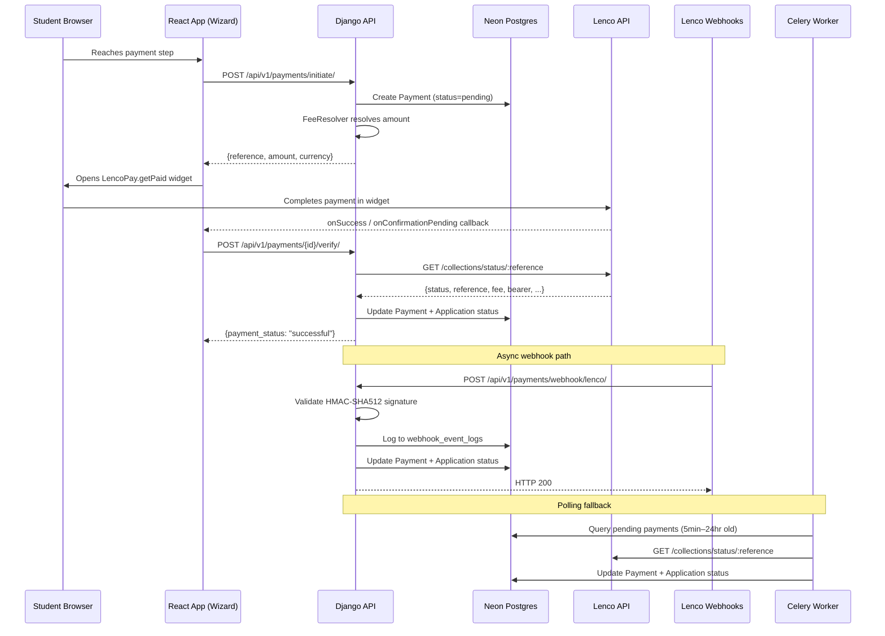
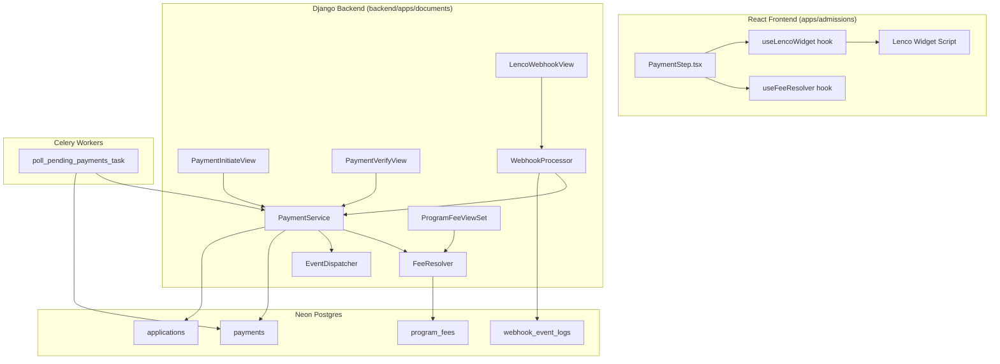
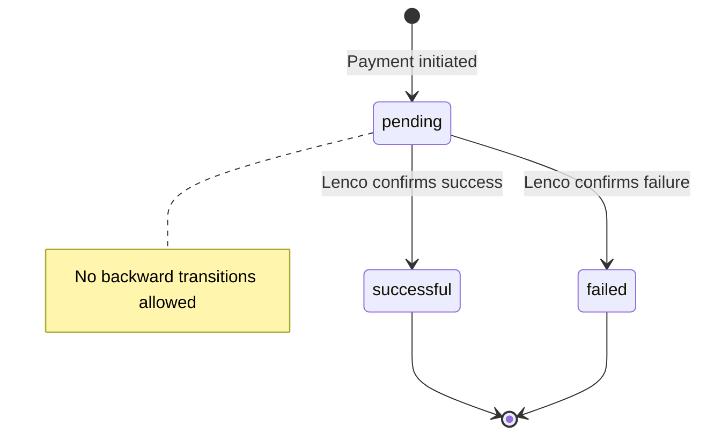

# Design Document: Lenco Payment Integration

## Overview

This design replaces the manual mobile-money proof-of-payment system in the MIHAS admissions platform with a real-time Lenco payment gateway. The integration spans:

- **Frontend**: Embedding the Lenco inline widget (`LencoPay.getPaid`) in the Application Wizard payment step, removing all legacy manual payment UI and logic.
- **Backend**: A new `PaymentService` for payment record lifecycle, a `WebhookProcessor` for Lenco event ingestion, a `FeeResolver` for program-level dynamic pricing, Celery tasks for polling fallback, and admin API endpoints for fee management.
- **Database**: New `program_fees` and `webhook_event_logs` tables, plus `ALTER TABLE` on `payments` and `applications` — all via idempotent SQL migration scripts (consistent with the `managed = False` pattern).

The system uses environment variables to switch between Lenco sandbox and production with zero code changes.

### CTO Review Notes (from live DB + codebase inspection)

- **Existing payment routes**: `/api/v1/payments/` already has `PaymentListView`, `PaymentReceiptView`, and `PaymentVerifyView` in `backend/apps/documents/urls.py`. The new Lenco views (`PaymentInitiateView`, `LencoWebhookView`, `FeeResolveView`) will be added to the same `payment_urlpatterns` list. The existing `PaymentVerifyView` will be replaced with the Lenco-aware version.
- **CSRF exemption**: The `CSRFEnforcementMiddleware` in `backend/apps/common/middleware.py` has an `EXEMPT_PATTERNS` list. The webhook endpoint `/api/v1/payments/webhook/lenco/` must be added to this list since Lenco servers POST without CSRF tokens.
- **Rate limiting**: The `RateLimitMiddleware.SCOPE_LIMITS` already has `("/api/v1/payments/", "20/10m")`. The webhook endpoint needs a more specific entry BEFORE this catch-all: `("/api/v1/payments/webhook/", "30/10m")` — higher limit since Lenco may send bursts of webhook retries.
- **Migration naming**: The `migration_history` table uses `migration_name` (text, unique). Existing names follow patterns like `add_idempotency_and_status_history.sql`. The new migration should be named `lenco_payment_integration.sql`.
- **ProgramFee unique constraint**: The `UNIQUE (program_id, fee_type, residency_category)` constraint should be a partial unique index `WHERE is_active = true` so that soft-deleted (inactive) records don't block new active records for the same combination.
- **Existing views to replace**: `PaymentVerifyView` currently does manual admin verification. It will be replaced with Lenco API verification. `PaymentListView` can stay as-is (lists payments for the authenticated user).

## Architecture

### High-Level Payment Flow



### Component Architecture



### Design Decisions

1. **Payment records live in `backend/apps/documents/`**: The existing `Payment` model, `payment_urlpatterns`, and payment views (`PaymentListView`, `PaymentVerifyView`, `PaymentReceiptView`) already live here. New Lenco-specific views and services are added to this app to keep payment logic consolidated. The existing `PaymentVerifyView` is replaced with a Lenco-aware version.

2. **Webhook endpoint is CSRF-exempt and unauthenticated**: Lenco servers POST webhooks without session cookies. The endpoint validates authenticity via HMAC-SHA512 signature instead. Specifically: add `re.compile(r"^/api/v1/payments/webhook/")` to `CSRFEnforcementMiddleware.EXEMPT_PATTERNS`, and add `("/api/v1/payments/webhook/", "30/10m")` BEFORE the existing `("/api/v1/payments/", "20/10m")` entry in `RateLimitMiddleware.SCOPE_LIMITS`.

3. **Fee resolution by program code, not UUID**: Since `applications.program` stores varchar codes, the `FeeResolver` joins through `catalog.Program.code` to find the matching `program_fees` record.

4. **Forward-only payment status transitions**: The `PaymentService` enforces `pending → successful` or `pending → failed` with no backward transitions, preventing race conditions between webhook and verification paths.

5. **Idempotent webhook processing**: The `WebhookProcessor` checks current payment status before updating. If a payment is already `successful`, re-processing a `collection.successful` webhook is a no-op.

6. **Polling fallback via Celery Beat**: A periodic task polls Lenco for pending payments older than 5 minutes, ensuring payments are confirmed even if webhooks fail. This runs every 10 minutes, processing at most 50 records per run.

## Components and Interfaces

### Backend Components

#### 1. PaymentService (`backend/apps/documents/payment_service.py`)

Central service for payment lifecycle management.

```python
class PaymentService:
    def initiate_payment(self, application_id: UUID, user_id: UUID) -> PaymentInitiationResult:
        """Create a pending Payment record with resolved fee. Returns reference, amount, currency."""

    def verify_payment(self, payment_id: UUID) -> PaymentVerificationResult:
        """Call Lenco API to verify payment status. Update Payment + Application accordingly."""

    def process_webhook_event(self, event_type: str, reference: str, payload: dict) -> None:
        """Update Payment record from webhook data. Idempotent."""

    def _update_payment_status(self, payment: Payment, new_status: str, lenco_data: dict) -> None:
        """Forward-only status transition with Lenco response data."""

    def _update_application_payment_status(self, application_id: UUID, status: str) -> None:
        """Sync application.payment_status when payment succeeds/fails."""
```

#### 2. FeeResolver (`backend/apps/documents/fee_resolver.py`)

Determines the correct fee for a student's program and residency.

```python
class FeeResolver:
    def resolve_fee(self, program_code: str, nationality: str | None, country: str | None) -> ResolvedFee:
        """
        1. Determine residency: 'local' if nationality=='Zambian' or country in ('Zambia','ZM'), else 'international'
        2. Look up active ProgramFee for (program.id, 'application', residency)
        3. Fallback to program.application_fee with currency ZMW
        Returns: ResolvedFee(amount, currency, residency_category, source)
        """
```

#### 3. WebhookProcessor (`backend/apps/documents/webhook_processor.py`)

Validates and processes Lenco webhook events.

```python
class WebhookProcessor:
    def validate_signature(self, raw_body: bytes, signature: str) -> bool:
        """HMAC-SHA512(raw_body, SHA256(api_secret_key)) == signature"""

    def process(self, event_type: str, payload: dict) -> None:
        """Log to webhook_event_logs, then delegate to PaymentService."""
```

#### 4. LencoWebhookView (`backend/apps/documents/views.py`)

```python
class LencoWebhookView(APIView):
    """POST /api/v1/payments/webhook/lenco/
    - No authentication (AllowAny)
    - CSRF exempt
    - Rate limited
    - Validates X-Lenco-Signature header
    """
    authentication_classes = []
    permission_classes = [AllowAny]
```

#### 5. PaymentInitiateView (`backend/apps/documents/views.py`)

```python
class PaymentInitiateView(APIView):
    """POST /api/v1/payments/initiate/
    - Authenticated (student)
    - Creates pending Payment record
    - Returns widget configuration (reference, amount, currency)
    """
    permission_classes = [IsAuthenticated]
```

#### 6. FeeResolveView (`backend/apps/documents/views.py`)

```python
class FeeResolveView(APIView):
    """GET /api/v1/payments/resolve-fee/?program_code=X&nationality=Y&country=Z
    - Authenticated (student)
    - Returns resolved fee amount and currency
    """
    permission_classes = [IsAuthenticated]
```

#### 7. ProgramFeeViewSet (`backend/apps/documents/views.py`)

```python
class ProgramFeeViewSet(ModelViewSet):
    """CRUD for /api/v1/programs/:id/fees/
    - Admin only
    - Validates unique (program, fee_type, residency_category) constraint
    - DELETE = soft delete (is_active=false)
    """
```

#### 8. Celery Task (`backend/apps/documents/tasks.py`)

```python
@shared_task(bind=True, max_retries=0)
def poll_pending_payments_task(self):
    """Every 10 minutes: query pending payments 5min–24hr old, verify via Lenco API, max 50 per run."""
```

### Frontend Components

#### 1. PaymentStep.tsx (Redesigned)

Replaces the current manual payment step with:
- Fee display (resolved from backend)
- "Pay Now" button that opens the Lenco widget
- Payment status indicators (pending, successful, failed)
- No more file upload, payment method dropdown, or pay-later option

#### 2. useLencoWidget Hook

```typescript
function useLencoWidget(): {
  openWidget: (config: LencoWidgetConfig) => void
  isLoading: boolean
  isScriptLoaded: boolean
}
```

Handles:
- Dynamic script loading from `VITE_LENCO_WIDGET_URL`
- Calling `LencoPay.getPaid(...)` with correct parameters
- Callback handling (onSuccess, onConfirmationPending, onClose)

#### 3. useFeeResolver Hook

```typescript
function useFeeResolver(programCode: string, nationality?: string, country?: string): {
  fee: { amount: number; currency: string } | null
  isLoading: boolean
  error: string | null
}
```

Calls `GET /api/v1/payments/resolve-fee/` when program or nationality changes.

#### 4. usePaymentStatus Hook

```typescript
function usePaymentStatus(applicationId: string): {
  status: 'pending' | 'successful' | 'failed' | null
  refetch: () => void
}
```

Polls or listens via SSE for payment status updates when the student returns to the wizard.

### API Contracts

#### POST /api/v1/payments/initiate/

Request:
```json
{
  "application_id": "uuid"
}
```

Response (201):
```json
{
  "success": true,
  "data": {
    "payment_id": "uuid",
    "reference": "MIHAS-APP-{app_number}-{timestamp}",
    "amount": "153.00",
    "currency": "ZMW",
    "lenco_public_key": "pub-xxx"
  }
}
```

#### POST /api/v1/payments/{payment_id}/verify/

Response (200):
```json
{
  "success": true,
  "data": {
    "status": "successful",
    "amount": "153.00",
    "currency": "ZMW",
    "lenco_reference": "LENCO-xxx",
    "payment_method": "card"
  }
}
```

#### GET /api/v1/payments/resolve-fee/?program_code=X&nationality=Y&country=Z

Response (200):
```json
{
  "success": true,
  "data": {
    "amount": "153.00",
    "currency": "ZMW",
    "residency_category": "local",
    "source": "program_fee"
  }
}
```

#### POST /api/v1/payments/webhook/lenco/

Request (from Lenco):
```json
{
  "event": "collection.successful",
  "data": {
    "reference": "MIHAS-APP-xxx",
    "amount": 153.00,
    "currency": "ZMW",
    "lencoReference": "LENCO-xxx",
    "fee": 2.30,
    "bearer": "merchant",
    "type": "card",
    "settlement": { ... }
  }
}
```

Response: HTTP 200 (empty body or `{"received": true}`)

#### GET /api/v1/programs/{id}/fees/

Response (200):
```json
{
  "success": true,
  "data": [
    {
      "id": "uuid",
      "fee_type": "application",
      "residency_category": "local",
      "amount": "153.00",
      "currency": "ZMW",
      "is_active": true
    }
  ]
}
```

#### POST /api/v1/programs/{id}/fees/

Request:
```json
{
  "fee_type": "application",
  "residency_category": "local",
  "amount": "153.00",
  "currency": "ZMW"
}
```

#### PUT /api/v1/programs/{id}/fees/{fee_id}/

Request: same shape as POST.

#### DELETE /api/v1/programs/{id}/fees/{fee_id}/

Response (200): soft-deletes by setting `is_active = false`.


## Data Models

### New Table: `program_fees`

```sql
CREATE TABLE IF NOT EXISTS program_fees (
    id UUID PRIMARY KEY DEFAULT gen_random_uuid(),
    program_id UUID NOT NULL REFERENCES programs(id) ON DELETE CASCADE,
    fee_type VARCHAR(20) NOT NULL CHECK (fee_type IN ('application', 'tuition')),
    residency_category VARCHAR(20) NOT NULL CHECK (residency_category IN ('local', 'international')),
    amount NUMERIC(10, 2) NOT NULL,
    currency VARCHAR(3) NOT NULL DEFAULT 'ZMW',
    is_active BOOLEAN NOT NULL DEFAULT TRUE,
    created_at TIMESTAMPTZ DEFAULT NOW(),
    updated_at TIMESTAMPTZ DEFAULT NOW(),
    CONSTRAINT uq_program_fee_type_residency UNIQUE (program_id, fee_type, residency_category)
);

-- Partial unique index: only active records must be unique per (program, fee_type, residency)
-- This allows soft-deleted (is_active=false) duplicates.
DROP INDEX IF EXISTS uq_program_fee_active;
CREATE UNIQUE INDEX uq_program_fee_active
    ON program_fees (program_id, fee_type, residency_category)
    WHERE is_active = true;
```

Django model (`backend/apps/documents/models.py`):

```python
class ProgramFee(models.Model):
    id = models.UUIDField(primary_key=True, default=uuid.uuid4, editable=False)
    program = models.ForeignKey('catalog.Program', on_delete=models.CASCADE)
    fee_type = models.CharField(max_length=20)  # 'application' or 'tuition'
    residency_category = models.CharField(max_length=20)  # 'local' or 'international'
    amount = models.DecimalField(max_digits=10, decimal_places=2)
    currency = models.CharField(max_length=3, default='ZMW')
    is_active = models.BooleanField(default=True)
    created_at = models.DateTimeField(null=True, blank=True)
    updated_at = models.DateTimeField(null=True, blank=True)

    class Meta:
        managed = False
        db_table = 'program_fees'
        # Note: The unique constraint is enforced via a partial unique index
        # (WHERE is_active = true) in the SQL migration, not via Django's
        # UniqueConstraint, because Django doesn't support partial unique
        # constraints on managed = False models.
```

### New Table: `webhook_event_logs`

```sql
CREATE TABLE IF NOT EXISTS webhook_event_logs (
    id UUID PRIMARY KEY DEFAULT gen_random_uuid(),
    event_type VARCHAR(50) NOT NULL,
    reference VARCHAR(100) NOT NULL,
    payload JSONB NOT NULL DEFAULT '{}',
    signature_valid BOOLEAN NOT NULL DEFAULT FALSE,
    processed BOOLEAN NOT NULL DEFAULT FALSE,
    processing_error TEXT,
    created_at TIMESTAMPTZ DEFAULT NOW()
);

CREATE INDEX IF NOT EXISTS idx_webhook_event_logs_reference
    ON webhook_event_logs (reference);
```

Django model (`backend/apps/documents/models.py`):

```python
class WebhookEventLog(models.Model):
    id = models.UUIDField(primary_key=True, default=uuid.uuid4, editable=False)
    event_type = models.CharField(max_length=50)
    reference = models.CharField(max_length=100)
    payload = models.JSONField(default=dict)
    signature_valid = models.BooleanField(default=False)
    processed = models.BooleanField(default=False)
    processing_error = models.TextField(null=True, blank=True)
    created_at = models.DateTimeField(null=True, blank=True)

    class Meta:
        managed = False
        db_table = 'webhook_event_logs'
```

### ALTER TABLE: `payments`

```sql
ALTER TABLE payments
    ADD COLUMN IF NOT EXISTS lenco_reference VARCHAR(100),
    ADD COLUMN IF NOT EXISTS fee NUMERIC(10, 2),
    ADD COLUMN IF NOT EXISTS bearer VARCHAR(20);
```

Updated Django model fields (added to existing `Payment` in `backend/apps/documents/models.py`):

```python
# Add to existing Payment model
lenco_reference = models.CharField(max_length=100, null=True, blank=True)
fee = models.DecimalField(max_digits=10, decimal_places=2, null=True, blank=True)
bearer = models.CharField(max_length=20, null=True, blank=True)
```

### ALTER TABLE: `applications`

```sql
ALTER TABLE applications
    ALTER COLUMN payment_status SET DEFAULT 'pending';
```

### SQL Migration Script

File: `backend/scripts/lenco_payment_integration.sql`

The script will be fully idempotent using `IF NOT EXISTS` guards on all `CREATE TABLE`, `CREATE INDEX`, and `ADD COLUMN` statements. It will also record itself in the `migration_history` table.

### Payment Reference Format

```
MIHAS-{application_number}-{unix_timestamp_ms}
```

Example: `MIHAS-APP-2025-0001-1719849600000`

This format is deterministic per payment attempt (includes timestamp to allow retries) and includes the application number for traceability.

### Payment Status State Machine



### Webhook Signature Verification

```
webhook_hash_key = SHA256(LENCO_API_SECRET_KEY)
expected_signature = HMAC-SHA512(raw_request_body, webhook_hash_key)
valid = constant_time_compare(expected_signature, X-Lenco-Signature header)
```


## Correctness Properties

*A property is a characteristic or behavior that should hold true across all valid executions of a system — essentially, a formal statement about what the system should do. Properties serve as the bridge between human-readable specifications and machine-verifiable correctness guarantees.*

### Property 1: Payment reference uniqueness and format

*For any* application number and any two distinct timestamps, the generated payment references should both contain the application number and should be distinct from each other.

**Validates: Requirements 1.6**

### Property 2: Payment initiation creates a complete record

*For any* valid application ID, user ID, and resolved fee, initiating a payment should create a Payment record with status `pending`, the correct amount and currency, a non-empty transaction reference, the application FK set, and the Lenco public key stored in metadata.

**Validates: Requirements 2.1, 2.2**

### Property 3: Payment status update from Lenco response

*For any* pending Payment record and any Lenco verification/webhook response, the PaymentService should update the payment status to match the Lenco status (`successful` → `successful`, `failed` → `failed`, `pending` → unchanged). When status becomes `successful`, the associated application's payment_status should also be set to `paid`.

**Validates: Requirements 3.2, 3.3, 3.4, 4.3, 4.4, 4.9, 12.3, 12.4**

### Property 4: Webhook signature validation round-trip

*For any* raw request body and any API secret key, computing the webhook signature (HMAC-SHA512 of body using SHA-256 of secret key) and then validating it should return true. Conversely, *for any* body and any incorrect signature, validation should return false.

**Validates: Requirements 4.1, 4.2**

### Property 5: Webhook processing idempotency

*For any* valid webhook event, processing it N times (where N ≥ 1) should produce the same Payment record state as processing it exactly once.

**Validates: Requirements 4.8**

### Property 6: Webhook event logging completeness

*For any* webhook request received (regardless of signature validity), a WebhookEventLog record should be created containing the event type, reference, raw payload, and signature validation result.

**Validates: Requirements 4.6, 4.7**

### Property 7: ProgramFee model validation

*For any* ProgramFee record, the fee_type must be one of `{'application', 'tuition'}`, the residency_category must be one of `{'local', 'international'}`, the currency must be a 3-letter string, and the amount must be a positive decimal.

**Validates: Requirements 5.2, 5.3, 5.4**

### Property 8: ProgramFee uniqueness constraint

*For any* program, fee_type, and residency_category combination, attempting to create a second **active** ProgramFee with the same combination should be rejected. Inactive (soft-deleted) records should not block creation of new active records.

**Validates: Requirements 5.5, 13.6**

### Property 9: Fee resolution correctness

*For any* program code and nationality/country combination, the FeeResolver should: (a) classify residency as `local` when nationality is `'Zambian'` or country is `'Zambia'` or `'ZM'`, and `international` otherwise; (b) return the matching active ProgramFee amount and currency; (c) fall back to the program's `application_fee` with currency `ZMW` when no ProgramFee exists.

**Validates: Requirements 6.1, 6.2, 5.7, 6.5**

### Property 10: Submission requires successful payment

*For any* application, the submission endpoint should accept the `draft` → `submitted` transition if and only if a Payment record with status `successful` exists for that application.

**Validates: Requirements 8.1, 8.2, 8.3, 8.4**

### Property 11: Payment amount mismatch detection

*For any* Payment record and Lenco verification response where the response amount differs from the Payment record's expected amount, the PaymentService should not mark the payment as `successful`.

**Validates: Requirements 10.4**

### Property 12: Forward-only payment status transitions

*For any* Payment record, status transitions should only move forward: `pending` → `successful` or `pending` → `failed`. Attempting to transition from `successful` to any other status, or from `failed` to any other status, should be a no-op.

**Validates: Requirements 10.5**

### Property 13: SQL migration idempotency

*For any* number of consecutive executions of the migration script, the resulting database schema should be identical to the schema after a single execution (no errors on re-run).

**Validates: Requirements 11.7**

### Property 14: Pending payment query window

*For any* set of Payment records with varying `created_at` timestamps, the polling task query should return only those with status `pending`, created more than 5 minutes ago, and created less than 24 hours ago.

**Validates: Requirements 12.1**

### Property 15: Admin fee endpoints require authentication

*For any* request to the fee management endpoints (`GET/POST/PUT/DELETE /api/v1/programs/:id/fees/`) without admin authentication, the response should be HTTP 401 or 403.

**Validates: Requirements 13.5**

### Property 16: Webhook settlement metadata update

*For any* `collection.settled` webhook event with valid signature, the matching Payment record's metadata should contain the settlement details from the event payload.

**Validates: Requirements 4.5**

## Error Handling

### Backend Error Handling

| Scenario | Behavior |
|----------|----------|
| Payment initiation fails (DB error) | Return 500 with generic error. Frontend prevents widget from opening. |
| Lenco API unreachable during verification | Log error, keep payment status `pending`, return 503 with `Retry-After` header. |
| Lenco API returns unexpected response shape | Log error with response body (redact secrets), keep status `pending`, return 502. |
| Webhook signature invalid | Return 401. Log the attempt with IP hash. Do not process payload. |
| Webhook references unknown payment | Log warning, store in webhook_event_logs with `processed=false`, return 200 (don't leak info). |
| Amount mismatch on verification | Log warning with expected vs actual amounts, keep status `pending`, return error to frontend. |
| FeeResolver finds no program for code | Return 404 with message "Program not found". |
| FeeResolver finds no active fee and no fallback | Return the program's `application_fee` (153.00 ZMW default). |
| Duplicate ProgramFee creation | Return 409 Conflict with descriptive message. |
| Polling task Lenco API failure | Log error, skip to next payment, continue processing batch. |
| Missing LENCO_API_SECRET_KEY env var | Log warning at startup. Payment initiation returns 503 "Payment processing unavailable". |

### Frontend Error Handling

| Scenario | Behavior |
|----------|----------|
| Lenco widget script fails to load | Show error alert with retry button. Disable "Pay Now" button. |
| Payment initiation API returns error | Show error toast. Keep student on payment step. Allow retry. |
| Widget `onClose` without payment | Retain step state. Show "Payment not completed" message with retry option. |
| Fee resolution API fails | Show "Unable to determine fee" with retry. Disable payment button until resolved. |
| Verification API returns error after widget success | Show "Payment is being confirmed" message. Enable SSE/polling for status updates. |
| Network timeout during any API call | Show generic network error with retry. Auto-save preserves wizard state. |

### Retry Strategy

- **Lenco API verification**: No automatic retry from the frontend. The polling Celery task handles retries server-side.
- **Webhook processing**: Lenco retries failed webhook deliveries. The backend is idempotent, so retries are safe.
- **Polling task**: Runs every 10 minutes. Payments older than 24 hours are excluded (assumed abandoned or manually resolved).
- **Payment initiation**: Frontend allows manual retry. Each retry generates a new reference.

## Testing Strategy

### Dual Testing Approach

This feature requires both unit tests and property-based tests:

- **Unit tests** (pytest + Vitest): Verify specific examples, edge cases, integration points, and error conditions.
- **Property-based tests** (Hypothesis for Python, fast-check for TypeScript): Verify universal properties across randomized inputs with minimum 100 iterations per property.

Both are complementary: unit tests catch concrete bugs at integration boundaries, property tests verify general correctness across the input space.

### Property-Based Testing Configuration

- **Backend**: Use `hypothesis` (already in the project at `backend/tests/property/`)
- **Frontend**: Use `fast-check` (already in the project at `apps/admissions/tests/`)
- **Minimum iterations**: 100 per property test (configured via `@settings(max_examples=100)` for Hypothesis, `fc.assert(..., { numRuns: 100 })` for fast-check)
- **Tag format**: Each test must include a comment referencing the design property:
  ```
  # Feature: lenco-payment-integration, Property {N}: {property_text}
  ```
- **Each correctness property must be implemented by a single property-based test**

### Backend Tests (`backend/tests/property/` and `backend/tests/unit/`)

#### Property Tests (Hypothesis)

| Property | Test Description | Location |
|----------|-----------------|----------|
| P1 | Generate random app numbers + timestamps, verify reference format and uniqueness | `backend/tests/property/test_payment_reference.py` |
| P2 | Generate random valid applications, verify initiation creates complete records | `backend/tests/property/test_payment_initiation.py` |
| P3 | Generate random Lenco responses (successful/failed/pending), verify status updates | `backend/tests/property/test_payment_status_update.py` |
| P4 | Generate random bodies + keys, verify signature round-trip | `backend/tests/property/test_webhook_signature.py` |
| P5 | Generate random webhook events, process N times, verify idempotency | `backend/tests/property/test_webhook_idempotency.py` |
| P6 | Generate random webhook payloads, verify log creation | `backend/tests/property/test_webhook_logging.py` |
| P7 | Generate random ProgramFee field values, verify validation | `backend/tests/property/test_program_fee_validation.py` |
| P8 | Generate random (program, fee_type, residency) tuples, verify uniqueness enforcement | `backend/tests/property/test_program_fee_uniqueness.py` |
| P9 | Generate random program codes + nationality/country combos, verify fee resolution | `backend/tests/property/test_fee_resolver.py` |
| P10 | Generate random applications with/without successful payments, verify submission gate | `backend/tests/property/test_submission_gate.py` |
| P11 | Generate random payments with mismatched amounts, verify rejection | `backend/tests/property/test_amount_mismatch.py` |
| P12 | Generate random sequences of status transitions, verify forward-only invariant | `backend/tests/property/test_status_transitions.py` |
| P14 | Generate random payment timestamps, verify query window filtering | `backend/tests/property/test_pending_query_window.py` |

#### Unit Tests (pytest)

| Test | Description |
|------|-------------|
| Webhook endpoint returns 401 for invalid signature | Example with known bad signature |
| Webhook endpoint returns 200 for valid event | Example with computed signature |
| Fee resolve API returns correct fee for known program | Example with seeded program_fees |
| Fee resolve API falls back when no program_fee exists | Edge case |
| Payment initiate API creates record | Integration test |
| Payment verify API calls Lenco and updates | Integration test with mocked Lenco API |
| Admin fee CRUD endpoints | Example-based CRUD tests |
| Admin fee endpoints reject unauthenticated requests | Auth enforcement |
| Polling task processes only payments in 5min–24hr window | Example with seeded payments |
| Migration script runs without error | Idempotency example |

### Frontend Tests (`apps/admissions/tests/`)

#### Property Tests (fast-check)

| Property | Test Description |
|----------|-----------------|
| P1 | Generate random app numbers + timestamps, verify reference format and uniqueness |
| P9 (partial) | Generate random nationality/country strings, verify local/international classification |

#### Unit Tests (Vitest)

| Test | Description |
|------|-------------|
| PaymentStep renders Lenco widget area | Component render test |
| useLencoWidget loads script and calls getPaid | Hook test with mocked script |
| useFeeResolver fetches and returns fee | Hook test with mocked API |
| onSuccess callback shows success state | Callback behavior |
| onClose callback retains step state | Callback behavior |
| onConfirmationPending shows pending state | Callback behavior |
| Deprecated payment fields removed from schema | Schema shape test |
| PAYMENT_CONFIG removed | Import test |
| paymentFlow.ts removed | Import test |

