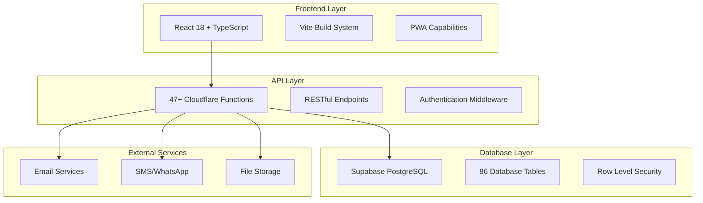
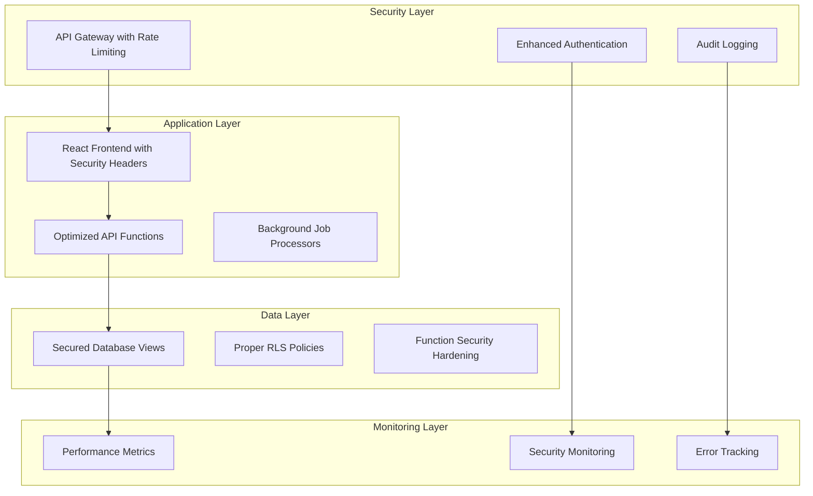

# Design Document: MIHAS Application System Analysis & Enhancement

## Overview

The MIHAS Application System is a comprehensive student admissions platform built with modern web technologies and enterprise-grade security. This design document outlines the analysis approach, security remediation strategies, and enhancement recommendations for the existing production system.

The system currently serves 23 active applications across 4 programs (Registered Nursing, Clinical Medicine, Psychosocial Counselling, Environmental Health) with 13 approved applications and verified payments. The analysis reveals both strengths and areas for improvement in security, performance, and user experience.

## Architecture

### Current System Architecture

The MIHAS system follows a modern serverless architecture pattern:



### Proposed Enhanced Architecture

Based on research findings and security analysis, the enhanced architecture addresses identified vulnerabilities:



## Components and Interfaces

### Security Analysis Component

**Purpose**: Identify and remediate security vulnerabilities in the database and application layers.

**Key Interfaces**:
- `SecurityAnalyzer`: Main analysis engine
- `VulnerabilityScanner`: Scans for specific security issues
- `RemediationEngine`: Provides fix recommendations
- `ComplianceChecker`: Validates security standards

**Security Issues Identified**:
1. **12 Security Definer Views**: Views executing with creator privileges instead of user privileges
2. **70+ Functions with Mutable Search Paths**: Functions vulnerable to search path manipulation
3. **13 Overly Permissive RLS Policies**: Policies using `USING (true)` or `WITH CHECK (true)`
4. **Disabled Password Protection**: Leaked password protection not enabled

### Database Optimization Component

**Purpose**: Optimize database schema, eliminate redundancies, and improve performance.

**Key Interfaces**:
- `SchemaAnalyzer`: Analyzes database structure
- `RedundancyDetector`: Identifies duplicate tables and data
- `PerformanceOptimizer`: Recommends indexing and query improvements
- `MigrationManager`: Handles schema migrations safely

**Optimization Opportunities**:
- Consolidate `applications` and `applications_legacy` tables
- Optimize indexes for frequently queried columns
- Implement proper foreign key constraints
- Clean up orphaned records in related tables

### Application Flow Analyzer

**Purpose**: Map user journeys and identify workflow improvements.

**Key Interfaces**:
- `FlowMapper`: Maps complete user journeys
- `BottleneckDetector`: Identifies process inefficiencies
- `AutomationEngine`: Recommends automation opportunities
- `ComplianceValidator`: Ensures regulatory compliance

**Current Flow Analysis**:
1. **Student Registration** → **Profile Creation** → **Application Wizard** → **Document Upload** → **Payment** → **Submission** → **Review** → **Decision**
2. **Admin Dashboard** → **Application Review** → **Document Verification** → **Eligibility Assessment** → **Decision Making** → **Notification**

### API Architecture Assessment

**Purpose**: Evaluate and modernize the API structure for better performance and maintainability.

**Key Interfaces**:
- `APIAnalyzer`: Catalogs and analyzes all endpoints
- `PerformanceProfiler`: Measures API response times
- `SecurityAuditor`: Validates API security
- `DocumentationGenerator`: Maintains API documentation

**Current API Structure**:
- 47+ serverless functions in `functions/` directory
- RESTful design with consistent naming conventions
- Proper error handling and CORS support
- Authentication middleware on protected endpoints

## Data Models

### Core Data Entities

```typescript
interface Application {
  id: string
  application_number: string
  user_id: string
  full_name: string
  program: string
  institution: string
  status: 'draft' | 'submitted' | 'under_review' | 'approved' | 'rejected'
  payment_status: 'pending_review' | 'verified' | 'rejected'
  eligibility_status: string
  eligibility_score: number
  created_at: Date
  updated_at: Date
}

interface UserProfile {
  id: string
  user_id: string
  full_name: string
  email: string
  phone: string
  role: 'student' | 'admin' | 'super_admin'
  is_active: boolean
}

interface ApplicationGrade {
  id: string
  application_id: string
  subject_id: string
  grade: number // 1-9 (Zambian grading system)
}

interface EligibilityRule {
  id: string
  program_id: string
  rule_name: string
  rule_type: string
  condition_json: object
  weight: number
  is_active: boolean
}
```

### Security Model

```typescript
interface SecurityVulnerability {
  id: string
  type: 'security_definer_view' | 'mutable_search_path' | 'permissive_rls'
  severity: 'ERROR' | 'WARN' | 'INFO'
  entity_name: string
  description: string
  remediation_steps: string[]
  status: 'identified' | 'in_progress' | 'resolved'
}

interface AuditLog {
  id: string
  actor_id: string
  action: string
  entity_type: string
  entity_id: string
  changes: object
  ip_address: string
  user_agent: string
  created_at: Date
}
```

## Error Handling

### Comprehensive Error Management Strategy

**Error Categories**:
1. **Security Errors**: Authentication failures, authorization violations, security policy breaches
2. **Validation Errors**: Input validation failures, business rule violations, data integrity issues
3. **System Errors**: Database connection failures, external service timeouts, resource exhaustion
4. **User Errors**: Invalid form submissions, missing required fields, file upload issues

**Error Handling Patterns**:
- Centralized error logging with structured data
- User-friendly error messages with actionable guidance
- Automatic error recovery for transient failures
- Escalation procedures for critical system errors

**Implementation**:
```typescript
interface ErrorHandler {
  logError(error: Error, context: ErrorContext): void
  notifyAdministrators(error: CriticalError): void
  attemptRecovery(error: RecoverableError): boolean
  generateUserMessage(error: Error): string
}
```

## Testing Strategy

### Dual Testing Approach

The testing strategy combines unit testing for specific scenarios with property-based testing for comprehensive validation:

**Unit Testing Focus**:
- Security vulnerability detection accuracy
- Database migration safety
- API endpoint functionality
- User interface interactions
- Error handling scenarios

**Property-Based Testing Focus**:
- Security policy enforcement across all data combinations
- Database integrity maintenance under various operations
- API behavior consistency across different inputs
- User workflow completion under various conditions

**Testing Configuration**:
- Minimum 100 iterations per property test
- Each property test tagged with: **Feature: mihas-system-analysis, Property {number}: {property_text}**
- Integration with existing Playwright and Vitest test suites
- Automated testing in CI/CD pipeline

**Testing Tools**:
- **Unit Tests**: Vitest for fast unit testing
- **Integration Tests**: Playwright for end-to-end testing
- **Property Tests**: QuickCheck-style testing with random data generation
- **Security Tests**: Custom security scanning tools

## Correctness Properties

*A property is a characteristic or behavior that should hold true across all valid executions of a system—essentially, a formal statement about what the system should do. Properties serve as the bridge between human-readable specifications and machine-verifiable correctness guarantees.*

### Property Reflection

After analyzing all acceptance criteria, several properties can be consolidated to eliminate redundancy:

- Security analysis properties (1.1-1.5) can be grouped as they all test the security analyzer's comprehensive capabilities
- Schema optimization properties (2.1-2.5) test different aspects of database analysis but are complementary
- Performance monitoring properties (8.1-8.5) test different aspects of system monitoring and can be kept separate
- Notification system properties (6.1-6.5) test different channels and behaviors, requiring separate validation

### Security Analysis Properties

**Property 1: Comprehensive Security Vulnerability Detection**
*For any* database schema with security vulnerabilities (Security_Definer_Views, mutable search path functions, permissive RLS policies), the Security_Analyzer should identify all vulnerabilities and provide actionable remediation steps
**Validates: Requirements 1.1, 1.2, 1.3, 1.4**

**Property 2: Security Fix Validation**
*For any* security vulnerability that has been remediated, the system should verify that the vulnerability is resolved and that existing functionality remains intact
**Validates: Requirements 1.5**

### Database Optimization Properties

**Property 3: Schema Redundancy Detection**
*For any* database schema with duplicate tables or redundant data structures, the Schema_Analyzer should identify all redundancies and recommend consolidation strategies
**Validates: Requirements 2.1, 2.2**

**Property 4: Data Integrity Maintenance**
*For any* database with orphaned records or integrity issues, the system should detect problems and provide automated fixes while maintaining referential integrity
**Validates: Requirements 2.3**

**Property 5: Backward Compatibility Preservation**
*For any* schema optimization applied to the database, all existing API endpoints should continue to function correctly without breaking changes
**Validates: Requirements 2.4**

**Property 6: Performance Optimization Recommendations**
*For any* database with performance bottlenecks, the system should identify slow queries and recommend specific indexing or optimization strategies
**Validates: Requirements 2.5**

### Application Flow Analysis Properties

**Property 7: Complete User Journey Mapping**
*For any* user workflow in the application system, the Flow_Analyzer should map all steps from initiation to completion and identify the complete path
**Validates: Requirements 3.1**

**Property 8: Bottleneck Impact Quantification**
*For any* identified workflow bottleneck, the system should quantify the impact on user experience and processing time with measurable metrics
**Validates: Requirements 3.2**

**Property 9: Process Improvement Recommendations**
*For any* workflow inefficiency detected, the system should recommend specific process improvements with quantified expected benefits
**Validates: Requirements 3.3**

**Property 10: Automation Opportunity Identification**
*For any* repetitive user interaction pattern, the system should identify opportunities for automation and recommend implementation approaches
**Validates: Requirements 3.4**

**Property 11: Regulatory Compliance Validation**
*For any* system configuration, all regulatory guidelines from HPCZ, GNC/NMCZ, and ECZ should be properly implemented and verifiable
**Validates: Requirements 3.5**

### API Architecture Properties

**Property 12: Complete API Endpoint Cataloging**
*For any* deployment of the system, the API_Analyzer should discover and catalog all serverless functions with their purposes and dependencies
**Validates: Requirements 4.1**

**Property 13: API Performance Analysis**
*For any* API endpoint under load, the system should measure performance characteristics and identify resource-intensive operations
**Validates: Requirements 4.2**

**Property 14: API Security Validation**
*For any* API endpoint, the system should verify that proper authentication and authorization mechanisms are implemented and functioning
**Validates: Requirements 4.3**

**Property 15: API Documentation Completeness**
*For any* API endpoint, the system should identify documentation gaps and recommend specific improvements for completeness
**Validates: Requirements 4.4**

**Property 16: API Versioning Strategy Compliance**
*For any* API versioning approach, the system should evaluate against best practices and recommend improvements for future updates
**Validates: Requirements 4.5**

### Analytics and Reporting Properties

**Property 17: Comprehensive Metrics Tracking**
*For any* application activity, the Analytics_Engine should track completion rates, processing times, and success metrics accurately
**Validates: Requirements 5.1**

**Property 18: Real-time Dashboard Generation**
*For any* request for system reports, the Reporting_System should generate dashboards with current KPIs and real-time data
**Validates: Requirements 5.2**

**Property 19: Predictive Analytics Accuracy**
*For any* historical application data, the system should forecast future volumes and capacity needs within acceptable accuracy bounds
**Validates: Requirements 5.3**

**Property 20: Regulatory Report Generation**
*For any* compliance reporting request, the system should generate reports that meet the specific requirements of HPCZ, GNC/NMCZ, and ECZ
**Validates: Requirements 5.4**

**Property 21: Secure Multi-format Data Export**
*For any* data export request, the system should provide secure exports in the requested format (PDF, Excel, CSV) with complete data integrity
**Validates: Requirements 5.5**

### Notification System Properties

**Property 22: Multi-channel Notification Delivery**
*For any* notification to be sent, the Notification_System should successfully deliver through all configured channels (email, SMS, WhatsApp, push, in-app)
**Validates: Requirements 6.1**

**Property 23: User Preference Compliance**
*For any* user with specific notification preferences, the system should respect consent settings and deliver only through approved channels
**Validates: Requirements 6.2**

**Property 24: Notification Delivery Resilience**
*For any* notification delivery failure, the system should implement retry logic and fallback to alternative channels as configured
**Validates: Requirements 6.3**

**Property 25: Bulk Notification Throttling**
*For any* bulk notification operation, the system should queue messages and throttle delivery to prevent system overload while maintaining delivery guarantees
**Validates: Requirements 6.4**

**Property 26: Notification Analytics Tracking**
*For any* notification sent through the system, delivery rates and user engagement metrics should be tracked and available for analysis
**Validates: Requirements 6.5**

### Eligibility Engine Properties

**Property 27: Grade Validation Accuracy**
*For any* student grade submission, the Eligibility_Engine should validate against the Zambian Grade 12 system (1=A+ to 9=F) and reject invalid grades
**Validates: Requirements 7.1**

**Property 28: Regulatory Compliance Verification**
*For any* program and student combination, the system should verify compliance with the appropriate regulatory guidelines (HPCZ, GNC/NMCZ, ECZ)
**Validates: Requirements 7.2**

**Property 29: Detailed Eligibility Scoring**
*For any* eligibility calculation performed, the system should provide detailed scoring breakdown and explanatory feedback
**Validates: Requirements 7.3**

**Property 30: Alternative Pathway Identification**
*For any* student not meeting direct entry requirements, the system should identify and recommend available bridging programs or additional requirements
**Validates: Requirements 7.4**

**Property 31: Appeals Process Tracking**
*For any* eligibility appeal submitted, the system should provide structured review workflow and complete decision tracking
**Validates: Requirements 7.5**

### Performance Monitoring Properties

**Property 32: Comprehensive System Monitoring**
*For any* system operation, the Monitoring_System should track response times, error rates, and resource utilization with accurate measurements
**Validates: Requirements 8.1**

**Property 33: Automated Performance Alerting**
*For any* performance issue detected, the system should automatically alert administrators and provide specific remediation suggestions
**Validates: Requirements 8.2**

**Property 34: Database Query Optimization**
*For any* database query execution, the system should identify slow queries and recommend specific optimization strategies
**Validates: Requirements 8.3**

**Property 35: Auto-scaling Response**
*For any* increase in system load, the system should implement auto-scaling and load balancing strategies to maintain performance
**Validates: Requirements 8.4**

**Property 36: Automated Backup and Recovery**
*For any* maintenance operation, the system should provide automated backup creation and verified recovery procedures
**Validates: Requirements 8.5**

### Mobile and PWA Properties

**Property 37: Responsive Design Optimization**
*For any* screen size or device type, the interface should provide optimized layouts that maintain full functionality
**Validates: Requirements 9.1**

**Property 38: Offline Functionality**
*For any* network connectivity issue, the PWA should cache critical data and enable offline functionality for essential operations
**Validates: Requirements 9.2**

**Property 39: Auto-save Consistency**
*For any* partially completed form, the system should auto-save progress every 8 seconds without data loss
**Validates: Requirements 9.3**

**Property 40: Push Notification Delivery**
*For any* enabled push notification, the system should deliver timely updates to mobile devices with proper formatting
**Validates: Requirements 9.4**

**Property 41: PWA Native Experience**
*For any* PWA installation, the system should provide native app-like experience with proper offline capabilities and performance
**Validates: Requirements 9.5**

### Integration Framework Properties

**Property 42: Standardized Integration APIs**
*For any* new integration requirement, the Integration_Framework should provide standardized APIs and webhooks that follow consistent patterns
**Validates: Requirements 10.1**

**Property 43: Secure Third-party Integration**
*For any* third-party service connection, the system should implement secure authentication and data exchange protocols
**Validates: Requirements 10.2**

**Property 44: Plugin Architecture Support**
*For any* system extension development, the framework should support plugin architecture and modular components without core system modification
**Validates: Requirements 10.3**

**Property 45: Automated Migration with Rollback**
*For any* data migration operation, the system should provide automated migration tools with verified rollback capabilities
**Validates: Requirements 10.4**

**Property 46: Zero-downtime Deployment**
*For any* system update deployment, the framework should support zero-downtime deployments and feature flag management
**Validates: Requirements 10.5**