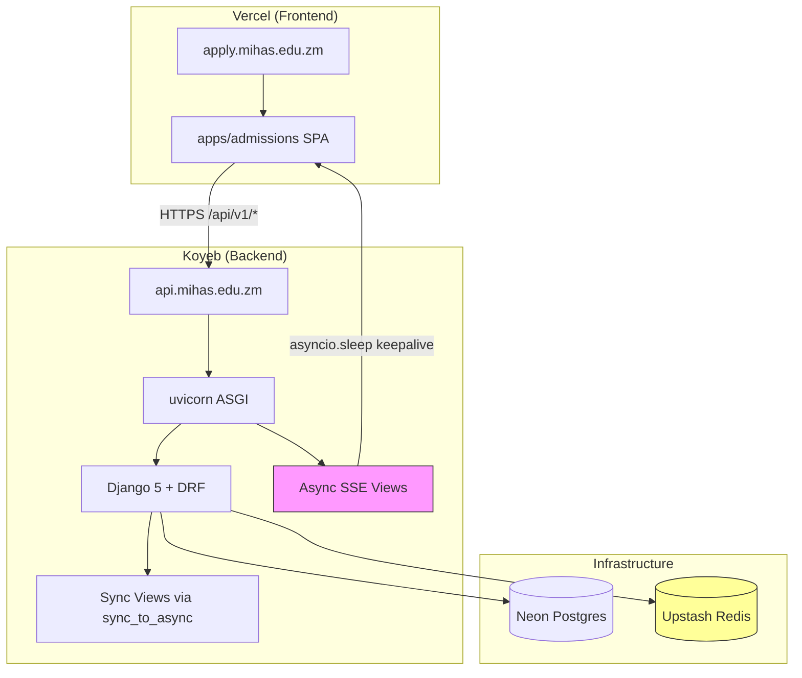
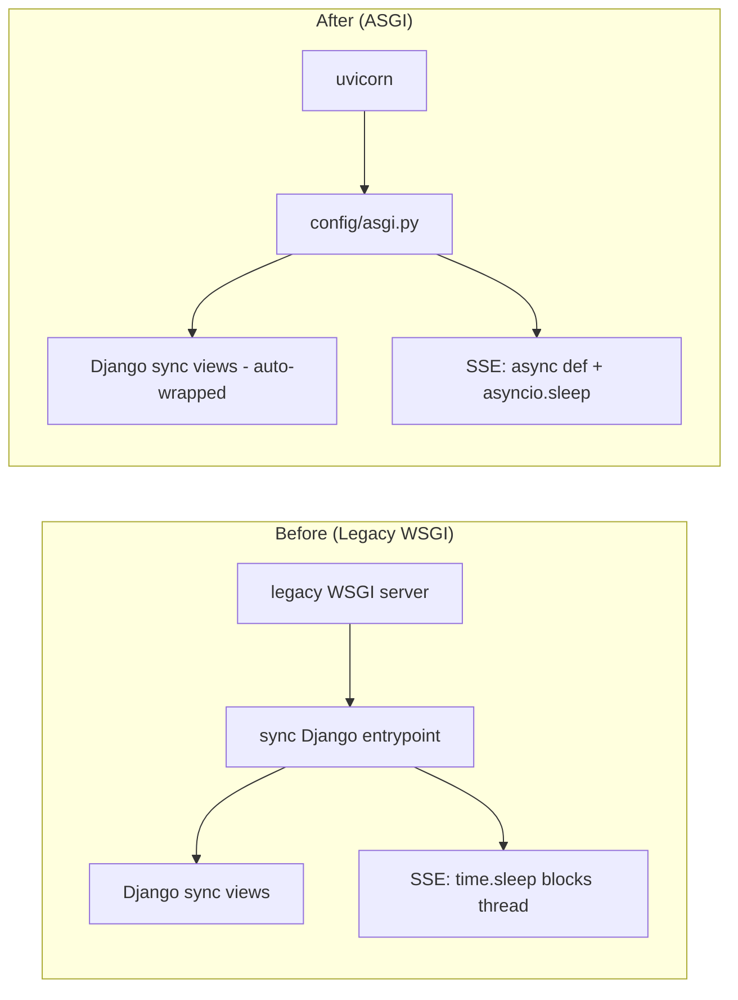
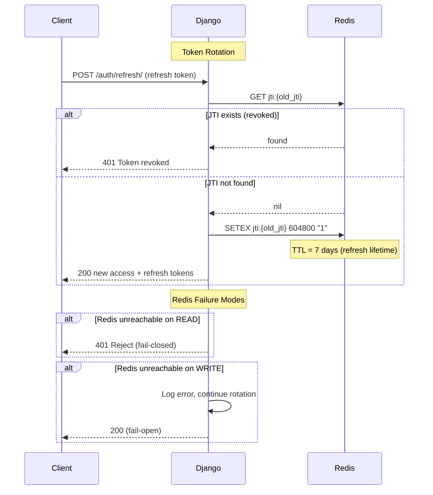

# Design Document: Monorepo Restructure

## Overview

This design covers the restructuring of the MIHAS Application System from a flat root-level layout into a clean monorepo, two P0 production fixes (Redis JTI blacklist, async SSE), removal of legacy Node.js backend artifacts, and updates to the frontend API client and steering files.

The work breaks into three tiers:

1. **P0 Production Fixes** — Redis-backed JTI blacklist and async ASGI SSE (Requirements 1, 2)
2. **Cleanup** — Delete legacy Node.js backend and stale files (Requirements 3, 4)
3. **Restructure** — Monorepo layout, frontend API client update, steering files, root tooling, test migration (Requirements 5, 6, 7, 8, 9)

### Current State

```
/ (workspace root)
├── django_api/          # Django backend (Python)
├── src/                 # React admissions frontend
├── public/              # Frontend static assets
├── tests/               # Frontend tests (Vitest, fast-check, Playwright)
├── api-src/             # Legacy Node.js backend (TypeScript source)
├── api/                 # Legacy Node.js backend (bundled JS)
├── lib/                 # Legacy shared backend utilities
├── migrations/          # Legacy SQL migration files
├── docs/                # Documentation
├── scripts/             # Build/deploy utilities
├── index.html           # Frontend entry point
├── package.json         # Frontend + legacy backend deps mixed
├── vite.config.ts       # Frontend build config
├── vitest.config.ts     # Frontend test config
├── vercel.json          # Legacy Vercel config
├── vercel.frontend-only.json  # Frontend-only Vercel config
├── local-server.js      # Legacy dev server
├── _routes.json         # Legacy routing
└── ... (stale files: duplicate.md, test-results.txt, etc.)
```

### Target State

```
/ (workspace root)
├── backend/                  # Django API (moved from django_api/)
│   ├── apps/
│   ├── config/
│   ├── Dockerfile
│   ├── requirements.txt
│   └── manage.py
├── apps/
│   ├── admissions/           # React admissions SPA (moved from src/, public/, etc.)
│   │   ├── src/
│   │   ├── public/
│   │   ├── tests/            # Frontend tests (moved from tests/)
│   │   ├── index.html
│   │   ├── package.json
│   │   ├── vite.config.ts
│   │   ├── vitest.config.ts
│   │   ├── vercel.json
│   │   └── tsconfig.json
│   ├── website/              # Placeholder
│   └── student-portal/       # Placeholder
├── shared/                   # Shared types, utilities, design tokens
├── docs/                     # Project documentation
├── .kiro/                    # Kiro steering files (stays at root)
├── package.json              # Root workspace config
├── .gitignore
└── README.md
```

## Architecture

### Deployment Architecture



### ASGI Migration (Requirement 2)

The backend switches from the legacy WSGI deployment to uvicorn (ASGI). The entire Django app runs under ASGI — sync views work transparently via Django's built-in `sync_to_async` wrapping. No hybrid WSGI/ASGI setup.



**Key decisions:**
- `uvicorn[standard]` with `--workers 3` replaces the legacy WSGI server entirely
- `config/asgi.py` becomes the primary entry point
- Dockerfile CMD changes to `uvicorn config.asgi:application --host 0.0.0.0 --port $PORT --workers 3`
- Legacy WSGI-only process manager config is removed (uvicorn uses CLI flags or env vars)

### Redis JTI Blacklist (Requirement 1)



## Components and Interfaces

### 1. Redis JTI Blacklist Module (`backend/apps/accounts/tokens.py`)

Replaces the in-memory `_blacklisted_jtis` set and `_blacklist_lock` with Redis operations.

```python
# New Redis-backed functions (replace in-memory set)
import redis
from django.conf import settings

_redis_client = None

def _get_redis() -> redis.Redis:
    """Lazy-init Redis client from REDIS_URL."""
    global _redis_client
    if _redis_client is None:
        _redis_client = redis.from_url(
            settings.CELERY_BROKER_URL,  # Same Upstash Redis
            decode_responses=True,
            socket_connect_timeout=5,
            socket_timeout=5,
        )
    return _redis_client

JTI_PREFIX = "jti:"

def blacklist_jti(jti: str, ttl_seconds: int = 604800) -> None:
    """Store jti in Redis with TTL. Fail-open on write errors."""
    try:
        _get_redis().setex(f"{JTI_PREFIX}{jti}", ttl_seconds, "1")
    except redis.RedisError:
        logger.error("Redis write failed for JTI blacklist", exc_info=True)

def is_jti_blacklisted(jti: str) -> bool:
    """Check Redis for jti. Fail-closed on read errors."""
    try:
        return _get_redis().exists(f"{JTI_PREFIX}{jti}") > 0
    except redis.RedisError:
        logger.error("Redis read failed for JTI blacklist", exc_info=True)
        return True  # Fail-closed: treat as blacklisted
```

**Interface changes:**
- `blacklist_jti(jti, ttl_seconds)` — adds TTL parameter (default 7 days = 604800s)
- `is_jti_blacklisted(jti)` — returns `True` on Redis failure (fail-closed)
- `rotate_tokens()` — calls `blacklist_jti()` instead of modifying in-memory set
- `verify_token()` — calls `is_jti_blacklisted()` instead of checking in-memory set
- Remove: `_blacklisted_jtis`, `_blacklist_lock` globals

### 2. Async SSE Module (`backend/apps/common/sse.py`)

```python
import asyncio
import json
from django.http import StreamingHttpResponse
from asgiref.sync import sync_to_async

KEEPALIVE_INTERVAL = 8  # seconds
MAX_DURATION = 30  # seconds

async def _async_event_stream(user_id):
    """Async generator yielding SSE events."""
    start = asyncio.get_event_loop().time()
    last_seen_id = None

    while asyncio.get_event_loop().time() - start < MAX_DURATION:
        try:
            notifications = await _fetch_notifications(user_id, last_seen_id)
            for notif in notifications:
                yield _sse_event({...}, event="notification", event_id=str(notif.id))
                last_seen_id = notif.created_at
        except Exception:
            logger.error("DB query failed in SSE stream", exc_info=True)

        yield _sse_event({"type": "keepalive"}, event="ping")
        await asyncio.sleep(KEEPALIVE_INTERVAL)

@sync_to_async
def _fetch_notifications(user_id, last_seen_id):
    """Wrap ORM query in sync_to_async."""
    qs = Notification.objects.filter(user_id=user_id, is_read=False).order_by("created_at")
    if last_seen_id:
        qs = qs.filter(created_at__gt=last_seen_id)
    return list(qs[:10])

class SSEStreamView(APIView):
    """Async SSE endpoint."""
    permission_classes = [IsAuthenticated]

    async def get(self, request):
        response = StreamingHttpResponse(
            _async_event_stream(request.user.pk),
            content_type="text/event-stream",
        )
        response["Cache-Control"] = "no-cache"
        response["X-Accel-Buffering"] = "no"
        return response
```

### 3. Frontend API Client Update (`apps/admissions/src/services/client.ts`)

**Changes to `normalizeEndpoint()`:**
- Remove the query-parameter translation logic entirely
- The client will pass Django REST-style paths directly (e.g., `/auth/login/`)
- `API_BASE` reads from `VITE_API_BASE_URL` which points to `***REMOVED***/api/v1`

**Path mapping (old → new):**

| Old (Vercel Functions) | New (Django REST) |
|------------------------|-------------------|
| `/api/auth?action=login` | `/auth/login/` |
| `/api/auth?action=logout` | `/auth/logout/` |
| `/api/auth?action=refresh` | `/auth/refresh/` |
| `/api/auth?action=session` | `/auth/session/` |
| `/api/auth?action=register` | `/auth/register/` |
| `/api/auth?action=reset-request` | `/auth/password-reset/` |
| `/api/auth?action=reset-confirm` | `/auth/password-reset/confirm/` |
| `/api/applications?id=xxx` | `/applications/{id}/` |
| `/api/applications?id=xxx&action=details` | `/applications/{id}/details/` |
| `/api/applications?id=xxx&action=documents` | `/applications/{id}/documents/` |
| `/api/applications?id=xxx&action=grades` | `/applications/{id}/grades/` |
| `/api/applications?id=xxx&action=summary` | `/applications/{id}/summary/` |
| `/api/applications?id=xxx&action=review` | `/applications/{id}/review/` |
| `/api/applications?action=export` | `/applications/export/` |
| `/api/catalog?type=programs` | `/catalog/programs/` |
| `/api/catalog?type=intakes` | `/catalog/intakes/` |
| `/api/catalog?type=subjects` | `/catalog/subjects/` |
| `/api/documents?action=upload` | `/documents/upload/` |
| `/api/documents?action=extract` | `/documents/{id}/extract/` |
| `/api/payments?action=receipt` | `/payments/{id}/receipt/` |
| `/api/admin?action=dashboard` | `/admin/dashboard/` |
| `/api/admin?action=users` | `/admin/users/` |
| `/api/admin?action=settings` | `/admin/settings/` |
| `/api/sessions?action=list` | `/sessions/` |
| `/api/sessions?action=revoke` | `/sessions/{id}/revoke/` |
| `/api/sessions?action=revoke-all` | `/sessions/revoke-all/` |
| `/api/notifications?action=preferences` | `/notifications/preferences/` |
| `/api/health?action=ping` | `/health/live/` |

### 4. Monorepo Root Configuration

**Root `package.json`:**
```json
{
  "name": "mihas-monorepo",
  "private": true,
  "workspaces": ["apps/*", "shared"],
  "scripts": {
    "dev:admissions": "cd apps/admissions && bun run dev",
    "build:admissions": "cd apps/admissions && bun run build",
    "test:admissions": "cd apps/admissions && bun run test",
    "lint:admissions": "cd apps/admissions && bun run lint"
  }
}
```

**`apps/admissions/package.json`** — contains only frontend dependencies (React, Radix, Tailwind, Vite, etc.). All backend-only deps removed: `@arcjet/*`, `@aws-sdk/*`, `@neondatabase/serverless`, `bcryptjs`, `cors`, `express`, `jose`, `node-fetch`, `pg`, `resend`, `web-push`, and their `@types/` packages.

### 5. Steering Files Updates

- `tech.md`: Remove "Legacy Backend (Vercel Functions)" section. Update directory table to reflect `backend/`, `apps/admissions/`, etc. Update commands table.
- `structure.md`: Replace flat directory rules with monorepo layout. Update import paths, test locations, API development workflow.
- `product.md`: Update migration state table — mark Node.js removal and monorepo restructure as complete.


## Data Models

### Redis Key Schema (JTI Blacklist)

| Key Pattern | Value | TTL | Purpose |
|-------------|-------|-----|---------|
| `jti:{uuid}` | `"1"` | 604800s (7 days) | Blacklisted refresh token JTI |

The TTL matches `SIMPLE_JWT["REFRESH_TOKEN_LIFETIME"]` (7 days). After expiry, the key auto-deletes — no cleanup needed. The `jti:` prefix namespaces blacklist keys away from Celery broker keys in the same Redis instance.

### No New Database Models

This spec does not introduce new database tables. The JTI blacklist moves from in-memory to Redis (not Postgres). All existing Django models remain unchanged.

### File System Changes Summary

**Deleted:**
- `api-src/` (entire directory)
- `api/` (entire directory)
- `lib/` (entire directory)
- `local-server.js`
- `_routes.json`
- `vercel.json`
- `duplicate.md`, `test-results.txt`, `POST_REMEDIATION_AUDIT.md`, `codexCLI.md`, `jules.md`, `Issues`, `skills-lock.json`

**Moved:**
- `django_api/` → `backend/`
- `src/` → `apps/admissions/src/`
- `public/` → `apps/admissions/public/`
- `index.html` → `apps/admissions/index.html`
- `tests/` → `apps/admissions/tests/`
- `migrations/` → `backend/migrations/`
- Frontend config files (`vite.config.ts`, `vitest.config.ts`, `tsconfig.json`, `tailwind.config.js`, `postcss.config.js`, `eslint.config.js`, `components.json`, `bunfig.toml`, `playwright.config.ts`) → `apps/admissions/`
- `vercel.frontend-only.json` → `apps/admissions/vercel.json`

**Created:**
- `apps/website/` (placeholder: `package.json` + `README.md`)
- `apps/student-portal/` (placeholder: `package.json` + `README.md`)
- `shared/` (placeholder: `package.json`)
- Root `package.json` (workspace config)
- Root `README.md` (monorepo docs)
- Root `.gitignore` (updated for monorepo)


## Correctness Properties

*A property is a characteristic or behavior that should hold true across all valid executions of a system — essentially, a formal statement about what the system should do. Properties serve as the bridge between human-readable specifications and machine-verifiable correctness guarantees.*

### Property 1: JTI Blacklist Round-Trip

*For any* valid JTI string, after calling `blacklist_jti(jti)`, calling `is_jti_blacklisted(jti)` should return `True`. Conversely, for any JTI string that has never been blacklisted, `is_jti_blacklisted(jti)` should return `False`.

**Validates: Requirements 1.1, 1.2, 1.3**

### Property 2: SSE Keepalive Timing and Duration

*For any* authenticated user, the SSE event stream should emit keepalive ping events at approximately 8-second intervals and should terminate (stop yielding events) within 30 seconds of stream start.

**Validates: Requirements 2.4**

### Property 3: SSE Notification Emission

*For any* set of unread notifications belonging to a user, the SSE event stream should emit each notification as a properly formatted SSE event containing the notification's id, title, message, type, and created_at fields.

**Validates: Requirements 2.6**

### Property 4: API Client REST-Style Path Format

*For any* API endpoint path used by the frontend, the constructed request URL should follow Django REST-style format (path segments with trailing slashes, e.g., `/auth/login/`) and should never contain query-parameter-based action routing (e.g., `?action=login`).

**Validates: Requirements 6.4**

## Error Handling

### Redis JTI Blacklist Errors

| Scenario | Behavior | Rationale |
|----------|----------|-----------|
| Redis unreachable on **write** (blacklist_jti) | Log error, continue token rotation | Fail-open: don't block auth for a write failure. The old token may remain usable, but the user gets their new tokens. |
| Redis unreachable on **read** (is_jti_blacklisted) | Return `True` (treat as blacklisted), reject token | Fail-closed: if we can't verify a token isn't revoked, reject it. User can re-authenticate. |
| Redis connection timeout | 5-second socket timeout, then fall through to above behaviors | Prevents hanging requests. |
| Invalid JTI format | No special handling — Redis treats any string as a key | JTIs are UUIDs generated by our code, so malformed values are not expected. |

### Async SSE Errors

| Scenario | Behavior | Rationale |
|----------|----------|-----------|
| DB query fails during stream | Log error, skip notification batch, continue keepalive pings | Stream stays alive for the remaining duration; client gets pings and can retry. |
| Client disconnects mid-stream | Async generator exits naturally when the response is closed | No cleanup needed — asyncio handles cancellation. |
| Authentication fails | 401 before stream starts (DRF permission check) | Standard DRF auth flow, no SSE-specific handling. |

### Monorepo / Migration Errors

| Scenario | Behavior |
|----------|----------|
| Import path not updated after move | TypeScript compiler / Vitest will fail with unresolved module errors. CI catches this. |
| Missing `VITE_API_BASE_URL` | `getApiBaseUrl()` falls back to development default. Production builds should validate env vars. |
| Backend-only dep left in admissions `package.json` | `bun install` succeeds but unused dep wastes space. Verify with dependency audit. |

## Testing Strategy

### Dual Testing Approach

This spec uses both unit tests and property-based tests:

- **Unit tests**: Verify specific examples, edge cases, error conditions, and integration points
- **Property tests**: Verify universal properties across randomly generated inputs

### Property-Based Testing

**Backend (Python):** Use `hypothesis` library (already in `requirements.txt`).
- Each property test runs with `@settings(max_examples=100)` minimum
- Each test is tagged with: `# Feature: monorepo-restructure, Property {N}: {title}`

**Frontend (TypeScript):** Use `fast-check` library (already in `devDependencies`).
- Each property test runs with `{ numRuns: 100 }` minimum
- Each test is tagged with: `// Feature: monorepo-restructure, Property {N}: {title}`

### Test Plan

#### Property Tests (Backend — hypothesis)

| Property | Test Description | File |
|----------|-----------------|------|
| Property 1: JTI Blacklist Round-Trip | Generate random UUID strings, blacklist them, verify `is_jti_blacklisted` returns True. Generate non-blacklisted UUIDs, verify returns False. | `backend/tests/property/test_jti_blacklist_properties.py` |
| Property 2: SSE Keepalive Timing | Create async SSE stream for a test user, collect events with timestamps, verify keepalive intervals ≈ 8s and total duration ≤ 30s. | `backend/tests/property/test_sse_properties.py` |
| Property 3: SSE Notification Emission | Generate random Notification objects, create SSE stream, verify each notification appears as a properly formatted SSE event with all required fields. | `backend/tests/property/test_sse_properties.py` |

#### Property Tests (Frontend — fast-check)

| Property | Test Description | File |
|----------|-----------------|------|
| Property 4: API Client REST-Style Path Format | Generate random endpoint paths from the known endpoint set, verify the constructed URL uses REST-style paths with no `?action=` parameters. | `apps/admissions/tests/property/test_api_client_paths.property.ts` |

#### Unit Tests

| Area | Tests | File |
|------|-------|------|
| Redis JTI — fail-open write | Mock Redis to raise on write, verify `blacklist_jti` doesn't raise | `backend/tests/unit/test_jti_blacklist.py` |
| Redis JTI — fail-closed read | Mock Redis to raise on read, verify `is_jti_blacklisted` returns True | `backend/tests/unit/test_jti_blacklist.py` |
| Redis JTI — TTL correctness | Blacklist a JTI, verify Redis key has TTL ≈ 604800s | `backend/tests/unit/test_jti_blacklist.py` |
| Async SSE — DB failure resilience | Mock DB to raise, verify stream continues with keepalive pings | `backend/tests/unit/test_sse_async.py` |
| Async SSE — poll fallback preserved | Verify poll endpoint returns unread notifications as sync response | `backend/tests/unit/test_sse_async.py` |
| API Client — normalizeEndpoint removed | Verify no query-parameter translation occurs | `apps/admissions/tests/unit/test_api_client.test.ts` |
| Monorepo — no backend deps in admissions | Parse `apps/admissions/package.json`, verify excluded deps are absent | `apps/admissions/tests/unit/test_package_deps.test.ts` |

#### Integration Tests

| Area | Tests |
|------|-------|
| Token rotation end-to-end | Rotate a refresh token, verify old JTI is in Redis, new tokens are valid |
| SSE stream end-to-end | Connect to SSE endpoint, create a notification, verify it appears in stream |
| Frontend build | `bun run build` from `apps/admissions/` succeeds with no errors |
| All frontend tests pass | `bun run test` from `apps/admissions/` passes all 150+ tests |

### Test Configuration Requirements

- Each correctness property MUST be implemented by a SINGLE property-based test
- Backend property tests: `@settings(max_examples=100)` for hypothesis
- Frontend property tests: `{ numRuns: 100 }` for fast-check
- Tag format: `Feature: monorepo-restructure, Property {N}: {title}`
- Unit tests focus on edge cases (Redis failures, DB failures) and specific examples
- Property tests focus on universal behaviors across all valid inputs
