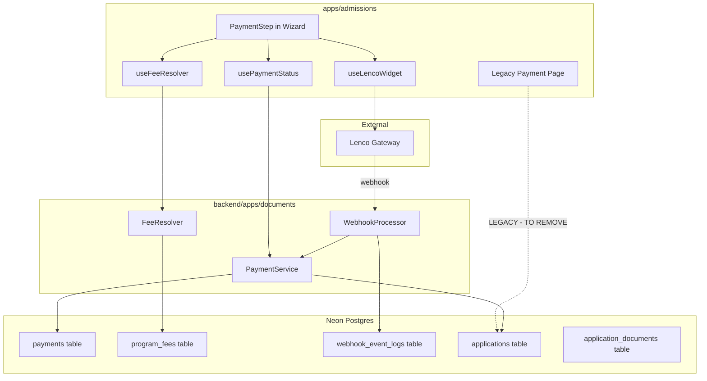
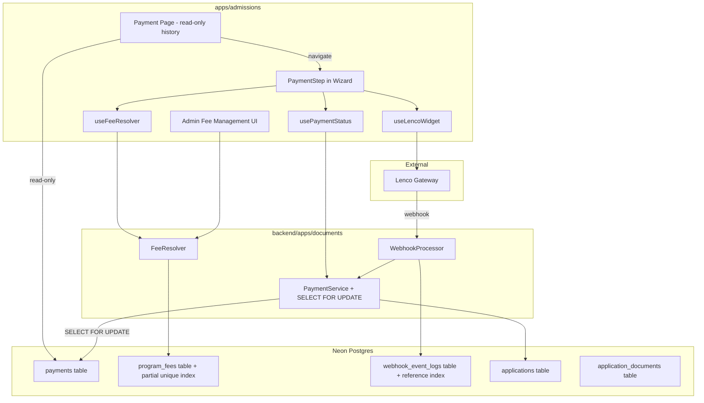

# Design Document: Production Payment Hardening

## Overview

This design covers the hardening work needed to make the MIHAS Lenco payment integration production-ready. The Lenco inline widget, `PaymentService`, `FeeResolver`, and `WebhookProcessor` are already implemented and functional. What remains is removing ~800 lines of legacy manual payment code, adding race condition prevention, enforcing identity document requirements, building admin fee management UI, and verifying end-to-end correctness.

The changes span three areas:
1. **Frontend cleanup** — Remove legacy Payment page forms, deprecated field references across hooks/types/schemas, and dead state machine events.
2. **Backend hardening** — Add `SELECT FOR UPDATE` locking to prevent webhook/verification race conditions, enforce payment gate and identity document checks on submission, and add double-payment-initiation prevention.
3. **Admin UI** — Build program fee management interface and ensure payment status override works correctly with the new `payments` table.

All changes target `apps/admissions/` (frontend) and `backend/apps/documents/` + `backend/apps/applications/` (backend). No new database tables are needed — only index verification and minor constraint additions on existing tables.

### CTO Review Notes (from live DB inspection via Neon MCP)

- **CRITICAL: Drop `uq_program_fee_type_residency` full unique constraint** — The `program_fees` table has both a full UNIQUE constraint and a partial unique index (`uq_program_fee_active WHERE is_active = true`). The full constraint blocks soft-deleted records from being replaced. Must drop the full constraint, keeping only the partial index.
- **Add composite index `idx_payments_app_status` on `payments(application_id, status)`** — The double-payment prevention query needs this for production performance.
- **Seed initial program fees** — 0 program_fees records exist. Insert defaults for all 4 programs (DRN, DCM, DEH, CPC) at K153 ZMW local.
- **Backward compatibility: `verified` status** — 25 existing applications have `payment_status = 'verified'` from the old manual system. The payment gate must treat `verified` as equivalent to `paid`.
- **No identity documents uploaded yet** — `application_documents` only has `application_slip`, `acceptance_letter`, `finance_receipt` types. The wizard must use `nrc` and `passport` as document_type values.
- **~30+ frontend files still reference deprecated fields** — Full cleanup list identified via grep: `pop_url`, `momo_ref`, `payer_name`, `payer_phone`, `payment_method` enums, `proofOfPayment`/`popFile`/`handleProofOfPaymentUpload` in wizard controller, state machine, types, schemas, admin components.

## Architecture

### Current Architecture



### Target Architecture

The legacy Payment page (`Payment.tsx`) is gutted of its ~800-line manual payment form and replaced with a read-only payment history view + navigation link to the wizard. All payment mutations flow exclusively through `PaymentService`, which gains `SELECT FOR UPDATE` locking for race condition safety.



### Key Architectural Decisions

1. **No new tables** — All needed tables (`payments`, `program_fees`, `webhook_event_logs`) already exist. We only add missing indexes and verify constraints.

2. **`SELECT FOR UPDATE` for race conditions** — The `PaymentService._update_payment_status` method wraps its read-check-write in `select_for_update()` inside a `transaction.atomic()` block. This prevents the webhook and verification API from concurrently transitioning the same payment.

3. **Double-payment prevention via existing pending check** — `initiate_payment` queries for an existing `pending` payment for the same application before creating a new one. If found, it returns the existing reference.

4. **Identity document enforcement at submission** — The backend `ApplicationReviewView` (for `status=submitted` transitions) checks `application_documents` for `document_type IN ('nrc', 'passport')`. The frontend wizard education step marks the upload as required.

5. **Legacy code removal is safe** — The deprecated Application model fields (`payment_method`, `payer_name`, `payer_phone`, `amount`, `paid_at`, `momo_ref`, `pop_url`, `receipt_number`) are already marked `DEPRECATED` in the model. The columns remain in the database for backward compatibility with existing rows, but no new code reads or writes them.

## Components and Interfaces

### Backend Changes

#### 1. `PaymentService` (`backend/apps/documents/payment_service.py`)

**Changes:**
- `initiate_payment`: Add check for existing `pending` payment for the same `application_id`. If found, return existing payment reference instead of creating a new record.
- `_update_payment_status`: Wrap in `transaction.atomic()` with `Payment.objects.select_for_update().get(id=payment.id)` to re-read the row under lock before applying the forward-only transition.
- `process_webhook_event`: Wrap the payment lookup in `select_for_update()` to prevent concurrent webhook processing.

```python
# initiate_payment — double-payment prevention
def initiate_payment(self, application_id, user_id):
    existing = Payment.objects.filter(
        application_id=application_id, status='pending'
    ).first()
    if existing:
        return PaymentInitiationResult(
            payment_id=existing.id,
            reference=existing.transaction_reference,
            amount=existing.amount,
            currency=existing.currency,
        )
    # ... existing creation logic

# _update_payment_status — SELECT FOR UPDATE
def _update_payment_status(self, payment, new_status, lenco_data):
    from django.db import transaction
    with transaction.atomic():
        locked = Payment.objects.select_for_update().get(id=payment.id)
        allowed = _ALLOWED_TRANSITIONS.get(locked.status, set())
        if new_status not in allowed:
            return  # safe no-op
        # ... apply transition on locked row
```

#### 2. `ApplicationReviewView` (`backend/apps/applications/views.py`)

**Changes:**
- For `new_status == 'submitted'`: Add identity document check — query `ApplicationDocument.objects.filter(application_id=..., document_type__in=['nrc', 'passport'])`. Return `IDENTITY_DOCUMENT_REQUIRED` error if none found.
- For `new_status == 'submitted'`: Wrap in `select_for_update()` on the Application row to prevent double submission.
- Existing payment gate check (`PAYMENT_REQUIRED`) is already implemented.

#### 3. `WebhookProcessor` (`backend/apps/documents/webhook_processor.py`)

**No changes needed** — signature validation, event logging, and delegation to `PaymentService` are already correct. The race condition fix is in `PaymentService._update_payment_status`.

#### 4. `FeeResolver` (`backend/apps/documents/fee_resolver.py`)

**No changes needed** — fallback logic (ProgramFee → program.application_fee → K153 default) is already implemented correctly.

#### 5. `ProgramFeeViewSet` (`backend/apps/documents/views.py`)

**No changes needed** — CRUD with unique active constraint validation and soft delete are already implemented.

### Frontend Changes

#### 1. Payment Page (`apps/admissions/src/pages/student/Payment.tsx`)

**Rewrite** — Replace ~800 lines with a slim read-only component:
- Fetch payment records from `GET /api/v1/payments/?application_id=...` for each application
- Display payment status, amount, currency, timestamp per application
- Show "Continue to Application Wizard" button for applications needing payment
- Remove: `handleSubmitDeferredPayment`, `PaymentCompletionForm`, `paymentForms` state, `expandedApplicationId`, `submittingApplicationId`, all form inputs (payment method selector, payer name, payer phone, amount, momo ref, file upload)

#### 2. `useWizardController` (`apps/admissions/src/pages/student/applicationWizard/hooks/useWizardController.ts`)

**Changes:**
- Remove `handleProofOfPaymentUpload` callback (and its wrapper `handleProofOfPaymentUploadWrapped`)
- Remove `popFile` from the returned interface
- Remove `baseHandleProofOfPaymentUpload`, `baseHandleProofOfPaymentFile` from `useApplicationFileUploads` destructuring
- Auto-save pause: Add check for payment step + payment in progress before triggering draft save

#### 3. `useApplicationSubmit` (`apps/admissions/src/hooks/useApplicationSubmit.ts`)

**Changes:**
- Remove deprecated fields from `updateData`: `payment_method`, `payer_name`, `payer_phone`, `amount`, `paid_at`, `momo_ref`, `pop_url`
- Submission should only set `status: 'submitted'` and `submitted_at`
- Remove deprecated fields from `WizardFormData` interface

#### 4. `applicationSchema.ts` (`apps/admissions/src/forms/applicationSchema.ts`)

**Changes:**
- Remove `payment_method` enum field from the Zod schema

#### 5. `applicationStateMachine.ts` (`apps/admissions/src/lib/applicationStateMachine.ts`)

**Changes:**
- Remove `SET_PROOF_OF_PAYMENT` event type
- Remove `hasProofOfPayment` from `StateMachineContext`
- Update `canProceed()` for payment step — no longer checks `hasProofOfPayment` (payment is handled by Lenco widget, not file upload)

#### 6. `offline.ts` (`apps/admissions/src/types/offline.ts`)

**Changes:**
- Remove `payer_name`, `payer_phone`, `momo_ref`, `pop_url` from `OfflineFormSubmissionData`

#### 7. Type definitions (`apps/admissions/src/types/database.ts`)

**Changes:**
- Remove `pop_url` from the Application type (or mark as deprecated/optional)

#### 8. `usePaymentReceipt.ts` and `useDocumentGeneration.ts`

**Changes:**
- Replace `application.momo_ref`, `application.payment_method`, `application.paid_at`, `application.payment_verified_at` with data fetched from the `payments` table via `GET /api/v1/payments/?application_id=...`

#### 9. Admin components (`useApplicationsData.ts`, etc.)

**Changes:**
- Replace `pop_url` references with payment data from the `payments` table

#### 10. PaymentStep (`apps/admissions/src/pages/student/applicationWizard/steps/PaymentStep.tsx`)

**Changes:**
- Disable pay button while initiation request is in flight (already partially done via `paymentStatus === 'initiating'` check, but ensure `canPay` also checks this)
- The existing `canPay` logic already prevents double-clicks. Verify it covers all edge cases.

#### 11. Admin Fee Management UI (new)

**New component** at `apps/admissions/src/pages/admin/ProgramFees.tsx`:
- Table listing active program fees grouped by program
- Create/edit/delete fee forms calling existing `ProgramFeeViewSet` endpoints
- Accessible to admin and super_admin roles only

#### 12. Application Wizard Resilience

**Changes to wizard:**
- Education step: Mark NRC/Passport upload as required, show validation error if missing
- Submit step: Check payment status before enabling submit, show message if payment incomplete
- Auto-save: Pause during payment step when payment is in progress
- `beforeunload`: Preserve form data to localStorage (partially implemented, verify completeness)
- Browser back/forward: Use `history.pushState` or React Router to handle wizard step navigation

## Data Models

### Existing Tables (No Schema Changes)

All tables use `managed = False` in Django models — schema is managed via SQL scripts, not Django migrations.

#### `payments` table
| Column | Type | Notes |
|--------|------|-------|
| id | UUID | PK |
| application_id | UUID | FK to applications |
| user_id | UUID | FK to profiles |
| amount | DECIMAL(10,2) | Expected fee amount |
| currency | VARCHAR(3) | Default 'ZMW' |
| payment_method | VARCHAR(50) | Set by Lenco webhook |
| transaction_reference | VARCHAR(100) | MIHAS-{app_number}-{timestamp} |
| status | VARCHAR(20) | 'pending', 'successful', 'failed' |
| lenco_reference | VARCHAR(100) | Lenco's reference |
| fee | DECIMAL(10,2) | Lenco processing fee |
| bearer | VARCHAR(20) | Fee bearer |
| metadata | JSONB | Lenco response data |
| created_at | TIMESTAMP | |
| updated_at | TIMESTAMP | |

#### `program_fees` table
| Column | Type | Notes |
|--------|------|-------|
| id | UUID | PK |
| program_id | UUID | FK to programs |
| fee_type | VARCHAR(20) | 'application' or 'tuition' |
| residency_category | VARCHAR(20) | 'local' or 'international' |
| amount | DECIMAL(10,2) | |
| currency | VARCHAR(3) | Default 'ZMW' |
| is_active | BOOLEAN | Soft delete flag |
| created_at | TIMESTAMP | |
| updated_at | TIMESTAMP | |

**Required index verification:** Partial unique index on `(program_id, fee_type, residency_category) WHERE is_active = true`

#### `webhook_event_logs` table
| Column | Type | Notes |
|--------|------|-------|
| id | UUID | PK |
| event_type | VARCHAR(50) | |
| reference | VARCHAR(100) | Payment transaction reference |
| payload | JSONB | Full webhook payload |
| signature_valid | BOOLEAN | |
| processed | BOOLEAN | |
| processing_error | TEXT | |
| created_at | TIMESTAMP | |

**Required index verification:** Index on `reference` column

#### `application_documents` table
Already supports `document_type` values of `'nrc'` and `'passport'`. No schema changes needed.

#### `applications` table
`payment_status` column already exists with default `'pending'`. Deprecated payment fields remain for backward compatibility but are not used by new code.

### Database Verification SQL

```sql
-- Verify partial unique index on program_fees
SELECT indexname, indexdef FROM pg_indexes 
WHERE tablename = 'program_fees' AND indexdef LIKE '%is_active%';

-- Verify reference index on webhook_event_logs
SELECT indexname, indexdef FROM pg_indexes 
WHERE tablename = 'webhook_event_logs' AND indexdef LIKE '%reference%';

-- Verify payments table has lenco columns
SELECT column_name, data_type FROM information_schema.columns 
WHERE table_name = 'payments' AND column_name IN ('lenco_reference', 'fee', 'bearer');

-- Verify applications.payment_status default
SELECT column_name, column_default FROM information_schema.columns 
WHERE table_name = 'applications' AND column_name = 'payment_status';
```


## Correctness Properties

*A property is a characteristic or behavior that should hold true across all valid executions of a system — essentially, a formal statement about what the system should do. Properties serve as the bridge between human-readable specifications and machine-verifiable correctness guarantees.*

### Property 1: Forward-only payment status transitions

*For any* payment record in a terminal state (`successful` or `failed`), attempting to transition it to any other state SHALL be a no-op — the payment status remains unchanged.

**Validates: Requirements 14.4, 7.3, 7.4**

### Property 2: Double payment initiation returns existing reference

*For any* application that already has a `pending` payment record, calling `initiate_payment` again SHALL return the same `payment_id` and `transaction_reference` as the existing pending payment, and the total number of payment records for that application SHALL not increase.

**Validates: Requirements 6.1**

### Property 3: Amount mismatch blocks status transition

*For any* payment record where the Lenco-reported amount differs from the expected amount stored in the payment record, the `_update_payment_status` call (whether from verification or webhook) SHALL not transition the payment to `successful` — the status remains `pending`.

**Validates: Requirements 17.1, 17.2**

### Property 4: Webhook signature computation correctness

*For any* raw request body and API secret key, the `WebhookProcessor.validate_signature` method SHALL compute the expected signature as `HMAC-SHA512(body, SHA-256(secret))` and return `True` only when the provided signature matches via constant-time comparison.

**Validates: Requirements 16.1**

### Property 5: Invalid webhook signature rejection and logging

*For any* webhook event with an invalid signature, the `WebhookProcessor.process` method SHALL create a `WebhookEventLog` record with `signature_valid=False` and SHALL not delegate to `PaymentService` for status updates.

**Validates: Requirements 16.4**

### Property 6: Fee resolution correctness with fallback chain

*For any* program code and nationality/country combination, the `FeeResolver.resolve_fee` method SHALL: (a) classify residency as `local` when nationality is `Zambian` or country is `Zambia`/`ZM`, and `international` otherwise; (b) return the active `ProgramFee` amount when one exists; (c) fall back to `program.application_fee` with currency `ZMW` when no `ProgramFee` exists; (d) fall back to `K153.00 ZMW` when `program.application_fee` is also null.

**Validates: Requirements 12.4, 15.1, 15.2, 15.3**

### Property 7: Identity document required for submission

*For any* application that has no `application_documents` record with `document_type` in `('nrc', 'passport')`, attempting to transition the application to `submitted` status SHALL fail with an `IDENTITY_DOCUMENT_REQUIRED` error.

**Validates: Requirements 5.3, 5.4**

### Property 8: Payment gate enforcement on submission

*For any* application that has no `successful` payment record in the `payments` table, attempting to transition the application to `submitted` status SHALL fail with a `PAYMENT_REQUIRED` error.

**Validates: Requirements 14.1**

### Property 9: Submission requires draft status

*For any* application whose current status is not `draft`, attempting to transition it to `submitted` SHALL fail with an error indicating the application has already been submitted or is in an invalid state.

**Validates: Requirements 8.1**

### Property 10: Admin payment status override records audit trail

*For any* admin payment status override request with notes, the `ApplicationReviewView` SHALL update the application's `payment_status` field to the requested value, set `admin_feedback` to the provided notes, set `admin_feedback_by` to the admin's user ID, and dispatch a `payment_update` SSE event.

**Validates: Requirements 4.2, 4.4, 4.5**

### Property 11: Duplicate active program fee rejection

*For any* program, fee_type, and residency_category combination that already has an active `ProgramFee` record, attempting to create another active fee with the same combination SHALL return a validation error.

**Validates: Requirements 3.6**

### Property 12: Webhook processing idempotence

*For any* valid webhook event, processing it N times (N ≥ 1) SHALL produce the same final payment state as processing it exactly once.

**Validates: Requirements 7.4**

### Property 13: Successful webhook syncs application payment_status

*For any* successful payment webhook event where the amount matches, after processing, the associated payment record SHALL have `status='successful'` and the associated application SHALL have `payment_status='paid'`.

**Validates: Requirements 12.2**

### Property 14: Pending payment polling picks up correct age range

*For any* set of pending payments, the `poll_pending_payments_task` SHALL only select payments with `created_at` older than 5 minutes and younger than 24 hours, limited to 50 records.

**Validates: Requirements 12.3**

### Property 15: Auto-save pauses during critical operations

*For any* wizard state where the current step is the payment step with a payment in progress (`initiating` or `pending`), or where a submission is in progress, the auto-save mechanism SHALL not trigger a draft save request.

**Validates: Requirements 9.1, 9.2**

### Property 16: Submission payload excludes deprecated fields

*For any* application submission, the update payload sent to the backend SHALL not contain the deprecated fields: `payment_method`, `payer_name`, `payer_phone`, `amount`, `paid_at`, `momo_ref`, `pop_url`.

**Validates: Requirements 2.5**

### Property 17: Approval requires verified payment or force flag

*For any* application without a `verified` payment status, attempting to transition it to `approved` without `force=true` SHALL fail with a `PAYMENT_UNVERIFIED` error.

**Validates: Requirements 14.3, 4.6**

## Error Handling

### Backend Error Handling

| Scenario | Response | Code |
|----------|----------|------|
| Payment initiation for non-existent application | 404 | `NOT_FOUND` |
| Payment initiation fails (Lenco/internal) | 500 | `PAYMENT_ERROR` |
| Payment verification for non-existent payment | 404 | `NOT_FOUND` |
| Lenco API unreachable during verification | 200 with error field | `VERIFICATION_ERROR` |
| Webhook with invalid signature | 401 | `Invalid webhook signature` |
| Webhook with invalid JSON | 400 | `Invalid JSON payload` |
| Amount mismatch on verification | 200 with error field | `VERIFICATION_ERROR` |
| Submission without payment | 400 | `PAYMENT_REQUIRED` |
| Submission without identity document | 400 | `IDENTITY_DOCUMENT_REQUIRED` |
| Submission of non-draft application | 400 | `ALREADY_SUBMITTED` |
| Duplicate active program fee | 400 | `ValidationError` |
| Approval without verified payment | 400 | `PAYMENT_UNVERIFIED` |
| Fee resolution for unknown program | 404 | `NOT_FOUND` |
| `LENCO_API_SECRET_KEY` not configured | Webhook: reject all; Verify: return error | Warning logged |

### Frontend Error Handling

| Scenario | Behavior |
|----------|----------|
| Lenco widget script fails to load | Show "Payment widget unavailable" alert with refresh suggestion |
| Payment verification timeout | Show "Payment pending" with polling continuation |
| Network error during wizard API call | Show retry-capable error message, preserve form data |
| Session expiry during payment | Preserve draft to localStorage, redirect to sign-in with return URL |
| Auto-save network failure | Retain unsaved data in localStorage, retry next cycle |
| Double-click on pay button | Button disabled during initiation (`canPay` check) |
| Double-click on submit button | Button disabled via `isSubmittingRef`, idempotency key preserved |

### Graceful Degradation

- If Redis is unavailable, rate limiting and error alert throttling fail-open
- If Lenco API is unreachable, verification returns current status with error message; polling task logs and moves on
- If `LENCO_API_SECRET_KEY` is missing, all webhooks are rejected (logged), verification returns error
- Auto-save failures do not block the user — data is preserved locally

## Testing Strategy

### Property-Based Testing

**Backend (Python):** Use `hypothesis` (already in the project) for property-based tests.
- Each property test runs minimum 100 iterations
- Tests live in `backend/tests/property/`
- Each test is tagged with: `# Feature: production-payment-hardening, Property {N}: {title}`

**Frontend (TypeScript):** Use `fast-check` (already in the project) for property-based tests.
- Each property test runs minimum 100 iterations
- Tests live in `apps/admissions/tests/property/`
- Each test is tagged with: `// Feature: production-payment-hardening, Property {N}: {title}`

### Backend Property Tests

| Property | Test File | Library |
|----------|-----------|---------|
| P1: Forward-only transitions | `backend/tests/property/test_payment_transitions.py` | hypothesis |
| P2: Double payment initiation | `backend/tests/property/test_payment_transitions.py` | hypothesis |
| P3: Amount mismatch blocks transition | `backend/tests/property/test_payment_transitions.py` | hypothesis |
| P4: Webhook signature computation | `backend/tests/property/test_webhook_signature.py` | hypothesis |
| P5: Invalid signature rejection | `backend/tests/property/test_webhook_signature.py` | hypothesis |
| P6: Fee resolution with fallback | `backend/tests/property/test_fee_resolution.py` | hypothesis |
| P7: Identity document required | `backend/tests/property/test_submission_gates.py` | hypothesis |
| P8: Payment gate on submission | `backend/tests/property/test_submission_gates.py` | hypothesis |
| P9: Submission requires draft | `backend/tests/property/test_submission_gates.py` | hypothesis |
| P10: Admin override audit trail | `backend/tests/property/test_admin_override.py` | hypothesis |
| P11: Duplicate fee rejection | `backend/tests/property/test_fee_resolution.py` | hypothesis |
| P12: Webhook idempotence | `backend/tests/property/test_webhook_signature.py` | hypothesis |
| P13: Webhook syncs application | `backend/tests/property/test_payment_transitions.py` | hypothesis |
| P14: Polling age range | `backend/tests/property/test_payment_transitions.py` | hypothesis |
| P17: Approval requires payment | `backend/tests/property/test_submission_gates.py` | hypothesis |

### Frontend Property Tests

| Property | Test File | Library |
|----------|-----------|---------|
| P15: Auto-save pauses | `apps/admissions/tests/property/autoSavePause.property.test.ts` | fast-check |
| P16: Submission payload shape | `apps/admissions/tests/property/submissionPayload.property.test.ts` | fast-check |

### Unit Tests (Complementary)

Unit tests cover specific examples, edge cases, and integration points:

**Backend unit tests** (`backend/tests/unit/`):
- Payment initiation happy path
- Webhook processing with valid/invalid signatures
- Fee resolution for specific programs (Zambian local, international, missing ProgramFee)
- Admin payment status override with specific values
- Submission with/without identity documents
- Database index existence verification (Req 13.1–13.5)

**Frontend unit tests** (`apps/admissions/tests/`):
- Payment page renders read-only history (no form elements)
- PaymentStep disables button during initiation
- Wizard education step shows identity document required error
- Submit step checks payment status before enabling
- Admin fee management CRUD operations
- Browser back/forward navigation in wizard

### Integration / E2E Tests

- Playwright test for the complete wizard flow: personal info → education → payment → submission
- Verify Lenco widget loads and payment step renders correctly
- Verify admin fee management page loads and CRUD works
- Verify payment status override from admin review interface
