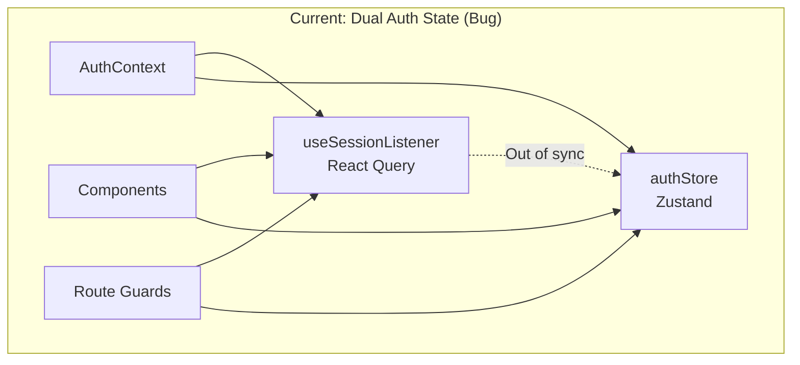
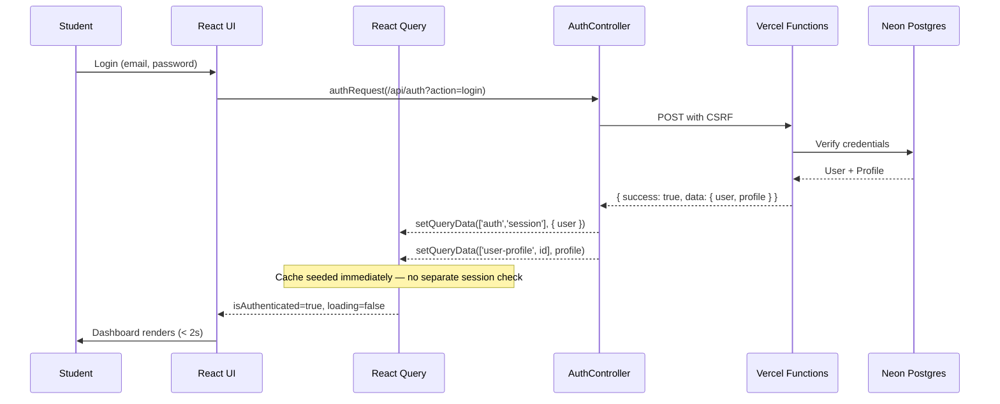

# Design Document: Production Remediation

## Overview

This design covers a comprehensive production remediation pass for the MIHAS Application System (https://apply.mihas.edu.zm). The system is a live admissions portal built with React 18 + TypeScript on Vite, deployed to Vercel with Neon Postgres, custom JWT auth, and Arcjet security.

Three prior specs addressed security hardening, UI token consistency, and critical bug fixes. This spec covers the remaining remediation tracks across 35 requirements organized into these domains:

1. **State & Race Conditions (Reqs 1-7)**: Eliminate dual auth state, prevent auto-save races, double-submit, multi-tab conflicts, SSE lifecycle leaks, polling leaks, and token refresh races
2. **API Correctness (Reqs 8-9)**: Enforce envelope consistency and RBAC across all endpoints
3. **Offline/PWA (Reqs 10-11)**: Harden offline sync queue and service worker cache
4. **Code Cleanup (Reqs 12-13)**: Remove admin complexity remnants and migration artifacts
5. **UI/UX (Reqs 14-16)**: Fix loading/skeleton states (including critical login hang), cache invalidation, error display
6. **Validation (Req 17)**: End-to-end file upload validation
7. **Data Accuracy (Reqs 18-19)**: Profile completion and application statistics
8. **Mobile/Performance (Reqs 20-21, 24)**: Mobile responsiveness, memory leaks, request timeouts
9. **Consistency (Reqs 22-23)**: Date formatting, navigation/sidebar
10. **Feature Completeness (Reqs 25-27)**: Catalog data, admin review, notifications
11. **Accessibility (Req 28)**: Dynamic content accessibility
12. **Testing/Build (Reqs 29-30)**: Integration tests with 11 PBT properties, build stability
13. **Auth Pages (Req 31)**: Clean sign-in/sign-up pages
14. **Form Cleanup (Req 32)**: Remove redundant nationality/citizenship
15. **Database (Req 33)**: Data normalization migration
16. **Login Bug (Req 34)**: Fix post-login skeleton hang (CRITICAL)
17. **Deployment (Req 35)**: Periodic deployment and live verification

### Key Design Decisions

- **Single auth source of truth**: React Query `['auth', 'session']` cache becomes the sole authority. `authStore` retains only retry/backoff state.
- **Optimistic concurrency for auto-save**: Monotonic version numbers prevent stale writes without server-side locking.
- **BroadcastChannel for multi-tab sync**: With `storage` event fallback for older browsers.
- **Promise-lock pattern for token refresh**: Module-level singleton promise prevents parallel refresh requests.
- **Idempotency keys for submissions**: Client-generated UUIDs stored server-side for 24h deduplication.
- **Immediate post-login cache seeding**: Login response seeds React Query cache directly, eliminating the separate session check round-trip that causes the skeleton hang.

## Architecture

### Current Architecture Issues



### Target Architecture

```mermaid
graph TD
    subgraph "Target: Single Source of Truth"
        A[AuthContext] --> B[useSessionListener<br/>React Query Cache]
        B --> C[authStore<br/>Retry/Backoff Only]
        D[Components] --> A
        E[Route Guards] --> A
        F[BroadcastChannel] --> B
    end

    subgraph "Auto-Save Pipeline"
        G[useAutoSave] -->|"ref-based lock"| H[API with version]
        H -->|"409 on stale"| G
        I[AbortController] --> G
    end

    subgraph "Token Refresh"
        J[401 Response] --> K[Promise Lock]
        K -->|"single refresh"| L[/api/auth?action=refresh]
        L -->|"new CSRF"| M[Retry Original Requests]
    end

    subgraph "Multi-Tab Sync"
        N[Tab A: Logout] -->|"BroadcastChannel"| O[Tab B: Clear + Redirect]
        P[Tab A: Refresh] -->|"BroadcastChannel"| Q[Tab B: Update CSRF]
    end
```

### Request Flow with Remediation



## Components and Interfaces

### 1. Auth State Unification (Reqs 1, 34)

**Modified Files:**
- `src/stores/authStore.ts` — Remove `user`, `isAuthenticated`, `setUser` fields. Retain only `retryCount`, `lastRetryTime`, `error`, `isLoading`, and backoff methods.
- `src/hooks/auth/useSessionListener.ts` — After `signIn` succeeds, seed React Query cache with user + profile from login response. No separate session round-trip.
- `src/contexts/AuthContext.tsx` — No changes needed; already delegates to `useSessionListener`.
- `src/components/ProtectedRoute.tsx`, `StudentRoute.tsx`, `AdminRoute.tsx` — Derive auth state exclusively from `useAuth()`.

**Interface Changes:**

```typescript
// authStore.ts — AFTER remediation (user/isAuthenticated removed)
interface AuthState {
  isLoading: boolean;
  error: string | null;
  retryCount: number;
  lastRetryTime: number | null;
  setLoading: (loading: boolean) => void;
  setError: (error: string | null) => void;
  clearAuth: () => void;
  incrementRetry: () => void;
  resetRetry: () => void;
  canRetry: () => boolean;
  getRetryDelay: () => number;
}
```

### 2. Auto-Save Race Prevention (Req 2)

**Modified Files:**
- `src/hooks/useAutoSave.ts`

**Design:**
- Replace `useState(isSaving)` with `useRef(isSavingRef)` to avoid stale closures in the interval callback.
- Add `AbortController` ref; abort on unmount.
- Add monotonic `versionRef` incremented on each save attempt.
- Queue manual saves when auto-save is in-flight.

```typescript
interface AutoSaveState {
  isSavingRef: React.MutableRefObject<boolean>;
  versionRef: React.MutableRefObject<number>;
  abortControllerRef: React.MutableRefObject<AbortController | null>;
  pendingManualSave: React.MutableRefObject<boolean>;
}
```

**Server-side:** `api-src/applications.ts` `save_draft` action checks `WHERE version < $newVersion` and returns 409 on conflict.

### 3. Double-Submit Prevention (Req 3)

**Design:**
- Client: `useApplicationSubmit` hook tracks `isSubmitting` ref. Disables button, ignores duplicate clicks.
- Client: Generate `crypto.randomUUID()` idempotency key, stored in form state.
- Server: `api-src/applications.ts` `submit` action stores idempotency key in `idempotency_keys` table (key, response_json, created_at). Returns cached response if key exists within 24h.
- On network failure: re-enable button, preserve same idempotency key for retry.

### 4. Multi-Tab Auth Sync (Req 4)

**New File:** `src/lib/authBroadcast.ts`

```typescript
interface AuthBroadcastMessage {
  type: 'logout' | 'login' | 'csrf-update';
  timestamp: number;
  csrfToken?: string;
  userId?: string;
}
```

**Design:**
- Use `BroadcastChannel('mihas-auth')` with `storage` event fallback on `localStorage['mihas-auth-event']`.
- On logout broadcast: clear React Query auth cache, clear authStore, redirect to sign-in.
- On login broadcast: invalidate session query to pick up new user.
- On CSRF update: call `setCsrfToken()` with the broadcast token.

### 5. SSE Connection Lifecycle (Req 5)

**Modified Files:**
- `src/lib/sseClient.ts`

**Design:**
- `connect()` closes any existing EventSource before creating a new one.
- `disconnect()` closes EventSource, clears all reconnection timeouts, removes `visibilitychange` listener, clears `handlers` Map.
- On `maxRetries` reached: emit `error` event with `{ type: 'max_retries_exceeded' }`, stop reconnection.
- `RealtimeStatusContext` exposes `status: 'connected' | 'reconnecting' | 'disconnected'`.

### 6. Polling Interval Management (Req 6)

**Modified Files:**
- `src/hooks/useStudentDashboardPolling.ts`
- `src/hooks/useAdminDashboardPolling.ts`

**Design:**
- `refetchInterval` returns `false` when tab hidden > 5 minutes (tracked via `visibilitychange` listener with timestamp).
- React Query `enabled: false` on unmount prevents orphaned intervals.
- StrictMode double-mount handled by React Query's built-in deduplication.

### 7. Token Refresh Race Prevention (Req 7)

**Modified Files:**
- `src/services/authController.ts`

**Design:**
- Module-level `let refreshPromise: Promise<boolean> | null = null`.
- First 401 sets `refreshPromise = requestRefresh()`. Subsequent 401s `await refreshPromise`.
- On refresh completion: set `refreshPromise = null`, update CSRF token.
- On refresh failure (401/403): `hardClearAuthState()` once, set `refreshPromise = null`.
- Max 1 refresh attempt per original request (tracked via request metadata).

```typescript
// Pseudocode for promise lock
let refreshPromise: Promise<boolean> | null = null;

async function ensureRefreshed(baseUrl: string): Promise<boolean> {
  if (refreshPromise) return refreshPromise;
  refreshPromise = requestRefresh(baseUrl).finally(() => { refreshPromise = null; });
  return refreshPromise;
}
```

### 8. API Envelope Consistency (Req 8)

**Audit all `api-src/*.ts` files** to ensure every response path uses `sendSuccess()` or `sendError()` from `lib/errorHandler.ts`. No bare `res.json()` calls.

**Modified Files:** All `api-src/*.ts` files.

**ApiClient Enhancement:**
- `unwrapApiResponse()` checks `Content-Type` header; if not `application/json`, returns raw response.

### 9. RBAC Enforcement (Req 9)

**Audit all `api-src/*.ts` files** to ensure:
- Every authenticated action calls `requireAuth(req)` before business logic.
- Every admin action calls `requireRole(req, ['admin', 'super_admin'])`.
- Student-scoped endpoints check `ownership.ts` for resource ownership.
- Reviewer write attempts return 403 `INSUFFICIENT_PERMISSIONS`.

### 10. Offline Sync Hardening (Req 10)

**Modified Files:**
- `src/services/offlineSync.ts`

**Design:**
- On 403 (CSRF mismatch): fetch fresh CSRF token via `/api/auth?action=session`, then retry.
- On 409 (version conflict): fetch server version, merge (server wins for conflicts, client wins for new fields).
- Strict FIFO: break processing loop on first failure (don't skip to next item).
- `init()` idempotency: check `this.initialized` flag, don't re-register listeners.
- `destroy()` method: clear `periodicSyncInterval`, remove `online` listener.
- Items at `maxRetries`: set `status: 'failed'` in IndexedDB, surface in UI with manual retry button.

### 11. Service Worker Cache Strategy (Req 11)

**Modified Files:**
- `src/service-worker.ts`

**Design:**
- Static assets: `StaleWhileRevalidate` with cache name `static-v1`.
- API calls: `NetworkFirst` with 5s timeout, fallback to cache.
- Pre-cache wizard chunks and app shell on install.
- Cache limits: 50MB total, 100 entries per bucket, LRU eviction.
- Offline indicator: API responses from cache include `X-From-Cache: true` header; frontend shows "offline data" badge.
- Update prompt: already `registerType: 'prompt'`; no change needed.

### 12-13. Code Cleanup (Reqs 12-13)

**Files to Remove (after verifying zero imports):**
- `src/utils/smart-features.ts`
- `src/utils/smart-matching.ts`
- `src/services/mcpService.ts`
- `src/v2-improvements-index.ts`
- `src/data/` directory (if only mock data)
- `src/lib/migration/`, `src/lib/connectionFix.ts`, `src/lib/hardReload.ts`, `src/lib/reloadControl.ts`, `src/lib/devApiProxy.ts`, `src/lib/localApiResolver.ts`, `src/lib/authDebug.ts` (if no active imports)
- Dead env variable references in `.env.*` files

**Verification:** Full `bun run build` + `bun run test` after each removal batch.

### 14. Loading/Skeleton States & Login Bug Fix (Reqs 14, 34)

**Root Cause of Login Skeleton Hang:**
The `signIn` method in `useSessionListener` calls `queryClient.clear()` before login, then seeds the cache with `setQueryData(['auth', 'session'], { user })`. However, the `ProtectedRoute` guard may still be reading a stale `isLoading: true` from the initial session query that was cleared. The race between `clear()` and `setQueryData()` leaves a window where `sessionLoading` is `true` with no pending query to resolve it.

**Fix:**
1. In `signIn`: replace `queryClient.clear()` with targeted removal of non-auth queries. Set auth cache atomically.
2. Add a 5-second timeout in `ProtectedRoute`: if `loading` is still `true` after 5s post-login, force `invalidateQueries(['auth', 'session'])` and show "Still loading..." with reload link.
3. Ensure `resolveAuthLoadingState` returns `false` when session data exists (even if `isLoading` is technically true due to background refetch).

**Skeleton Pattern:**
- One skeleton per content area (no nesting).
- Skeleton matches target layout dimensions.
- Error state with retry button on fetch failure (no infinite skeleton).

### 15. Cache Invalidation (Req 15)

**Design:**
- `getInvalidationPatterns()` in `ApiClient` maps endpoint+method to query keys.
- Application submit → invalidate `['student-dashboard-polling']`, `['applications']`.
- Admin status change → invalidate `['applications', appId]`, `['admin-applications']`.
- `queryClient.clear()` only on login/logout.
- Token refresh does NOT invalidate data caches.

### 16. Error Display (Req 16)

**Design:**
- Error code → user-friendly message map in `src/lib/errorMessages.ts`.
- Deduplication: 3-second window per error message hash.
- Wizard save errors: inline near save indicator, not toast.
- Network errors: "Connection error. Please check your internet and try again." + retry button.

### 17. File Upload Validation (Req 17)

**Client-side:**
- Check extension against `['.pdf', '.jpg', '.jpeg', '.png']` before upload.
- Check `file.size <= 10 * 1024 * 1024` before upload.
- Show progress bar for files > 1MB.

**Server-side:**
- `lib/fileValidator.ts` already validates magic bytes. Ensure `api-src/documents.ts` calls it after base64 decode.
- Return specific rejection reason in error response.

### 18-19. Data Accuracy (Reqs 18-19)

**Profile Completion:**
- Define required fields: `first_name`, `last_name`, `email`, `phone`, `date_of_birth`, `gender`, `nrc_number`, `address`, `next_of_kin`.
- Calculate: `filledCount / totalRequired * 100`.
- Show missing fields list when < 100%.

**Application Statistics:**
- Derive from React Query cache (`['student-dashboard-polling']`).
- In-progress = `status IN ('draft', 'submitted')`.
- Completed = `status IN ('approved', 'rejected', 'waitlisted')`.
- Remove hardcoded/placeholder values.

### 20. Mobile Responsiveness (Req 20)

- Minimum 44x44px touch targets.
- Wizard steps: horizontal scroll or dropdown on < 320px.
- Admin sidebar: hamburger toggle on mobile, overlay with backdrop.
- Modals: scrollable with sticky close button.
- Form inputs: stack vertically below `sm:` breakpoint.

### 21. Memory Leak Prevention (Req 21)

- Audit all `useEffect` hooks for missing cleanup of `setInterval`, `setTimeout`, `addEventListener`.
- `OfflineSyncService.destroy()` clears interval and removes listeners.
- `SSEClient.disconnect()` removes `visibilitychange` listener.
- `applicationStore.applications` bounded to 50 items.

### 22. Date Formatting (Req 22)

**New utility:** `src/lib/dateFormat.ts`

```typescript
function formatDate(iso: string): string;       // "15 Jan 2025"
function formatTimestamp(iso: string): string;   // "15 Jan 2025, 14:30"
function formatRelative(iso: string): string;    // "2 hours ago" (within 7 days)
function toDateInputValue(iso: string): string;  // "2025-01-15" (for <input type="date">)
```

Replace all inline `new Date().toLocaleDateString()` calls.

### 23. Navigation/Sidebar (Req 23)

- Active route highlighting via `useLocation()` match.
- Collapsed state: icon-only with tooltips, persisted in `localStorage['sidebar-collapsed']`.
- Mobile: overlay with backdrop, Escape to close.
- Role-based menu filtering from `useAuth()`.

### 24. Request Timeout/Retry (Req 24)

**Modified Files:** `src/services/client.ts`

```typescript
// Default timeout: 30s, health/session: 10s
const DEFAULT_TIMEOUT = 30_000;
const SHORT_TIMEOUT = 10_000;

// Retry: 2 attempts for network/5xx, exponential backoff (1s, 3s)
// No retry for 4xx or user-aborted requests
```

### 25. Catalog Data (Req 25)

- Programs fetched with institution name via JOIN.
- Auto-populate institution on program selection.
- Empty list: "No programmes available for the current intake".
- Cache: `staleTime: 10 * 60 * 1000` (10 minutes).

### 26. Admin Review Flow (Req 26)

- Status change → insert into `application_status_history` with admin ID, timestamp, notes.
- Status change → send notification email via Resend.
- Status history timeline on detail page.
- Payment warning (advisory, overridable).
- Server-side pagination with total count.

### 27. Notifications (Req 27)

- Fetch from `/api/notifications?action=preferences`.
- Polling-based unread badge increment.
- Phone number from profile (not hardcoded "No number on file").
- Optimistic read status update.
- Push API feature detection with fallback message.

### 28. Accessibility (Req 28)

- Error toasts: `aria-live="assertive"`.
- Success/info toasts: `aria-live="polite"`.
- Auto-save announcement: `aria-live="polite"` visually hidden region.
- Skip navigation links at page top.
- All dynamic content in live regions.

### 31. Auth Pages Cleanup (Req 31)

- Sign-in: logo, email, password, submit, "Forgot password?", "Create account" — nothing else.
- Sign-up: first name, last name, email, phone, password, confirm password, submit.
- Center-aligned card on desktop, full-width on mobile.
- Remove verbose helper text, info callouts, multi-paragraph explanations.
- Heading: "Mukuba Institute of Health and Allied Sciences — Admissions".

### 32. Nationality/Citizenship Cleanup (Req 32)

- Single "Nationality" dropdown, remove "Citizenship" field.
- "Zambian" as default/first option.
- Migration: copy `citizenship` → `nationality` where `nationality IS NULL`.
- Either drop `citizenship` column or auto-populate from `nationality`.

### 33. Database Normalization (Req 33)

**New migration:** `migrations/normalize_data.sql`

- Normalize `profiles`: fill null required fields, normalize phone to +260, copy citizenship → nationality.
- Normalize `applications`: validate status enum, ensure valid user_id, consistent timestamps.
- Clean orphans: applications without users, documents without applications, payments without applications.
- Normalize `programs`/`intakes`: valid institution_id, non-empty names, start_date < end_date.
- Validate all foreign keys.
- Idempotent: all UPDATEs use `WHERE` conditions checking current state.
- Log summary counts (no PII).

### 35. Deployment Cadence (Req 35)

- Git push after each major requirement group.
- No more than 3 requirements without deployment.
- Live verification on mobile after each deploy.
- Regression fix takes priority over new work.

## Data Models

### New Tables

```sql
-- Idempotency keys for double-submit prevention (Req 3)
CREATE TABLE IF NOT EXISTS idempotency_keys (
  key TEXT PRIMARY KEY,
  endpoint TEXT NOT NULL,
  response_json JSONB NOT NULL,
  created_at TIMESTAMPTZ NOT NULL DEFAULT NOW()
);
-- Auto-cleanup: DELETE FROM idempotency_keys WHERE created_at < NOW() - INTERVAL '24 hours'

-- Application status history (Req 26)
CREATE TABLE IF NOT EXISTS application_status_history (
  id UUID PRIMARY KEY DEFAULT gen_random_uuid(),
  application_id UUID NOT NULL REFERENCES applications(id) ON DELETE CASCADE,
  old_status TEXT,
  new_status TEXT NOT NULL,
  changed_by UUID NOT NULL REFERENCES profiles(id),
  notes TEXT,
  created_at TIMESTAMPTZ NOT NULL DEFAULT NOW()
);
CREATE INDEX IF NOT EXISTS idx_status_history_app ON application_status_history(application_id);
```

### Modified Columns

```sql
-- Add version column for optimistic concurrency (Req 2)
ALTER TABLE applications ADD COLUMN IF NOT EXISTS version INTEGER NOT NULL DEFAULT 1;

-- Ensure nationality column exists (Req 32)
ALTER TABLE profiles ADD COLUMN IF NOT EXISTS nationality TEXT;
```

### Existing Tables Referenced

| Table | Usage |
|-------|-------|
| `profiles` | Auth, profile completion, nationality normalization |
| `applications` | Auto-save versioning, status management, statistics |
| `programs` | Catalog with institution JOIN |
| `intakes` | Catalog date validation |
| `documents` | File upload validation |
| `payments` | Double-submit prevention |
| `csrf_tokens` | CSRF validation (existing) |
| `audit_logs` | Status change audit trail (existing) |


## Correctness Properties

*A property is a characteristic or behavior that should hold true across all valid executions of a system — essentially, a formal statement about what the system should do. Properties serve as the bridge between human-readable specifications and machine-verifiable correctness guarantees.*

### Property 1: Auto-save version ordering

*For any* sequence of auto-save operations on the same application, the version numbers sent to the server must be strictly monotonically increasing, and the server must reject (409) any save where the incoming version is less than or equal to the currently stored version.

**Validates: Requirements 2.5**

### Property 2: Auto-save data round-trip

*For any* valid auto-save payload (form data object), serializing it to JSON and then parsing it back must produce an object deeply equal to the original.

**Validates: Requirements 2.6**

### Property 3: Idempotency key deduplication

*For any* idempotency key and submission payload, submitting the same key multiple times within 24 hours must return the same response as the first submission, and must not create duplicate records in the database.

**Validates: Requirements 3.3**

### Property 4: RBAC determinism and correctness

*For any* role from the set {super_admin, admin, reviewer, student} and any action from the set of all API actions, calling `hasPermission(role, action)` must always return the same boolean result. Furthermore, student roles must be denied all admin actions, and reviewer roles must be denied all write actions.

**Validates: Requirements 9.1, 9.2, 9.3, 9.4, 9.5, 9.6**

### Property 5: Offline queue FIFO ordering

*For any* set of offline queue items with distinct timestamps, processing the queue must handle items in strictly ascending timestamp order, and must not process item N+1 until item N has either succeeded or been moved to the failed state.

**Validates: Requirements 10.3**

### Property 6: Offline sync init idempotency

*For any* number of `init()` calls on the OfflineSyncService (1 to N), the service must have exactly one `online` event listener and exactly one periodic sync interval active. Calling `init()` K times must produce the same observable state as calling it once.

**Validates: Requirements 10.4**

### Property 7: API envelope structure

*For any* API endpoint and any action parameter, a successful response must have the shape `{ success: true, data: <payload> }` and an error response must have the shape `{ success: false, error: <message>, code?: <code> }`. No endpoint may return a bare object without the envelope wrapper.

**Validates: Requirements 8.1, 8.2, 8.5**

### Property 8: Multi-tab auth broadcast consistency

*For any* auth event (logout, login, csrf-update) dispatched from one tab, all other tabs listening on the same BroadcastChannel must receive the event with the correct type and payload. After a logout broadcast, every receiving tab's auth state must be cleared.

**Validates: Requirements 4.1, 4.2, 4.3, 4.4**

### Property 9: File magic byte validation idempotency

*For any* file buffer and declared MIME type, calling `validateMagicBytes(buffer, mimeType)` twice on the same inputs must return the same boolean result. Additionally, for any buffer whose actual magic bytes match a supported type, `detectMimeType(buffer)` must return that type.

**Validates: Requirements 17.3, 17.6**

### Property 10: Profile completion calculation

*For any* profile object with a random subset of the 9 required fields (first_name, last_name, email, phone, date_of_birth, gender, nrc_number, address, next_of_kin) filled with non-empty values, the completion percentage must equal `(filledCount / 9) * 100`, and the missing fields list must be exactly the complement of the filled fields. The completion percentage must be monotonically non-decreasing as fields are added.

**Validates: Requirements 18.1, 18.2, 18.4**

### Property 11: Application statistics accuracy

*For any* list of applications with random statuses from {draft, submitted, under_review, approved, rejected, waitlisted}, the "in-progress" count must equal the count of applications with status `draft` or `submitted`, and the "completed" count must equal the count of applications with status `approved`, `rejected`, or `waitlisted`. The sum of in-progress + completed + other must equal the total count.

**Validates: Requirements 19.1, 19.2**

### Property 12: Date formatting round-trip

*For any* valid Date object, formatting it with `formatDate()` and then parsing the result back must produce a date with the same year, month, and day. Additionally, `toDateInputValue()` applied to any ISO 8601 timestamp must produce a string matching the pattern `YYYY-MM-DD`.

**Validates: Requirements 22.1, 22.2, 22.3**

### Property 13: Relative time formatting threshold

*For any* timestamp within the last 7 days, `formatRelative()` must return a string containing a relative time indicator (e.g., "ago", "yesterday", "today"). For any timestamp older than 7 days, `formatRelative()` must return the absolute `DD MMM YYYY` format.

**Validates: Requirements 22.5**

### Property 14: Token refresh deduplication

*For any* number of concurrent 401 responses (2 to N), the auth controller must issue exactly one refresh request to `/api/auth?action=refresh`. Each original request must retry at most once after the refresh completes. If the refresh itself fails, the system must redirect to sign-in exactly once without entering a retry loop.

**Validates: Requirements 7.1, 7.3, 7.5**

### Property 15: Database normalization post-conditions

*For all* records after the normalization migration: every `profiles` row must have non-null `nationality` and phone numbers matching `+260` format where applicable; every `applications` row must have a status in {draft, submitted, under_review, approved, rejected, waitlisted} and a valid `user_id`; every `programs` row must have a valid `institution_id` and non-empty `name`; every `intakes` row must have `start_date < end_date`; and no orphaned records (applications without users, documents without applications) may exist.

**Validates: Requirements 33.2, 33.3, 33.4, 33.5, 33.6**

### Property 16: Normalization migration idempotency

*For any* database state, running the normalization migration once and then running it again must produce the same database state as running it once. The migration must use conditional updates (`UPDATE ... WHERE condition`) that are no-ops when the data already satisfies the target state.

**Validates: Requirements 33.7**

### Property 17: Login cache seeding

*For any* successful login response containing a user object with a role, the React Query cache at key `['auth', 'session']` must contain that user object immediately after the `signIn` function resolves, and the user's role must be available for routing decisions without a separate session API call.

**Validates: Requirements 34.1, 34.4**

## Error Handling

### API Error Strategy

| Error Type | HTTP Status | Client Behavior |
|-----------|-------------|-----------------|
| Validation error | 400 | Display field-level errors inline |
| Authentication required | 401 | Attempt token refresh, then redirect to sign-in |
| Insufficient permissions | 403 | Toast: "You don't have permission for this action" |
| Resource not found | 404 | Toast: "The requested resource was not found" |
| Version conflict | 409 | Auto-save: silently fetch latest; Submit: show conflict dialog |
| Rate limited | 429 | Toast: "Too many requests. Please wait and try again." |
| CSRF validation failed | 403 (CSRF_VALIDATION_FAILED) | Refresh CSRF token and retry once |
| Server error | 500 | Toast: "Something went wrong. Please try again." |
| Network error | N/A | Toast: "Connection error. Please check your internet." + retry button |
| Request timeout | N/A | Toast: "Request timed out. Please try again." + retry button |

### Error Code → User Message Map

```typescript
// src/lib/errorMessages.ts
const ERROR_MESSAGES: Record<string, string> = {
  CSRF_VALIDATION_FAILED: 'Your session has expired. Please try again.',
  RATE_LIMIT_EXCEEDED: 'Too many requests. Please wait a moment.',
  INSUFFICIENT_PERMISSIONS: "You don't have permission for this action.",
  AUTHENTICATION_REQUIRED: 'Please sign in to continue.',
  INVALID_CREDENTIALS: 'Invalid email or password.',
  ACCOUNT_LOCKED: 'Account temporarily locked. Try again in 30 minutes.',
  VERSION_CONFLICT: 'Your changes conflict with a newer version.',
  FILE_TYPE_NOT_ALLOWED: 'Only PDF, JPEG, and PNG files are accepted.',
  FILE_TOO_LARGE: 'File must be smaller than 10MB.',
  FILE_CONTENT_MISMATCH: 'File content does not match the declared type.',
};
```

### Error Deduplication

Toast errors are deduplicated by message hash within a 3-second window. The `useToastStore` maintains a `recentErrors: Map<string, number>` (hash → timestamp) and skips duplicate toasts.

### Wizard Save Errors

Auto-save errors display inline near the save status indicator (e.g., "Save failed — retrying...") rather than as toasts, preserving the student's form context. Only persistent failures (3+ consecutive) escalate to a toast.

### Offline Error Handling

When offline, mutations are queued in IndexedDB. The UI shows an "Offline — changes will sync when connected" banner. Failed sync items (after 3 retries) surface in a "Failed to sync" section with manual retry buttons.

## Testing Strategy

### Dual Testing Approach

This remediation uses both unit tests and property-based tests:

- **Unit tests**: Verify specific examples, edge cases, integration points, and error conditions
- **Property tests**: Verify universal properties across randomly generated inputs using fast-check

### Property-Based Testing Configuration

- **Library**: fast-check (already in project dependencies)
- **Framework**: Vitest
- **Minimum iterations**: 100 per property test (use `numRuns: 100`)
- **Location**: `tests/property/production-remediation/`
- **Tag format**: Each test includes a comment: `// Feature: production-remediation, Property {N}: {title}`

### Property Test Plan

Each correctness property maps to a single property-based test:

| Property | Test File | Generator Strategy |
|----------|-----------|-------------------|
| P1: Auto-save version ordering | `autoSaveVersion.property.test.ts` | Generate random sequences of version numbers, verify server rejects out-of-order |
| P2: Auto-save data round-trip | `autoSaveRoundTrip.property.test.ts` | Generate arbitrary JSON-serializable objects, verify JSON.parse(JSON.stringify(x)) === x |
| P3: Idempotency key dedup | `idempotencyKey.property.test.ts` | Generate random UUIDs and payloads, verify duplicate submissions return same response |
| P4: RBAC determinism | `rbacDeterminism.property.test.ts` | Generate random role-action pairs, verify hasPermission is pure and correct |
| P5: Offline queue FIFO | `offlineQueueFifo.property.test.ts` | Generate random queue items with timestamps, verify processing order matches sort order |
| P6: Offline init idempotency | `offlineInitIdempotency.property.test.ts` | Call init() N times (1-10), verify single listener/interval |
| P7: API envelope structure | `apiEnvelope.property.test.ts` | Generate random endpoint-action pairs, verify response shape |
| P8: Multi-tab broadcast | `authBroadcast.property.test.ts` | Generate random auth events, verify all receivers get correct payload |
| P9: File validation idempotency | `fileValidation.property.test.ts` | Generate random buffers with known magic bytes, verify idempotent detection |
| P10: Profile completion | `profileCompletion.property.test.ts` | Generate random subsets of 9 required fields, verify percentage and missing list |
| P11: Application statistics | `applicationStats.property.test.ts` | Generate random application lists with random statuses, verify counts |
| P12: Date formatting round-trip | `dateFormatting.property.test.ts` | Generate random valid dates, verify format/parse round-trip |
| P13: Relative time threshold | `relativeTime.property.test.ts` | Generate timestamps at various offsets, verify relative vs absolute output |
| P14: Token refresh dedup | `tokenRefreshDedup.property.test.ts` | Simulate N concurrent 401s, verify single refresh call |
| P15: DB normalization post-conditions | `normalization.property.test.ts` | Generate random dirty records, run normalization logic, verify post-conditions |
| P16: Migration idempotency | `migrationIdempotency.property.test.ts` | Run normalization twice on random data, verify identical results |
| P17: Login cache seeding | `loginCacheSeeding.property.test.ts` | Generate random user objects, verify cache state after signIn |

### Unit Test Plan

| Area | Test File | Coverage |
|------|-----------|----------|
| Auth state unification | `tests/unit/authStateUnification.test.ts` | Verify authStore no longer has user/isAuthenticated |
| Auto-save abort on unmount | `tests/unit/autoSaveAbort.test.ts` | Verify AbortController cancels in-flight save |
| Double-submit button disable | `tests/unit/doubleSubmit.test.ts` | Verify button disabled during submission |
| SSE max retries error | `tests/unit/sseMaxRetries.test.ts` | Verify error event emitted at maxRetries |
| Polling pause on hidden tab | `tests/unit/pollingPause.test.ts` | Verify polling stops after 5min hidden |
| Error message mapping | `tests/unit/errorMessages.test.ts` | Verify all error codes map to user-friendly messages |
| Login skeleton timeout | `tests/unit/loginSkeletonTimeout.test.ts` | Verify force-refetch after 5s |
| Nationality migration | `tests/unit/nationalityMigration.test.ts` | Verify citizenship → nationality copy |

### Integration Test Plan

| Flow | Test File | Steps |
|------|-----------|-------|
| Auth flow | `tests/integration/authFlow.test.ts` | Register → login → session → refresh → logout |
| Application submission | `tests/integration/applicationSubmit.test.ts` | Create draft → auto-save → submit → verify |
| Admin review | `tests/integration/adminReview.test.ts` | List → view → change status → verify audit |

### E2E Test Plan

| Flow | Test File | Steps |
|------|-----------|-------|
| Login to dashboard | `tests/e2e/loginFlow.spec.ts` | Sign in → verify dashboard loads < 3s |
| Application wizard | `tests/e2e/applicationFlow.spec.ts` | Already exists; extend with auto-save verification |

### Build Verification

- `bun run build` must produce zero errors and zero warnings
- Main bundle < 500KB gzipped
- `bun run test` must pass all existing + new tests
- No new `@ts-ignore`, `@ts-nocheck`, or `as any` introduced
