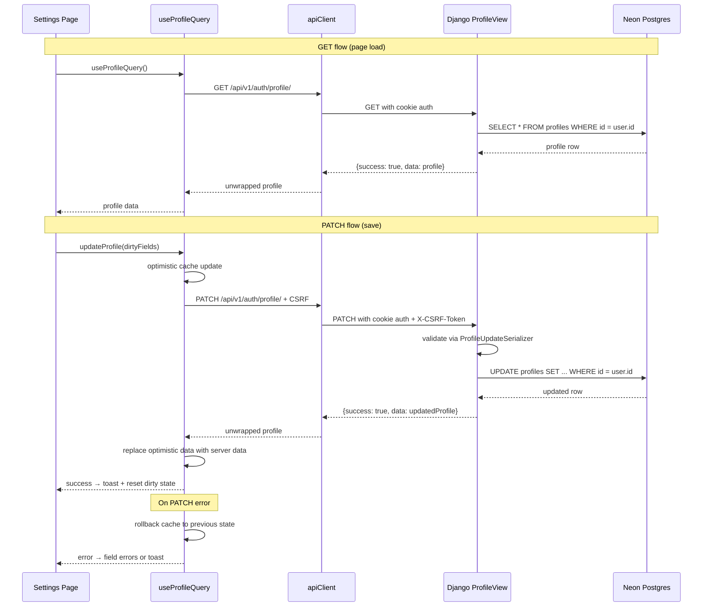

# Design Document: Profile Updates

## Overview

This design enables end-to-end student profile editing in the MIHAS admissions platform. The current Settings page renders profile data read-only because the Django backend lacks a profile update endpoint and the frontend mutation is a no-op stub. This feature adds:

1. A `ProfileView` in the accounts app supporting `GET` (full profile fetch) and `PATCH` (partial update) at `/api/v1/auth/profile/`
2. A `ProfileUpdateSerializer` with field-level validation reusing existing validators
3. A real React Query mutation in `useProfileQuery.ts` with optimistic updates and cache rollback
4. Settings page enablement: form controls unlocked, save button wired, toast feedback, read-only banner removed

The design preserves existing auth conventions (cookie-based auth, CSRF enforcement, envelope responses) and requires no database migrations since the `profiles` table already contains all needed columns (verified via Neon MCP).

## Architecture



### Key Architectural Decisions

1. **Single view, two methods**: `ProfileView` handles both GET and PATCH on the same URL (`/api/v1/auth/profile/`). This keeps the URL surface minimal and follows the existing pattern where auth endpoints live under `/api/v1/auth/`.

2. **Reuse existing middleware stack**: The request flows through `JWTAuthenticationMiddleware` (sets `request.user`) and `CSRFEnforcementMiddleware` (validates `X-CSRF-Token` on PATCH). No middleware changes needed.

3. **Partial update semantics**: The PATCH serializer uses `partial=True` so only submitted fields are validated and persisted. Empty strings on optional fields are accepted without error.

4. **Optimistic updates with rollback**: The frontend mutation optimistically writes to the React Query cache before the server responds, then either confirms with server data or rolls back on error. This gives instant UI feedback.

5. **No database migration**: The `profiles` table already has all required columns (`full_name`, `phone`, `date_of_birth`, `sex`, `residence_town`, `country`, `nrc_number`, `address`, `nationality`, `next_of_kin_name`, `next_of_kin_phone`, `updated_at`). Schema verification via Neon MCP confirms this. The Django model has `managed = False`.

## Components and Interfaces

### Backend Components

#### `ProfileView` (new)
- **Location**: `backend/apps/accounts/views.py`
- **Base class**: `APIView`
- **Permissions**: `IsAuthenticated`
- **Methods**:
  - `GET`: Returns the authenticated user's full profile serialized via `ProfileReadSerializer`
  - `PATCH`: Validates input via `ProfileUpdateSerializer(partial=True)`, updates the profile row, returns the updated profile

#### `ProfileReadSerializer` (new)
- **Location**: `backend/apps/accounts/serializers.py`
- **Purpose**: Serialize the full profile for GET responses
- **Fields** (read-only): `id`, `email`, `role`, `full_name`, `phone`, `date_of_birth`, `sex`, `residence_town`, `country`, `nrc_number`, `address`, `nationality`, `next_of_kin_name`, `next_of_kin_phone`, `updated_at`

#### `ProfileUpdateSerializer` (new)
- **Location**: `backend/apps/accounts/serializers.py`
- **Purpose**: Validate PATCH input for profile updates
- **Writable fields**: `full_name`, `phone`, `date_of_birth`, `sex`, `residence_town`, `country`, `nrc_number`, `address`, `nationality`, `next_of_kin_name`, `next_of_kin_phone`
- **Validation**:
  - `phone`: `validate_zambian_phone` when non-empty
  - `date_of_birth`: `DateField` (ISO 8601)
  - `sex`: `ChoiceField` with `['Male', 'Female']`
  - `full_name`: `min_length=2`
  - `nationality`: `normalize_nationality`
  - All fields optional, empty strings accepted (partial update)

#### URL Registration
- **Location**: `backend/apps/accounts/urls.py`
- **Route**: `path("profile/", ProfileView.as_view(), name="auth-profile")`
- **Result**: `GET/PATCH /api/v1/auth/profile/`

### Frontend Components

#### `useProfileQuery` hook (modified)
- **Location**: `apps/admissions/src/hooks/auth/useProfileQuery.ts`
- **Changes**:
  - `queryFn`: Fetch from `GET /api/v1/auth/profile/` via `apiClient.request()`, fall back to session-based profile on error
  - `updateProfile` mutation: Send `PATCH /api/v1/auth/profile/` via `apiClient.request()` with dirty fields as body
  - Optimistic update: `onMutate` snapshots cache, writes optimistic data; `onError` rolls back; `onSettled` invalidates query

#### Settings page (modified)
- **Location**: `apps/admissions/src/pages/student/Settings.tsx`
- **Changes**:
  - Set `profileEditingEnabled = true`
  - Remove read-only notice banner
  - Add `onSubmit` handler that extracts dirty fields and calls `updateProfile`
  - Wire save button: enabled when `isDirty && !updatingProfile`, shows spinner during save
  - Display field-level validation errors from server response
  - Show success/error toast notifications via existing toast system

### Interface Contracts

#### PATCH /api/v1/auth/profile/

**Request**:
```json
{
  "full_name": "John Doe",
  "phone": "+260971234567",
  "nationality": "Zambian"
}
```

**Success Response** (200):
```json
{
  "success": true,
  "data": {
    "id": "uuid",
    "email": "user@example.com",
    "role": "student",
    "full_name": "John Doe",
    "phone": "+260971234567",
    "date_of_birth": "2000-01-15",
    "sex": "Male",
    "residence_town": "Kitwe",
    "country": "Zambia",
    "nrc_number": "123456/78/1",
    "address": "Plot 123, Main Street",
    "nationality": "Zambian",
    "next_of_kin_name": "Jane Doe",
    "next_of_kin_phone": "+260971234568",
    "updated_at": "2025-01-15T10:30:00Z"
  }
}
```

**Validation Error** (400):
```json
{
  "success": false,
  "error": "Validation failed",
  "code": "VALIDATION_ERROR",
  "details": {
    "phone": ["+260123 is not a valid Zambian phone number (+260XXXXXXXXX)"],
    "sex": ["\"Other\" is not a valid choice."]
  }
}
```

**Auth Error** (401):
```json
{
  "success": false,
  "error": "Authentication credentials were not provided.",
  "code": "AUTHENTICATION_REQUIRED"
}
```

#### GET /api/v1/auth/profile/

**Success Response** (200): Same shape as PATCH success response above.

## Data Models

### Existing `profiles` Table (Neon Postgres)

No schema changes required. The table already contains all needed columns:

| Column | Type | Django Field | Editable |
|--------|------|-------------|----------|
| `id` | `uuid` | `UUIDField(primary_key)` | No |
| `email` | `varchar(255)` | `EmailField(unique)` | No |
| `role` | `varchar(50)` | `CharField(choices)` | No |
| `full_name` | `varchar(255)` | `CharField` | Yes |
| `phone` | `varchar(20)` | `CharField` | Yes |
| `date_of_birth` | `date` | `DateField` | Yes |
| `sex` | `varchar(10)` | `CharField` | Yes |
| `residence_town` | `varchar(255)` | `CharField` | Yes |
| `country` | `varchar(255)` | `CharField` | Yes |
| `nrc_number` | `varchar(20)` | `CharField` | Yes |
| `address` | `text` | `TextField` | Yes |
| `nationality` | `varchar(100)` | `CharField` | Yes |
| `next_of_kin_name` | `varchar(255)` | `CharField` | Yes |
| `next_of_kin_phone` | `varchar(50)` | `CharField` | Yes |
| `password_hash` | `text` | `TextField` | No (protected) |
| `is_active` | `boolean` | `BooleanField` | No (protected) |
| `created_at` | `timestamptz` | `DateTimeField` | No (protected) |
| `updated_at` | `timestamptz` | `DateTimeField` | Auto-set on update |

### Protected Fields

The following fields are explicitly excluded from the `ProfileUpdateSerializer` writable set: `id`, `email`, `role`, `password_hash`, `is_active`, `created_at`, `updated_at`, `refresh_token_hash`, `failed_login_attempts`, `locked_until`, `password_changed_at`, `email_verified`, `avatar_url`.


## Correctness Properties

*A property is a characteristic or behavior that should hold true across all valid executions of a system — essentially, a formal statement about what the system should do. Properties serve as the bridge between human-readable specifications and machine-verifiable correctness guarantees.*

### Property 1: Profile update round-trip

*For any* authenticated user and *for any* non-empty subset of the 11 editable profile fields (`full_name`, `phone`, `date_of_birth`, `sex`, `residence_town`, `country`, `nrc_number`, `address`, `nationality`, `next_of_kin_name`, `next_of_kin_phone`) with valid values, sending a PATCH to `/api/v1/auth/profile/` and then reading the profile back via GET should return a profile where every patched field matches the submitted value, and every non-patched field remains unchanged from its pre-PATCH state.

**Validates: Requirements 1.1, 1.2, 6.2, 6.4**

### Property 2: Protected fields are immutable through PATCH

*For any* authenticated user and *for any* values submitted for protected fields (`id`, `email`, `role`, `password_hash`, `is_active`, `created_at`), sending a PATCH to `/api/v1/auth/profile/` that includes those protected fields should result in the protected fields remaining unchanged in the database — the serializer silently ignores them.

**Validates: Requirements 1.3**

### Property 3: updated_at advances on every successful update

*For any* authenticated user and *for any* valid PATCH request, the `updated_at` timestamp in the response should be greater than or equal to the `updated_at` value before the request was made.

**Validates: Requirements 1.6**

### Property 4: Invalid field values produce validation errors

*For any* invalid field value (phone not matching `+260XXXXXXXXX`, date_of_birth not in ISO 8601 format, sex not in `{Male, Female}`, full_name shorter than 2 characters), sending a PATCH to `/api/v1/auth/profile/` with that invalid value should return HTTP 400 with `"code": "VALIDATION_ERROR"` and a `details` object containing an error message keyed by the invalid field name. The profile in the database should remain unchanged.

**Validates: Requirements 2.1, 2.2, 2.3, 2.4, 2.6**

### Property 5: Save button reflects form dirty state

*For any* combination of form dirty state (`isDirty`) and save-in-progress state (`updatingProfile`), the "Save changes" button should be enabled if and only if `isDirty` is true and `updatingProfile` is false.

**Validates: Requirements 5.2**

### Property 6: Only dirty fields are submitted

*For any* set of form fields where a subset has been modified (dirty), clicking "Save changes" should result in a PATCH request body that contains exactly the dirty fields and no others.

**Validates: Requirements 5.3**

### Property 7: Cache rollback on mutation failure

*For any* profile state in the React Query cache and *for any* failed PATCH request (server returns 4xx or 5xx), the React Query cache for the `user-profile` key should be restored to the exact state it held before the optimistic update was applied.

**Validates: Requirements 7.1, 7.2**

## Error Handling

### Backend Error Handling

| Scenario | Status | Response |
|----------|--------|----------|
| Unauthenticated request | 401 | `{"success": false, "error": "...", "code": "AUTHENTICATION_REQUIRED"}` |
| Missing/invalid CSRF token | 403 | `{"success": false, "error": "...", "code": "CSRF_VALIDATION_FAILED"}` |
| Validation failure | 400 | `{"success": false, "error": "Validation failed", "code": "VALIDATION_ERROR", "details": {...}}` |
| Database error | 500 | `{"success": false, "error": "...", "code": "INTERNAL_ERROR"}` — logged via `ErrorLog` + throttled alert |
| Method not allowed | 405 | `{"success": false, "error": "...", "code": "METHOD_NOT_ALLOWED"}` |

All error responses flow through the existing `envelope_exception_handler` in `backend/apps/common/exceptions.py`. No custom error handling is needed in `ProfileView` beyond what DRF and the middleware stack provide.

### Frontend Error Handling

| Scenario | Behavior |
|----------|----------|
| PATCH returns 400 with `details` | Map `details` keys to form field errors via `setError()` on React Hook Form |
| PATCH returns 401 | `apiClient` handles token refresh + retry automatically; if retry fails, redirects to sign-in |
| PATCH returns 403 (CSRF) | `apiClient` handles CSRF re-fetch + retry automatically |
| PATCH returns 5xx or network error | Show error toast with "Something went wrong. Please try again." and a retry option |
| GET /api/v1/auth/profile/ fails | Fall back to constructing profile from auth session user object (existing behavior) |
| Optimistic update followed by error | Roll back React Query cache to pre-mutation snapshot |

### Validation Error Mapping

The backend returns field errors in `details` as `{ field_name: ["error message", ...] }`. The frontend maps these to React Hook Form errors:

```typescript
if (error.fieldErrors) {
  Object.entries(error.fieldErrors).forEach(([field, message]) => {
    setError(field as keyof ProfileForm, { type: 'server', message })
  })
}
```

## Testing Strategy

### Dual Testing Approach

This feature uses both unit tests and property-based tests for comprehensive coverage:

- **Unit tests**: Verify specific examples, edge cases, integration points, and error conditions
- **Property tests**: Verify universal properties across randomly generated inputs

### Backend Testing

**Framework**: pytest + Hypothesis (property-based testing library for Python)

**Property tests** (`backend/tests/property/test_profile_update_properties.py`):
- Each property test runs a minimum of 100 iterations (`@settings(max_examples=100)`)
- Each test is tagged with a comment referencing the design property:
  - `# Feature: profile-updates, Property 1: Profile update round-trip`
  - `# Feature: profile-updates, Property 2: Protected fields are immutable through PATCH`
  - `# Feature: profile-updates, Property 3: updated_at advances on every successful update`
  - `# Feature: profile-updates, Property 4: Invalid field values produce validation errors`
- Hypothesis strategies generate random valid/invalid profile field values
- Tests use `APIClient` with authenticated sessions against the test database

**Unit tests** (`backend/tests/unit/test_profile_endpoint.py`):
- Unauthenticated PATCH returns 401 (Requirement 1.4)
- Missing CSRF token returns 403 (Requirement 1.5)
- GET returns full profile with all expected fields (Requirement 6.4)
- Empty PATCH body returns 200 with unchanged profile (Requirement 2.7 edge case)
- Nationality normalization: empty string → "Zambian" (Requirement 2.5)

### Frontend Testing

**Framework**: Vitest + fast-check (property-based testing library for TypeScript)

**Property tests** (`apps/admissions/tests/property/profileUpdates.property.test.ts`):
- Each property test runs a minimum of 100 iterations (`fc.assert(property, { numRuns: 100 })`)
- Each test is tagged with a comment referencing the design property:
  - `// Feature: profile-updates, Property 5: Save button reflects form dirty state`
  - `// Feature: profile-updates, Property 6: Only dirty fields are submitted`
  - `// Feature: profile-updates, Property 7: Cache rollback on mutation failure`
- fast-check arbitraries generate random form states, dirty field subsets, and error responses

**Unit tests** (`apps/admissions/tests/unit/profileUpdates.test.ts`):
- Settings page renders with editing enabled (Requirement 5.1)
- Read-only banner is not rendered (Requirement 5.8)
- Success toast shown after save (Requirement 5.5)
- Field-level errors displayed on validation failure (Requirement 5.6)
- Error toast shown on network/server error (Requirement 5.7)
- GET fallback to session-based profile on failure (Requirement 6.3)
- Optimistic update applied before server response (Requirement 7.1)
