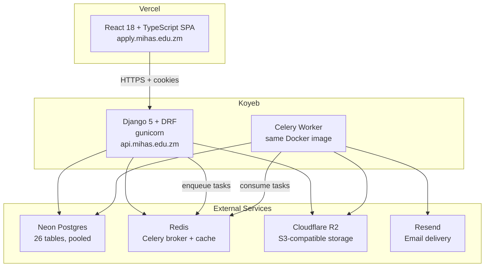
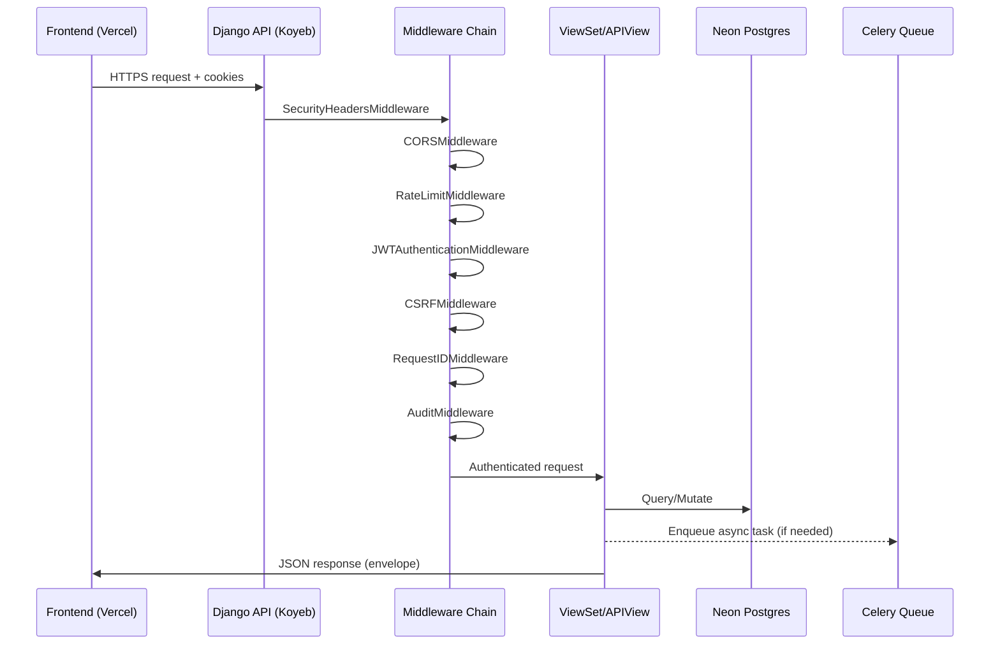

# Design Document: Python Backend Migration

## Overview

This design describes the migration of the MIHAS admissions portal backend from Vercel Serverless Functions (Node.js/Bun with query-parameter routing in `api-src/`) to a Django 5 + Django REST Framework API deployed on Koyeb. The React 18 + TypeScript frontend remains on Vercel at `apply.mihas.edu.zm`. The Django API is served from `api.mihas.edu.zm` on Koyeb.

The migration preserves all existing authentication, authorization, CRUD, notification, and async processing behaviors. The shared Neon Postgres database (26 tables) is accessed by both backends during a dual-run validation period, after which the Vercel backend is decommissioned.

### Key Design Decisions

1. **Django `managed = False` for existing tables**: During dual-run, Django models map to the existing 26 tables without Django migrations altering the shared schema. Post-cutover, `managed` can be flipped to `True`.
2. **Subdomain cookie strategy**: Auth cookies use `Domain=.mihas.edu.zm` so the frontend at `apply.mihas.edu.zm` and API at `api.mihas.edu.zm` share first-party cookies. Fallback to Bearer header transport if subdomain routing is infeasible.
3. **Shared JWT signing key**: During dual-run, both backends use the same `JWT_SIGNING_KEY` so tokens issued by either are valid on both.
4. **Celery for async work**: Emails (Resend), OCR (pytesseract), bulk notifications, and long-running tasks move to Celery workers backed by Redis, replacing in-process execution in Vercel functions.
5. **django-ratelimit + custom middleware**: Replaces Arcjet for rate limiting. Per-scope limits match the existing Arcjet configuration.
6. **Response envelope parity**: All responses use the same `{ "success": true, "data": ... }` / `{ "success": false, "error": "...", "code": "..." }` envelope as the current backend.

## Architecture

### System Architecture Diagram



### Request Flow



### Middleware Chain (Order Matters)

| Order | Middleware | Purpose |
|-------|-----------|---------|
| 1 | `SecurityHeadersMiddleware` | HSTS, X-Content-Type-Options, X-Frame-Options, Referrer-Policy, Permissions-Policy |
| 2 | `django.middleware.security.SecurityMiddleware` | SSL redirect, SECURE_PROXY_SSL_HEADER |
| 3 | `whitenoise.middleware.WhiteNoiseMiddleware` | Static file serving (admin, docs) |
| 4 | `corsheaders.middleware.CorsMiddleware` | CORS enforcement |
| 5 | `RequestIDMiddleware` | Generate/propagate X-Request-ID |
| 6 | `RateLimitMiddleware` | Per-scope rate limiting (django-ratelimit) |
| 7 | `django.middleware.common.CommonMiddleware` | URL normalization |
| 8 | `JWTAuthenticationMiddleware` | Extract JWT from cookies/Bearer, set request.user |
| 9 | `CSRFEnforcementMiddleware` | Custom CSRF token validation (X-CSRF-Token header, SHA-256 hash comparison) |
| 10 | `AuditMiddleware` | Log state-changing operations to audit_logs |

### Django Project Layout

```
django_api/
├── config/                     # Project configuration
│   ├── __init__.py
│   ├── asgi.py
│   ├── wsgi.py
│   ├── urls.py                 # Root URL configuration
│   ├── celery.py               # Celery app configuration
│   └── settings/
│       ├── __init__.py
│       ├── base.py             # Shared settings
│       ├── dev.py              # Development overrides
│       ├── staging.py          # Staging overrides
│       └── prod.py             # Production overrides
├── apps/
│   ├── accounts/               # User auth, sessions, RBAC
│   │   ├── models.py           # Profile, DeviceSession, LoginAttempt, PasswordResetToken, CSRFToken
│   │   ├── serializers.py
│   │   ├── views.py            # Login, logout, refresh, register, reset, session mgmt
│   │   ├── permissions.py      # RBAC permission classes
│   │   ├── authentication.py   # JWT authentication backend
│   │   ├── tokens.py           # JWT generation/verification (SimpleJWT customization)
│   │   ├── services.py         # Business logic (login attempts, lockout, password hashing)
│   │   └── urls.py
│   ├── applications/           # Student applications, interviews, drafts, status history
│   │   ├── models.py           # Application, ApplicationDraft, ApplicationStatusHistory, Interview
│   │   ├── serializers.py
│   │   ├── views.py            # CRUD, public tracking, bulk operations
│   │   ├── filters.py          # DRF filter backends
│   │   ├── services.py
│   │   └── urls.py
│   ├── documents/              # Document uploads, OCR, payments
│   │   ├── models.py           # ApplicationDocument, Payment, ApplicationGrade
│   │   ├── serializers.py
│   │   ├── views.py
│   │   ├── tasks.py            # Celery tasks: OCR extraction, receipt generation
│   │   ├── validators.py       # Magic byte + MIME validation
│   │   ├── services.py
│   │   └── urls.py
│   ├── catalog/                # Programs, intakes, subjects, institutions
│   │   ├── models.py           # Program, Intake, ProgramIntake, Subject, Institution, CourseRequirement
│   │   ├── serializers.py
│   │   ├── views.py
│   │   └── urls.py
│   └── common/                 # Shared utilities
│       ├── models.py           # AuditLog, IdempotencyKey, Setting, Notification, EmailQueue, etc.
│       ├── middleware.py        # SecurityHeaders, RequestID, RateLimit, CSRF, Audit
│       ├── renderers.py        # Envelope renderer ({ success, data } / { success, error, code })
│       ├── pagination.py       # Standard pagination with page/pageSize/totalCount
│       ├── exceptions.py       # Custom exception handler mapping to envelope format
│       ├── validators.py       # Zambian validators (NRC, phone, ECZ grades)
│       ├── tasks.py            # Celery tasks: email delivery, bulk notifications
│       ├── sse.py              # SSE view with 8s keepalive + polling fallback
│       └── storage.py          # S3/R2 storage backend, signed URL generation
├── Dockerfile
├── docker-compose.yml          # Local dev: Django + Redis + Celery
├── requirements.txt
├── manage.py
└── pyproject.toml
```

## Components and Interfaces

### API Endpoint Mapping (Vercel → Django)

The current Vercel backend uses query-parameter routing (`?action=xxx`). Django uses standard URL-based routing under `/api/v1/`.

| Current Vercel Endpoint | Django Endpoint | Method | Auth |
|------------------------|-----------------|--------|------|
| `/api/health?action=ping` | `/api/v1/health/live/` | GET | None |
| `/api/health?action=db` | `/api/v1/health/ready/` | GET | None |
| `/api/auth?action=login` | `/api/v1/auth/login/` | POST | None |
| `/api/auth?action=logout` | `/api/v1/auth/logout/` | POST | Auth |
| `/api/auth?action=refresh` | `/api/v1/auth/refresh/` | POST | Cookie |
| `/api/auth?action=register` | `/api/v1/auth/register/` | POST | None |
| `/api/auth?action=session` | `/api/v1/auth/session/` | GET | Auth |
| `/api/auth?action=reset-request` | `/api/v1/auth/password-reset/` | POST | None |
| `/api/auth?action=reset-confirm` | `/api/v1/auth/password-reset/confirm/` | POST | None |
| `/api/applications` (GET) | `/api/v1/applications/` | GET | Auth |
| `/api/applications` (POST) | `/api/v1/applications/` | POST | Auth |
| `/api/applications?id=xxx` | `/api/v1/applications/{id}/` | GET/PATCH | Auth |
| `/api/applications?action=details` | `/api/v1/applications/{id}/details/` | GET | Auth |
| `/api/applications?action=documents` | `/api/v1/applications/{id}/documents/` | GET | Auth |
| `/api/applications?action=grades` | `/api/v1/applications/{id}/grades/` | GET/POST | Auth |
| `/api/applications?action=summary` | `/api/v1/applications/{id}/summary/` | GET | Auth |
| `/api/applications?action=review` | `/api/v1/applications/{id}/review/` | POST | Admin |
| `/api/applications?action=export` | `/api/v1/applications/export/` | GET | Admin |
| Public tracking | `/api/v1/applications/track/` | GET | None |
| `/api/catalog?type=programs` | `/api/v1/catalog/programs/` | GET | None/Admin |
| `/api/catalog?type=intakes` | `/api/v1/catalog/intakes/` | GET | None/Admin |
| `/api/catalog?type=subjects` | `/api/v1/catalog/subjects/` | GET | None |
| `/api/catalog` (admin CRUD) | `/api/v1/catalog/programs/{id}/`, etc. | POST/PATCH/DELETE | Admin |
| `/api/documents?action=upload` | `/api/v1/documents/upload/` | POST | Auth |
| `/api/documents?action=extract` | `/api/v1/documents/{id}/extract/` | POST | Auth |
| `/api/payments?action=receipt` | `/api/v1/payments/{id}/receipt/` | GET | Auth |
| `/api/payments` (verify) | `/api/v1/payments/{id}/verify/` | POST | Admin |
| `/api/admin?action=dashboard` | `/api/v1/admin/dashboard/` | GET | Admin |
| `/api/admin?action=users` | `/api/v1/admin/users/` | GET/POST | Admin |
| `/api/admin?action=settings` | `/api/v1/admin/settings/` | GET/POST | Admin |
| `/api/sessions?action=list` | `/api/v1/sessions/` | GET | Auth |
| `/api/sessions?action=revoke` | `/api/v1/sessions/{id}/revoke/` | POST | Auth |
| `/api/sessions?action=revoke-all` | `/api/v1/sessions/revoke-all/` | POST | Auth |
| `/api/notifications?action=preferences` | `/api/v1/notifications/preferences/` | GET/PUT | Auth |
| `/api/notifications?action=send` | `/api/v1/notifications/` | POST | Admin |
| `/api/email` | `/api/v1/email/send/` | POST | Admin |
| SSE events | `/api/v1/events/stream/` | GET | Auth |
| OpenAPI docs | `/api/v1/docs/` | GET | None |
| ReDoc | `/api/v1/redoc/` | GET | None |

### Component Interfaces

#### Authentication Backend (`apps/accounts/authentication.py`)

```python
class JWTCookieAuthentication(BaseAuthentication):
    """
    Extracts JWT from HTTP-only cookies or Authorization Bearer header.
    Sets request.user with role and permissions from JWT payload.
    No database lookup for permission resolution.
    """
    def authenticate(self, request) -> tuple[User, dict] | None: ...
```

#### Permission Classes (`apps/accounts/permissions.py`)

```python
class IsStudent(BasePermission):
    """Allows access to users with 'student' role."""

class IsAdmin(BasePermission):
    """Allows access to users with 'admin' or 'super_admin' role."""

class IsReviewer(BasePermission):
    """Allows access to users with 'reviewer', 'admin', or 'super_admin' role."""

class IsSuperAdmin(BasePermission):
    """Allows access to users with 'super_admin' role only."""

class IsOwnerOrAdmin(BasePermission):
    """Allows access if user owns the resource or has admin role."""
```

#### Response Envelope Renderer (`apps/common/renderers.py`)

```python
class EnvelopeRenderer(JSONRenderer):
    """
    Wraps all responses in the standard envelope:
    Success: { "success": true, "data": <payload> }
    Error:   { "success": false, "error": "<message>", "code": "<error_code>" }
    """
    def render(self, data, accepted_media_type=None, renderer_context=None) -> bytes: ...
```

#### Custom Exception Handler (`apps/common/exceptions.py`)

```python
def envelope_exception_handler(exc, context) -> Response:
    """
    Maps DRF exceptions to the envelope error format.
    Includes request_id in all error responses.
    Maps:
      - ValidationError → 400 + VALIDATION_ERROR
      - AuthenticationFailed → 401 + AUTHENTICATION_REQUIRED
      - PermissionDenied → 403 + INSUFFICIENT_PERMISSIONS
      - NotFound → 404 + NOT_FOUND
      - Throttled → 429 + RATE_LIMITED (with Retry-After)
    """
```

#### Zambian Validators (`apps/common/validators.py`)

```python
def validate_zambian_phone(value: str) -> str:
    """Validates +260 followed by 9 digits. Strips whitespace."""

def validate_nrc(value: str) -> str:
    """Validates NRC format: 123456/78/9. Strips whitespace."""

def validate_ecz_grade(value: int) -> int:
    """Validates ECZ grade 1-9. 1-6 pass, 7-9 fail."""

def validate_ecz_subject_code(value: str) -> str:
    """Validates subject code exists in subjects table."""

def normalize_nationality(value: str | None) -> str:
    """Normalizes nationality, defaults to 'Zambian'."""
```

#### Celery Tasks

```python
# apps/common/tasks.py
@shared_task(bind=True, max_retries=3, default_retry_delay=60)
def send_email_task(self, email_queue_id: int) -> None:
    """Send email via Resend API with exponential backoff retry."""

@shared_task(bind=True, max_retries=3)
def send_bulk_notifications_task(self, notification_ids: list[int]) -> None:
    """Process bulk notification delivery."""

# apps/documents/tasks.py
@shared_task(bind=True, max_retries=3, default_retry_delay=60)
def extract_document_text_task(self, document_id: int) -> None:
    """Run pytesseract OCR on uploaded document. Store extracted text."""
```

## Data Models

### Django Model Mapping to Existing 26 Tables

All models use `managed = False` during dual-run to prevent Django migrations from altering the shared Neon schema. Column names and types are preserved exactly.

#### accounts app

```python
class Profile(models.Model):
    """Maps to 'profiles' table. Primary user model."""
    id = models.UUIDField(primary_key=True, default=uuid.uuid4)
    email = models.EmailField(unique=True)
    password_hash = models.TextField()
    first_name = models.CharField(max_length=255)
    last_name = models.CharField(max_length=255)
    phone = models.CharField(max_length=20, blank=True)
    nationality = models.CharField(max_length=100, default='Zambian')
    role = models.CharField(max_length=20, choices=ROLE_CHOICES)  # student, admin, reviewer, super_admin
    is_active = models.BooleanField(default=True)
    created_at = models.DateTimeField(auto_now_add=True)
    updated_at = models.DateTimeField(auto_now=True)

    class Meta:
        managed = False
        db_table = 'profiles'

class DeviceSession(models.Model):
    """Maps to 'device_sessions' table."""
    id = models.UUIDField(primary_key=True, default=uuid.uuid4)
    user = models.ForeignKey(Profile, on_delete=models.CASCADE)
    device_info = models.JSONField()
    ip_hash = models.CharField(max_length=64)
    refresh_token_hash = models.CharField(max_length=64)
    last_active = models.DateTimeField()
    is_active = models.BooleanField(default=True)
    created_at = models.DateTimeField(auto_now_add=True)

    class Meta:
        managed = False
        db_table = 'device_sessions'

class LoginAttempt(models.Model):
    """Maps to 'login_attempts' table. No PII — email/IP stored as SHA-256 hashes."""
    id = models.UUIDField(primary_key=True, default=uuid.uuid4)
    email_hash = models.CharField(max_length=64)
    ip_hash = models.CharField(max_length=64)
    success = models.BooleanField()
    created_at = models.DateTimeField(auto_now_add=True)

    class Meta:
        managed = False
        db_table = 'login_attempts'

class PasswordResetToken(models.Model):
    """Maps to 'password_reset_tokens' table."""
    id = models.UUIDField(primary_key=True, default=uuid.uuid4)
    user = models.ForeignKey(Profile, on_delete=models.CASCADE)
    token_hash = models.CharField(max_length=64)
    expires_at = models.DateTimeField()
    used = models.BooleanField(default=False)
    created_at = models.DateTimeField(auto_now_add=True)

    class Meta:
        managed = False
        db_table = 'password_reset_tokens'

class CSRFToken(models.Model):
    """Maps to 'csrf_tokens' table."""
    id = models.UUIDField(primary_key=True, default=uuid.uuid4)
    user = models.ForeignKey(Profile, on_delete=models.CASCADE)
    token_hash = models.CharField(max_length=64)
    created_at = models.DateTimeField(auto_now_add=True)

    class Meta:
        managed = False
        db_table = 'csrf_tokens'

class UserPermissionOverride(models.Model):
    """Maps to 'user_permission_overrides' table."""
    id = models.UUIDField(primary_key=True, default=uuid.uuid4)
    user = models.ForeignKey(Profile, on_delete=models.CASCADE)
    permissions = models.JSONField()

    class Meta:
        managed = False
        db_table = 'user_permission_overrides'
```

#### applications app

```python
class Application(models.Model):
    """Maps to 'applications' table."""
    id = models.UUIDField(primary_key=True, default=uuid.uuid4)
    user = models.ForeignKey('accounts.Profile', on_delete=models.CASCADE)
    application_number = models.CharField(max_length=50, unique=True)
    public_tracking_code = models.CharField(max_length=50, unique=True)
    full_name = models.CharField(max_length=255)
    nrc_number = models.CharField(max_length=20, blank=True)
    passport_number = models.CharField(max_length=50, blank=True)
    date_of_birth = models.DateField()
    sex = models.CharField(max_length=10)
    phone = models.CharField(max_length=20)
    email = models.EmailField()
    residence_town = models.CharField(max_length=255)
    nationality = models.CharField(max_length=100, default='Zambian')
    program = models.CharField(max_length=255)
    intake = models.CharField(max_length=100)
    institution = models.CharField(max_length=255)
    status = models.CharField(max_length=50, default='draft')
    version = models.IntegerField(default=1)
    created_at = models.DateTimeField(auto_now_add=True)
    updated_at = models.DateTimeField(auto_now=True)

    class Meta:
        managed = False
        db_table = 'applications'

class ApplicationStatusHistory(models.Model):
    """Maps to 'application_status_history' table."""
    id = models.UUIDField(primary_key=True, default=uuid.uuid4)
    application = models.ForeignKey(Application, on_delete=models.CASCADE)
    old_status = models.CharField(max_length=50)
    new_status = models.CharField(max_length=50)
    changed_by = models.ForeignKey('accounts.Profile', on_delete=models.SET_NULL, null=True)
    notes = models.TextField(blank=True)
    created_at = models.DateTimeField(auto_now_add=True)

    class Meta:
        managed = False
        db_table = 'application_status_history'

class ApplicationDraft(models.Model):
    """Maps to 'application_drafts' table."""
    id = models.UUIDField(primary_key=True, default=uuid.uuid4)
    application = models.ForeignKey(Application, on_delete=models.CASCADE, null=True)
    user = models.ForeignKey('accounts.Profile', on_delete=models.CASCADE)
    draft_data = models.JSONField()
    created_at = models.DateTimeField(auto_now_add=True)
    updated_at = models.DateTimeField(auto_now=True)

    class Meta:
        managed = False
        db_table = 'application_drafts'

class ApplicationInterview(models.Model):
    """Maps to 'application_interviews' table."""
    id = models.UUIDField(primary_key=True, default=uuid.uuid4)
    application = models.ForeignKey(Application, on_delete=models.CASCADE)
    scheduled_at = models.DateTimeField()
    status = models.CharField(max_length=50)
    notes = models.TextField(blank=True)
    created_at = models.DateTimeField(auto_now_add=True)
    updated_at = models.DateTimeField(auto_now=True)

    class Meta:
        managed = False
        db_table = 'application_interviews'
```

#### documents app

```python
class ApplicationDocument(models.Model):
    """Maps to 'application_documents' table."""
    id = models.UUIDField(primary_key=True, default=uuid.uuid4)
    application = models.ForeignKey('applications.Application', on_delete=models.CASCADE)
    document_type = models.CharField(max_length=100)
    file_key = models.CharField(max_length=500)  # S3/R2 object key
    file_url = models.URLField(blank=True)
    verification_status = models.CharField(max_length=50, default='pending')
    extracted_text = models.TextField(blank=True)
    created_at = models.DateTimeField(auto_now_add=True)
    updated_at = models.DateTimeField(auto_now=True)

    class Meta:
        managed = False
        db_table = 'application_documents'

class ApplicationGrade(models.Model):
    """Maps to 'application_grades' table."""
    id = models.UUIDField(primary_key=True, default=uuid.uuid4)
    application = models.ForeignKey('applications.Application', on_delete=models.CASCADE)
    subject = models.ForeignKey('catalog.Subject', on_delete=models.CASCADE)
    grade = models.IntegerField()  # 1-9 ECZ scale
    created_at = models.DateTimeField(auto_now_add=True)

    class Meta:
        managed = False
        db_table = 'application_grades'

class Payment(models.Model):
    """Maps to 'payments' table."""
    id = models.UUIDField(primary_key=True, default=uuid.uuid4)
    application = models.ForeignKey('applications.Application', on_delete=models.CASCADE)
    user = models.ForeignKey('accounts.Profile', on_delete=models.CASCADE)
    amount = models.DecimalField(max_digits=10, decimal_places=2)
    currency = models.CharField(max_length=10, default='ZMW')
    status = models.CharField(max_length=50, default='pending')
    verified_by = models.ForeignKey('accounts.Profile', on_delete=models.SET_NULL, null=True, related_name='verified_payments')
    notes = models.TextField(blank=True)
    created_at = models.DateTimeField(auto_now_add=True)
    updated_at = models.DateTimeField(auto_now=True)

    class Meta:
        managed = False
        db_table = 'payments'
```

#### catalog app

```python
class Institution(models.Model):
    """Maps to 'institutions' table."""
    id = models.UUIDField(primary_key=True, default=uuid.uuid4)
    name = models.CharField(max_length=255)
    code = models.CharField(max_length=50, unique=True)
    full_name = models.CharField(max_length=500)
    type = models.CharField(max_length=100)
    accreditation_status = models.CharField(max_length=50)
    is_active = models.BooleanField(default=True)
    created_at = models.DateTimeField(auto_now_add=True)

    class Meta:
        managed = False
        db_table = 'institutions'

class Program(models.Model):
    """Maps to 'programs' table."""
    id = models.UUIDField(primary_key=True, default=uuid.uuid4)
    name = models.CharField(max_length=255)
    code = models.CharField(max_length=50, unique=True)
    institution = models.ForeignKey(Institution, on_delete=models.CASCADE)
    duration_years = models.IntegerField()
    application_fee = models.DecimalField(max_digits=10, decimal_places=2)
    requirements = models.JSONField(default=dict)
    is_active = models.BooleanField(default=True)
    created_at = models.DateTimeField(auto_now_add=True)

    class Meta:
        managed = False
        db_table = 'programs'

class Intake(models.Model):
    """Maps to 'intakes' table."""
    id = models.UUIDField(primary_key=True, default=uuid.uuid4)
    name = models.CharField(max_length=255)
    year = models.IntegerField()
    application_deadline = models.DateTimeField()
    max_capacity = models.IntegerField()
    is_active = models.BooleanField(default=True)
    created_at = models.DateTimeField(auto_now_add=True)

    class Meta:
        managed = False
        db_table = 'intakes'

class ProgramIntake(models.Model):
    """Maps to 'program_intakes' table."""
    id = models.UUIDField(primary_key=True, default=uuid.uuid4)
    program = models.ForeignKey(Program, on_delete=models.CASCADE)
    intake = models.ForeignKey(Intake, on_delete=models.CASCADE)
    max_capacity = models.IntegerField()
    current_enrollment = models.IntegerField(default=0)

    class Meta:
        managed = False
        db_table = 'program_intakes'

class Subject(models.Model):
    """Maps to 'subjects' table."""
    id = models.UUIDField(primary_key=True, default=uuid.uuid4)
    name = models.CharField(max_length=255)
    code = models.CharField(max_length=50, unique=True)
    category = models.CharField(max_length=100)
    is_core = models.BooleanField(default=False)

    class Meta:
        managed = False
        db_table = 'subjects'

class CourseRequirement(models.Model):
    """Maps to 'course_requirements' table."""
    id = models.UUIDField(primary_key=True, default=uuid.uuid4)
    program = models.ForeignKey(Program, on_delete=models.CASCADE)
    subject = models.ForeignKey(Subject, on_delete=models.CASCADE)
    minimum_grade = models.IntegerField()  # 1-9 ECZ scale

    class Meta:
        managed = False
        db_table = 'course_requirements'
```

#### common app

```python
class AuditLog(models.Model):
    """Maps to 'audit_logs' table. No PII stored."""
    id = models.UUIDField(primary_key=True, default=uuid.uuid4)
    actor_id = models.UUIDField(null=True)
    action = models.CharField(max_length=100)
    entity_type = models.CharField(max_length=100)
    entity_id = models.UUIDField(null=True)
    changes = models.JSONField(default=dict)
    ip_address = models.CharField(max_length=64)  # SHA-256 hash
    user_agent = models.CharField(max_length=64, blank=True)  # SHA-256 hash
    retention_category = models.CharField(max_length=20, default='standard')  # standard (90d) / security (365d)
    created_at = models.DateTimeField(auto_now_add=True)

    class Meta:
        managed = False
        db_table = 'audit_logs'

class IdempotencyKey(models.Model):
    """Maps to 'idempotency_keys' table."""
    key = models.CharField(max_length=255, primary_key=True)
    endpoint = models.CharField(max_length=255)
    response_json = models.JSONField()
    created_at = models.DateTimeField(auto_now_add=True)

    class Meta:
        managed = False
        db_table = 'idempotency_keys'

class Setting(models.Model):
    """Maps to 'settings' table."""
    id = models.UUIDField(primary_key=True, default=uuid.uuid4)
    key = models.CharField(max_length=255, unique=True)
    value = models.TextField()
    category = models.CharField(max_length=100, blank=True)
    description = models.TextField(blank=True)
    is_public = models.BooleanField(default=False)
    updated_at = models.DateTimeField(auto_now=True)

    class Meta:
        managed = False
        db_table = 'settings'

class Notification(models.Model):
    """Maps to 'notifications' table."""
    id = models.UUIDField(primary_key=True, default=uuid.uuid4)
    user = models.ForeignKey('accounts.Profile', on_delete=models.CASCADE)
    title = models.CharField(max_length=255)
    message = models.TextField()
    type = models.CharField(max_length=50)
    is_read = models.BooleanField(default=False)
    idempotency_key = models.CharField(max_length=255, unique=True, null=True)
    created_at = models.DateTimeField(auto_now_add=True)

    class Meta:
        managed = False
        db_table = 'notifications'

class UserNotificationPreference(models.Model):
    """Maps to 'user_notification_preferences' table."""
    id = models.UUIDField(primary_key=True, default=uuid.uuid4)
    user = models.OneToOneField('accounts.Profile', on_delete=models.CASCADE)
    email_enabled = models.BooleanField(default=True)
    push_enabled = models.BooleanField(default=False)
    quiet_hours = models.JSONField(default=dict)

    class Meta:
        managed = False
        db_table = 'user_notification_preferences'

class EmailQueue(models.Model):
    """Maps to 'email_queue' table."""
    id = models.UUIDField(primary_key=True, default=uuid.uuid4)
    recipient_email = models.EmailField()
    subject = models.CharField(max_length=500)
    body = models.TextField()
    status = models.CharField(max_length=50, default='pending')
    retry_count = models.IntegerField(default=0)
    last_error = models.TextField(blank=True)
    created_at = models.DateTimeField(auto_now_add=True)
    updated_at = models.DateTimeField(auto_now=True)

    class Meta:
        managed = False
        db_table = 'email_queue'

class MigrationHistory(models.Model):
    """Maps to 'migration_history' table."""
    id = models.UUIDField(primary_key=True, default=uuid.uuid4)
    migration_name = models.CharField(max_length=255)
    applied_at = models.DateTimeField(auto_now_add=True)

    class Meta:
        managed = False
        db_table = 'migration_history'
```

### Settings Configuration (`config/settings/base.py` — key excerpts)

```python
# Database — Neon Postgres with connection pooling
DATABASES = {
    'default': dj_database_url.config(
        default=os.environ['DATABASE_URL'],
        conn_max_age=600,
        conn_health_checks=True,
        ssl_require=True,
    )
}

# Celery
CELERY_BROKER_URL = os.environ['REDIS_URL']
CELERY_RESULT_BACKEND = os.environ['REDIS_URL']
CELERY_TASK_SERIALIZER = 'json'
CELERY_ACCEPT_CONTENT = ['json']

# JWT (SimpleJWT customization)
SIMPLE_JWT = {
    'ACCESS_TOKEN_LIFETIME': timedelta(minutes=15),
    'REFRESH_TOKEN_LIFETIME': timedelta(days=7),
    'SIGNING_KEY': os.environ['JWT_SIGNING_KEY'],
    'ALGORITHM': 'HS256',
    'ROTATE_REFRESH_TOKENS': True,
    'BLACKLIST_AFTER_ROTATION': True,
}

# CORS
CORS_ALLOWED_ORIGINS = os.environ['CORS_ALLOWED_ORIGINS'].split(',')
CORS_ALLOW_CREDENTIALS = True
CORS_EXPOSE_HEADERS = ['X-CSRF-Token', 'X-Request-ID']
CORS_PREFLIGHT_MAX_AGE = 86400

# Security
SECURE_HSTS_SECONDS = 31536000
SECURE_CONTENT_TYPE_NOSNIFF = True
X_FRAME_OPTIONS = 'DENY'
SECURE_REFERRER_POLICY = 'strict-origin-when-cross-origin'

# Cookie settings (subdomain strategy)
AUTH_COOKIE_DOMAIN = '.mihas.edu.zm'
AUTH_COOKIE_SAMESITE = 'Lax'
AUTH_COOKIE_SECURE = True
AUTH_COOKIE_HTTPONLY = True

# Storage (S3/R2)
DEFAULT_FILE_STORAGE = 'storages.backends.s3boto3.S3Boto3Storage'
AWS_S3_ENDPOINT_URL = os.environ['S3_ENDPOINT_URL']
AWS_STORAGE_BUCKET_NAME = os.environ['S3_BUCKET']
AWS_S3_ACCESS_KEY_ID = os.environ['S3_ACCESS_KEY']
AWS_S3_SECRET_ACCESS_KEY = os.environ['S3_SECRET_KEY']
AWS_QUERYSTRING_EXPIRE = 900  # 15-minute signed URLs

# Static files
STATICFILES_STORAGE = 'whitenoise.storage.CompressedManifestStaticFilesStorage'

# DRF
REST_FRAMEWORK = {
    'DEFAULT_RENDERER_CLASSES': ['apps.common.renderers.EnvelopeRenderer'],
    'DEFAULT_AUTHENTICATION_CLASSES': ['apps.accounts.authentication.JWTCookieAuthentication'],
    'DEFAULT_PERMISSION_CLASSES': ['rest_framework.permissions.IsAuthenticated'],
    'DEFAULT_PAGINATION_CLASS': 'apps.common.pagination.StandardPagination',
    'PAGE_SIZE': 20,
    'EXCEPTION_HANDLER': 'apps.common.exceptions.envelope_exception_handler',
    'DEFAULT_SCHEMA_CLASS': 'drf_spectacular.openapi.AutoSchema',
}

# Required environment variables — validated at startup
REQUIRED_ENV_VARS = [
    'SECRET_KEY', 'DATABASE_URL', 'REDIS_URL', 'JWT_SIGNING_KEY',
    'ALLOWED_HOSTS', 'CORS_ALLOWED_ORIGINS', 'RESEND_API_KEY',
    'S3_ENDPOINT_URL', 'S3_BUCKET', 'S3_ACCESS_KEY', 'S3_SECRET_KEY',
]
```

## Correctness Properties

*A property is a characteristic or behavior that should hold true across all valid executions of a system — essentially, a formal statement about what the system should do. Properties serve as the bridge between human-readable specifications and machine-verifiable correctness guarantees.*

<!-- Property Reflection:
Identified redundancies and consolidations:
- 2.7 (5-failure block) and 2.8 (10-failure lockout) can be combined into a single "login attempt throttling" property
- 2.11 (reset rate limit) and 2.12 (registration rate limit) can be combined into a single "auth rate limiting" property
- 10.3 (success envelope) and 10.4 (error envelope) can be combined into a single "response envelope" property
- 10.5 (pagination fields) and 10.6 (request ID) can be combined into "response metadata" property
- 11.2 (security headers) and 18.5 (CORS max-age) can be combined into "security headers" property
- 11.3 (rate limits per scope) and 11.4 (429 + Retry-After) are the same concept — combined
- 6.1 (magic byte upload) and 11.7 (magic byte verification) are identical — deduplicated
- 4.4 (status history), 4.8 (interview audit), 5.2 (catalog audit), 6.5 (payment audit), 7.3 (user mgmt audit), 17.1 (all state-changing audit) — 17.1 subsumes all others, combined into one audit property
- 8.4 (email retry) and 12.3 (Celery retry) are the same exponential backoff pattern — combined
- 13.1 (model column mapping) and 13.2 (managed=False) can be combined into "schema compatibility" property
- 9.1 (session on login) is part of 2.1 (login flow) — keep separate since they test different things
- 19.2 and 19.3 (contract test comparison) combined into one contract parity property
-->

### Property 1: Password hashing round-trip

*For any* plaintext password, hashing it with bcrypt (12 rounds) and then verifying the same plaintext against the hash should return `True`. Verifying a different plaintext should return `False`.

**Validates: Requirements 2.2**

### Property 2: JWT token lifecycle — rotation invalidates previous tokens

*For any* valid refresh token, performing a token rotation should produce a new valid access token and a new valid refresh token, and the original refresh token should be rejected on subsequent use.

**Validates: Requirements 2.3**

### Property 3: Login attempt throttling

*For any* email address, after N failed login attempts within the configured window (5 failures → 15-minute block, 10 consecutive failures → 30-minute lockout), the next login attempt for that email should be rejected with HTTP 429 and a `Retry-After` header.

**Validates: Requirements 2.7, 2.8**

### Property 4: Auth rate limiting — reset and registration

*For any* email, after 3 password reset requests within 15 minutes, the 4th should be rejected with HTTP 429. *For any* IP address, after 3 registration attempts within 10 minutes, the 4th should be rejected with HTTP 429.

**Validates: Requirements 2.11, 2.12**

### Property 5: Password reset token round-trip

*For any* password reset request, the generated token should be 32 bytes, and `SHA-256(token)` should equal the hash stored in the `password_reset_tokens` table. The token should be invalid after 1 hour or after single use.

**Validates: Requirements 2.9**

### Property 6: Email existence is never revealed

*For any* email address (whether it exists in the system or not), the HTTP status code and response body structure for a failed login or password reset request should be identical, preventing enumeration.

**Validates: Requirements 2.10**

### Property 7: CSRF enforcement on state-changing endpoints

*For any* POST, PUT, PATCH, or DELETE request to a non-exempt endpoint, if the `X-CSRF-Token` header is missing or contains an invalid token, the request should be rejected with HTTP 403. Login, register, and password reset endpoints should be exempt from this check.

**Validates: Requirements 2.6**

### Property 8: RBAC permission determinism

*For any* user role in {student, admin, reviewer, super_admin}, the set of permissions derived from the role should be deterministic (same role always produces the same permission set) and should not require a database query. The role hierarchy should hold: `permissions(super_admin) ⊇ permissions(admin) ⊇ permissions(reviewer) ⊇ permissions(student)`.

**Validates: Requirements 3.1, 3.2**

### Property 9: Student resource ownership enforcement

*For any* student user and *for any* resource (application, document, payment), the student should only be able to access resources where `resource.user_id == student.id`. Accessing another student's resource should return HTTP 403.

**Validates: Requirements 3.3**

### Property 10: Reviewer write denial

*For any* reviewer user and *for any* write endpoint (POST, PUT, PATCH, DELETE) on applications, the request should be denied with HTTP 403 and error code `INSUFFICIENT_PERMISSIONS`.

**Validates: Requirements 3.4**

### Property 11: Application CRUD round-trip

*For any* valid application data (with valid program, intake, and institution references), creating an application and then reading it back should return all the same field values. Creating an application with invalid catalog references should fail with field-level validation errors.

**Validates: Requirements 4.1, 4.2**

### Property 12: Application listing — filter and sort correctness

*For any* set of applications and *for any* combination of filters (status, payment, program, institution, search) and sort parameters (date, name, ASC/DESC), the returned list should contain only applications matching all filter criteria, and the list should be sorted according to the specified sort parameter.

**Validates: Requirements 4.3**

### Property 13: Public tracking without authentication

*For any* valid application number or tracking code, the public tracking endpoint should return application status, program, intake, submission date, and feedback summary without requiring authentication. Invalid codes should return HTTP 404.

**Validates: Requirements 4.5**

### Property 14: Unverified payment approval guard

*For any* application with unverified payment status, an admin approval request without the `force` flag should be rejected with an advisory warning. With the `force` flag, the approval should proceed.

**Validates: Requirements 4.7**

### Property 15: Draft auto-save round-trip

*For any* draft data (JSON), saving it to the `application_drafts` table and then loading it back should produce identical JSON content.

**Validates: Requirements 4.9**

### Property 16: Catalog visibility by role

*For any* catalog GET request, if the requesting user is not an admin, the response should exclude records where `is_active = false`. If the user is an admin, inactive records should be included.

**Validates: Requirements 5.5**

### Property 17: Institution soft-delete with active programs

*For any* institution that has at least one active program, a soft-delete request should be rejected with HTTP 409 Conflict.

**Validates: Requirements 5.4**

### Property 18: File upload magic byte validation

*For any* uploaded file, if the file's magic bytes do not match the declared MIME type, the upload should be rejected. If magic bytes match, the upload should proceed and create a record in `application_documents`.

**Validates: Requirements 6.1, 6.2, 11.7**

### Property 19: Response envelope format

*For any* API response, successful responses should be wrapped in `{ "success": true, "data": <payload> }` and error responses should be wrapped in `{ "success": false, "error": "<message>", "code": "<error_code>" }`. All responses should include an `X-Request-ID` header.

**Validates: Requirements 10.3, 10.4, 10.6**

### Property 20: API versioning prefix

*For any* registered URL pattern in the Django API (excluding health, docs, and admin), the URL path should start with `/api/v1/`.

**Validates: Requirements 10.1**

### Property 21: Pagination metadata

*For any* paginated list endpoint response, the response should include `page`, `pageSize`, and `totalCount` fields in the response data.

**Validates: Requirements 10.5**

### Property 22: Security headers on all responses

*For any* HTTP response from the Django API, the following headers should be present: `Strict-Transport-Security` (max-age=31536000), `X-Content-Type-Options: nosniff`, `X-Frame-Options: DENY`, `Referrer-Policy: strict-origin-when-cross-origin`, and a `Permissions-Policy` header. CORS preflight responses should include `Access-Control-Max-Age: 86400`.

**Validates: Requirements 11.2, 18.5**

### Property 23: Rate limiting per scope with Retry-After

*For any* rate limit scope (auth: 60/5min, admin: 60/10min, documents: 20/10min, sessions: 30/10min, notifications: 50/10min), exceeding the limit should return HTTP 429 with a `Retry-After` header indicating seconds until reset.

**Validates: Requirements 11.3, 11.4**

### Property 24: CORS origin enforcement

*For any* HTTP request with an `Origin` header, if the origin is not in `CORS_ALLOWED_ORIGINS`, the response should not include `Access-Control-Allow-Origin` for that origin. If the origin is allowed, the header should reflect it.

**Validates: Requirements 11.1**

### Property 25: Input validation parity

*For any* user input to a DRF serializer, invalid inputs (missing required fields, wrong types, out-of-range values) should be rejected with field-level validation errors. URL inputs containing open redirect patterns should be rejected.

**Validates: Requirements 11.5, 11.6**

### Property 26: Zambian data format validation

*For any* string, the Zambian phone validator should accept only strings matching `+260` followed by exactly 9 digits. The NRC validator should accept only strings matching `\d{6}/\d{2}/\d`. The ECZ grade validator should accept only integers 1-9. The nationality normalizer should default to "Zambian" when input is None or empty.

**Validates: Requirements 16.1, 16.2, 16.3, 16.5**

### Property 27: Celery task retry with exponential backoff

*For any* Celery task that fails, the retry count should not exceed 3, and the delay between retries should follow exponential backoff (base 60 seconds: 60s, 120s, 240s). After 3 failures, the task should be routed to a dead-letter queue.

**Validates: Requirements 8.4, 12.3**

### Property 28: Notification idempotency

*For any* notification with a given idempotency key, sending it multiple times should result in exactly one record in the `notifications` table.

**Validates: Requirements 8.1**

### Property 29: Notification preference round-trip

*For any* notification preference update (email_enabled, push_enabled, quiet_hours), reading the preferences back should return the updated values.

**Validates: Requirements 8.2**

### Property 30: Audit logging — all state-changing operations, no PII

*For any* state-changing API request (POST, PUT, PATCH, DELETE), an entry should be created in `audit_logs` with actor_id, action, entity_type, entity_id, changes, ip_address (hashed), and user_agent (hashed). No audit log entry should contain plaintext email addresses, phone numbers, or names. Auth/authz events should have retention_category='security', routine operations should have 'standard'.

**Validates: Requirements 17.1, 17.2, 17.3**

### Property 31: Idempotent request processing

*For any* request with an `Idempotency-Key` header, sending the same request twice should return the same response body and status code, and should not create duplicate side effects.

**Validates: Requirements 17.4**

### Property 32: Session revocation invalidates refresh token

*For any* active device session, revoking it should immediately invalidate the associated refresh token. A refresh attempt using that token should fail with HTTP 401.

**Validates: Requirements 9.3**

### Property 33: Auth cookie attributes

*For any* auth cookie set by the Django API, the cookie should have `Domain=.mihas.edu.zm`, `SameSite=Lax`, `Secure=True`, and `HttpOnly=True`.

**Validates: Requirements 18.2**

### Property 34: Shared JWT signing key — cross-backend token validity

*For any* JWT token generated by the Django API using the shared `JWT_SIGNING_KEY`, the token should be verifiable by the Vercel backend, and vice versa.

**Validates: Requirements 18.4**

### Property 35: Contract response parity

*For any* recorded Vercel backend request/response pair, replaying the request against the Django API should produce a response with matching status code, envelope structure, field names, and data types. Timestamps, request IDs, and token values should be excluded from comparison.

**Validates: Requirements 19.2, 19.3**

### Property 36: Schema compatibility — managed=False and column mapping

*For any* Django model mapping to one of the 26 existing Neon tables, the model should have `managed = False` in its Meta class, and the model's field names and types should match the existing table columns exactly.

**Validates: Requirements 13.1, 13.2**

### Property 37: Migration idempotency

*For any* migration script in the Migration_Toolkit, running it twice on the same database should produce the same final state as running it once (no duplicate rows, no errors on re-run).

**Validates: Requirements 13.4**

### Property 38: Read-only mode blocks writes

*For any* write request (POST, PUT, PATCH, DELETE) when the Django API is in read-only mode, the request should be rejected with an appropriate error response. Read requests (GET) should continue to work normally.

**Validates: Requirements 14.5**

### Property 39: Signed URL expiry

*For any* document download signed URL generated by the Django API, the URL should contain an expiry parameter set to 15 minutes from generation time.

**Validates: Requirements 21.2**

### Property 40: Startup environment validation

*For any* subset of required environment variables where at least one is missing, the Django API should refuse to start and report which variables are missing.

**Validates: Requirements 1.8**

### Property 41: Dashboard counts consistency

*For any* set of applications in the database, the dashboard endpoint's application counts by status should equal the actual count of applications with each status. Period totals (today/week/month) should match the actual counts for those time ranges.

**Validates: Requirements 7.1**

### Property 42: Settings CRUD round-trip

*For any* system setting key-value pair, creating it and then reading it back should return the same value, category, and description.

**Validates: Requirements 7.4**

### Property 43: Catalog public caching headers

*For any* unauthenticated GET request to a catalog endpoint, the response should include `Cache-Control: public, max-age=300`.

**Validates: Requirements 5.1**

### Property 44: Program listing includes institution data

*For any* program in a catalog listing response, the response should include the program's `duration_years`, `application_fee`, and nested institution details (name, code, type).

**Validates: Requirements 5.3**

## Error Handling

### Error Response Strategy

All errors are returned in the standard envelope format via the custom exception handler:

```python
{
    "success": false,
    "error": "<human-readable message>",
    "code": "<machine-readable error code>"
}
```

### Error Code Mapping

| HTTP Status | Error Code | Trigger |
|-------------|-----------|---------|
| 400 | `VALIDATION_ERROR` | DRF serializer validation failure, invalid input |
| 400 | `INVALID_ACTION` | Unknown action or malformed request |
| 401 | `AUTHENTICATION_REQUIRED` | Missing or expired JWT |
| 401 | `INVALID_TOKEN` | Malformed or tampered JWT |
| 401 | `TOKEN_EXPIRED` | Access token past 15-minute expiry |
| 401 | `INVALID_CREDENTIALS` | Wrong email/password (generic, no email leak) |
| 403 | `INSUFFICIENT_PERMISSIONS` | Role lacks required permission |
| 403 | `CSRF_VALIDATION_FAILED` | Missing or invalid CSRF token |
| 403 | `SECURITY_VIOLATION` | Suspicious request pattern |
| 404 | `NOT_FOUND` | Resource does not exist |
| 409 | `CONFLICT` | Constraint violation (e.g., soft-delete institution with active programs) |
| 429 | `RATE_LIMITED` | Rate limit exceeded (includes `Retry-After` header) |
| 429 | `ACCOUNT_LOCKED` | Too many failed login attempts |
| 500 | `INTERNAL_ERROR` | Unhandled exception (sanitized, no stack trace) |
| 503 | `SERVICE_UNAVAILABLE` | Database or Redis unreachable |

### Error Handling Rules

1. Never expose stack traces, SQL queries, or internal paths in error responses
2. Never reveal whether an email exists in the system (login failure and password reset use identical responses)
3. Log errors with full context server-side (structured logging with request ID)
4. Never log PII — use SHA-256 hashes for email/IP in logs
5. All 5xx errors trigger audit log entries with retention_category='security'
6. Validation errors include field-level detail: `{ "error": "Validation failed", "code": "VALIDATION_ERROR", "details": { "field": ["error message"] } }`

### Celery Task Error Handling

| Scenario | Behavior |
|----------|----------|
| Task fails (transient) | Retry with exponential backoff: 60s, 120s, 240s |
| Task fails after 3 retries | Route to dead-letter queue, mark as `failed` in DB |
| Email delivery fails | Update `email_queue.status` to `failed`, increment `retry_count` |
| OCR extraction fails | Mark document `extraction_status` as `failed`, log error |
| Redis connection lost | Celery reconnects automatically; tasks are re-delivered from broker |

### Health Check Error Responses

| Endpoint | Healthy | Unhealthy |
|----------|---------|-----------|
| `/health/live/` | HTTP 200 `{ "status": "ok" }` | N/A (always 200 if process is running) |
| `/health/ready/` | HTTP 200 `{ "status": "ok", "db": "ok", "redis": "ok" }` | HTTP 503 `{ "status": "unhealthy", "db": "error", "redis": "ok" }` |

## Testing Strategy

### Dual Testing Approach

This migration requires both unit tests and property-based tests working together:

- **Unit tests**: Verify specific examples, edge cases, integration points, and error conditions
- **Property tests**: Verify universal properties across all valid inputs using randomized generation

### Testing Framework

| Tool | Purpose |
|------|---------|
| `pytest` | Test runner and framework |
| `hypothesis` | Property-based testing library (Python equivalent of fast-check) |
| `pytest-django` | Django test utilities |
| `factory_boy` | Test data factories for Django models |
| `responses` / `httpx` | HTTP mocking for external API calls (Resend, S3) |
| `pytest-celery` | Celery task testing |
| `freezegun` | Time-based test control (token expiry, rate limits) |

### Property-Based Testing Configuration

- Library: `hypothesis` (Python's standard PBT library)
- Minimum iterations: 100 per property test (`@settings(max_examples=100)`)
- Each property test references its design document property via tag comment
- Tag format: `# Feature: python-backend-migration, Property {number}: {title}`
- Each correctness property is implemented by a single `@given(...)` test function

### Unit Test Coverage Areas

| Area | Focus |
|------|-------|
| Auth flows | Login, logout, refresh, register, password reset — specific scenarios |
| RBAC | Each role's access to each endpoint category |
| Serializers | Field validation, required fields, type coercion |
| Middleware | Security headers, CORS, rate limiting, CSRF, request ID |
| Celery tasks | Email delivery, OCR extraction, retry behavior |
| Health endpoints | Liveness (no DB), readiness (DB + Redis) |
| Contract tests | Vercel vs Django response parity for recorded request/response pairs |

### Property Test Coverage Areas

| Property Group | Properties | Strategy |
|---------------|------------|----------|
| Auth & Security | 1-7, 33, 34 | Generate random credentials, tokens, emails, IPs; verify auth invariants |
| RBAC | 8-10 | Generate random roles and resources; verify permission boundaries |
| Application CRUD | 11-15 | Generate random application data; verify round-trips and validation |
| Catalog | 16-17, 43-44 | Generate random catalog data; verify visibility and constraints |
| File handling | 18, 39 | Generate random file content with various magic bytes; verify validation |
| Response format | 19-22 | Generate random API requests; verify envelope and header invariants |
| Rate limiting | 23-24 | Generate random request sequences; verify throttling behavior |
| Validation | 25-26 | Generate random inputs including edge cases; verify acceptance/rejection |
| Async tasks | 27-29 | Generate random task payloads; verify retry and idempotency |
| Audit & compliance | 30-31 | Generate random state-changing requests; verify audit trail and PII absence |
| Migration | 36-38 | Verify schema mapping and idempotency |
| Infrastructure | 40, 42 | Verify startup validation and settings round-trip |

### Test Data Generation Strategy (Hypothesis)

```python
# Example: Zambian phone number generator
from hypothesis import strategies as st

zambian_phone = st.from_regex(r'\+260\d{9}', fullmatch=True)
invalid_phone = st.text().filter(lambda s: not re.match(r'^\+260\d{9}$', s))

nrc_number = st.from_regex(r'\d{6}/\d{2}/\d', fullmatch=True)
ecz_grade = st.integers(min_value=1, max_value=9)

# Application data generator
application_data = st.fixed_dictionaries({
    'full_name': st.text(min_size=1, max_size=255),
    'email': st.emails(),
    'phone': zambian_phone,
    'nrc_number': nrc_number,
    'date_of_birth': st.dates(),
    'sex': st.sampled_from(['male', 'female']),
    'nationality': st.sampled_from(['Zambian', 'Other']),
    'program': st.text(min_size=1, max_size=255),
    'intake': st.text(min_size=1, max_size=100),
    'institution': st.text(min_size=1, max_size=255),
})
```

### Contract Testing Strategy

Contract tests verify Django API response parity with the Vercel backend:

1. **Record phase**: Capture request/response pairs from the live Vercel backend for all critical endpoints
2. **Replay phase**: Send the same requests to the Django API
3. **Compare phase**: Assert matching status codes, envelope structure, field names, and data types
4. **Tolerance**: Exclude timestamps, request IDs, and token values from comparison
5. **CI integration**: Run contract tests before every Koyeb deployment

### Test Directory Structure

```
tests/
├── conftest.py                    # Shared fixtures, factories
├── factories.py                   # factory_boy model factories
├── unit/
│   ├── test_auth_views.py
│   ├── test_application_views.py
│   ├── test_catalog_views.py
│   ├── test_document_views.py
│   ├── test_admin_views.py
│   ├── test_session_views.py
│   ├── test_notification_views.py
│   ├── test_middleware.py
│   ├── test_serializers.py
│   └── test_celery_tasks.py
├── property/
│   ├── test_auth_properties.py        # Properties 1-7, 33, 34
│   ├── test_rbac_properties.py        # Properties 8-10
│   ├── test_application_properties.py # Properties 11-15, 41
│   ├── test_catalog_properties.py     # Properties 16-17, 43-44
│   ├── test_document_properties.py    # Properties 18, 39
│   ├── test_response_properties.py    # Properties 19-22
│   ├── test_ratelimit_properties.py   # Properties 23-24
│   ├── test_validation_properties.py  # Properties 25-26
│   ├── test_async_properties.py       # Properties 27-29
│   ├── test_audit_properties.py       # Properties 30-31
│   ├── test_migration_properties.py   # Properties 36-38
│   └── test_infra_properties.py       # Properties 40, 42
└── contract/
    ├── recordings/                    # Recorded Vercel request/response pairs
    ├── test_contract_parity.py        # Property 35
    └── conftest.py                    # Contract test fixtures
```
