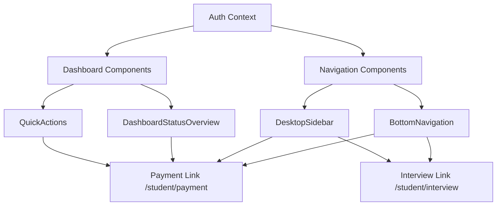

# Design Document: Student Payment & Interview Pages Fix

## Overview

This design addresses three critical issues in the MIHAS student portal:
1. React Error #130 occurring during session termination
2. Missing Payment and Interview navigation links
3. Incorrect navigation path for "Complete Payment" action

The solution involves updating navigation components, fixing component rendering guards, and correcting navigation targets.

## Architecture

### Component Hierarchy

```
App
├── AuthProvider (provides auth context)
│   ├── AppLayout
│   │   ├── DesktopSidebar (studentLinks array)
│   │   ├── BottomNavigation (defaultStudentNavItems array)
│   │   └── Routes
│   │       ├── StudentDashboard
│   │       │   ├── QuickActions (hasPendingPayment, hasScheduledInterview)
│   │       │   └── DashboardStatusOverview
│   │       ├── PaymentPage
│   │       └── InterviewPage
```

### Data Flow



## Components and Interfaces

### 1. DesktopSidebar Navigation Update

**File:** `src/components/navigation/DesktopSidebar.tsx`

**Current State:**
```typescript
const studentLinks: NavItem[] = [
  { to: '/student/dashboard', icon: Home, label: 'Dashboard' },
  { to: '/apply', icon: FileText, label: 'Application' },
  { to: '/student/notifications', icon: Bell, label: 'Notifications' },
  { to: '/student/profile', icon: User, label: 'Profile' },
]
```

**Proposed Change:**
```typescript
const studentLinks: NavItem[] = [
  { to: '/student/dashboard', icon: Home, label: 'Dashboard' },
  { to: '/apply', icon: FileText, label: 'Application' },
  { to: '/student/payment', icon: CreditCard, label: 'Payment' },
  { to: '/student/interview', icon: Calendar, label: 'Interview' },
  { to: '/student/notifications', icon: Bell, label: 'Notifications' },
  { to: '/student/profile', icon: User, label: 'Profile' },
]
```

### 2. BottomNavigation Update

**File:** `src/components/ui/BottomNavigation.tsx`

**Current State:**
```typescript
export const defaultStudentNavItems: BottomNavItem[] = [
  { href: '/', label: 'Home', icon: Home },
  { href: '/track-application', label: 'Track', icon: Search },
  { href: '/student/dashboard', label: 'Dashboard', icon: FileText, requiresAuth: true },
  { href: '/student/profile', label: 'Profile', icon: User, requiresAuth: true },
]
```

**Proposed Change:**
```typescript
export const defaultStudentNavItems: BottomNavItem[] = [
  { href: '/student/dashboard', label: 'Dashboard', icon: Home, requiresAuth: true },
  { href: '/student/payment', label: 'Payment', icon: CreditCard, requiresAuth: true },
  { href: '/student/interview', label: 'Interview', icon: Calendar, requiresAuth: true },
  { href: '/student/profile', label: 'Profile', icon: User, requiresAuth: true },
]
```

### 3. QuickActions Navigation Fix

**File:** `src/components/student/QuickActions.tsx`

**Current State (Line 199-203):**
```typescript
<ActionCard
  icon={<CreditCard className="h-5 w-5" />}
  title="Complete Payment"
  description="Finish your application payment"
  href="/student/payment"  // This is correct but may not be rendering
  variant="warning"
/>
```

The QuickActions component already has the correct href. The issue is that `hasPendingPayment` may not be correctly calculated in the Dashboard.

### 4. Dashboard Payment Detection Fix

**File:** `src/pages/student/Dashboard.tsx`

**Current State (Line 253-256):**
```typescript
const hasPendingPayment = applications.some(app => 
  app.status === 'submitted' && app.payment_status !== 'verified'
)
```

**Issue:** This only checks for `submitted` status, but applications may have other statuses with pending payments.

**Proposed Change:**
```typescript
const hasPendingPayment = applications.some(app => 
  app.payment_status === null || 
  app.payment_status === 'pending_review' ||
  (app.status !== 'draft' && app.payment_status !== 'verified')
)
```

### 5. Session Termination Error Fix

**Root Cause Analysis:**
The React Error #130 occurs when a component type is `undefined`. This typically happens when:
1. A lazy-loaded component fails to load
2. A component is conditionally rendered with an undefined reference
3. Auth state changes cause components to receive undefined props

**File:** `src/contexts/AuthContext.tsx`

The current implementation already handles logout gracefully, but the issue may be in components that don't guard against undefined auth state.

**Proposed Guard Pattern:**
```typescript
// In components that use auth context
const { user } = useAuth()

// Guard against undefined user during logout
if (!user) {
  return null // or a loading state
}
```

### 6. DashboardStatusOverview Navigation Fix

**File:** `src/components/student/DashboardStatusOverview.tsx`

Need to verify the "Complete Payment" link navigates to `/student/payment`.

## Data Models

No database changes required. The existing `applications` and `application_interviews` tables already support the required functionality.

### Application Payment Status Flow
```
null → pending_review → verified | rejected
```

### Interview Status Flow
```
scheduled → rescheduled | completed | cancelled
```

## Correctness Properties

*A property is a characteristic or behavior that should hold true across all valid executions of a system—essentially, a formal statement about what the system should do. Properties serve as the bridge between human-readable specifications and machine-verifiable correctness guarantees.*

### Property 1: Navigation Links Presence
*For any* authenticated student user, the navigation menu (both desktop and mobile) SHALL contain links to Payment (`/student/payment`) and Interview (`/student/interview`) pages.
**Validates: Requirements 2.1, 2.2, 2.5, 2.6, 2.7**

### Property 2: Payment Link Highlighting
*For any* student with applications where `payment_status` is null or 'pending_review', the Payment navigation link SHALL display a visual indicator (badge or highlight).
**Validates: Requirements 2.3, 4.2**

### Property 3: Interview Link Highlighting
*For any* student with scheduled interviews (status = 'scheduled' or 'rescheduled'), the Interview navigation link SHALL display a visual indicator.
**Validates: Requirements 2.4, 4.3**

### Property 4: Complete Payment Navigation Target
*For any* "Complete Payment" action in QuickActions or DashboardStatusOverview, clicking the action SHALL navigate to `/student/payment`, not `/student/application-wizard`.
**Validates: Requirements 3.1, 3.2**

### Property 5: Pending Payment Display
*For any* set of applications, the Payment page SHALL display exactly those applications where `payment_status` is null or 'pending_review'.
**Validates: Requirements 3.3**

### Property 6: Graceful Undefined State Handling
*For any* component receiving undefined auth context or user props, the component SHALL render a safe fallback (null or loading state) without throwing errors.
**Validates: Requirements 1.3, 5.4**

### Property 7: Session Termination Resilience
*For any* session termination attempt, even if errors occur during the signOut process, the user SHALL be navigated to the home page and local state SHALL be cleared.
**Validates: Requirements 1.1, 1.2, 5.2**

### Property 8: Navigation Reactivity
*For any* change in application status (payment verified, interview scheduled), the navigation indicators SHALL update to reflect the new state without requiring a page refresh.
**Validates: Requirements 4.4**

## Error Handling

### Session Termination Errors
- Clear local state immediately (non-blocking)
- Navigate to home page before API call completes
- Log errors silently without user-facing messages
- Use fire-and-forget pattern for signOut API call

### Component Rendering Errors
- Wrap critical components in error boundaries
- Provide fallback UI for failed lazy loads
- Guard against undefined props with early returns

### Navigation Errors
- Validate route existence before navigation
- Handle 404 gracefully with redirect to dashboard

## Testing Strategy

### Unit Tests
- Test navigation link presence in DesktopSidebar
- Test navigation link presence in BottomNavigation
- Test QuickActions href values
- Test DashboardStatusOverview href values
- Test payment status detection logic
- Test interview status detection logic

### Property-Based Tests
Using Vitest with fast-check for property-based testing:

1. **Navigation Links Property Test** - Generate random auth states and verify navigation links are present for authenticated users
2. **Payment Highlighting Property Test** - Generate random application arrays and verify highlighting logic
3. **Interview Highlighting Property Test** - Generate random interview arrays and verify highlighting logic
4. **Undefined State Handling Property Test** - Generate random undefined states and verify no crashes

### Integration Tests
- Test complete logout flow without errors
- Test navigation from dashboard to payment page
- Test navigation from dashboard to interview page
- Test payment page displays correct applications

### Configuration
- Minimum 100 iterations per property test
- Tag format: **Feature: student-payment-interview-pages, Property {number}: {property_text}**
