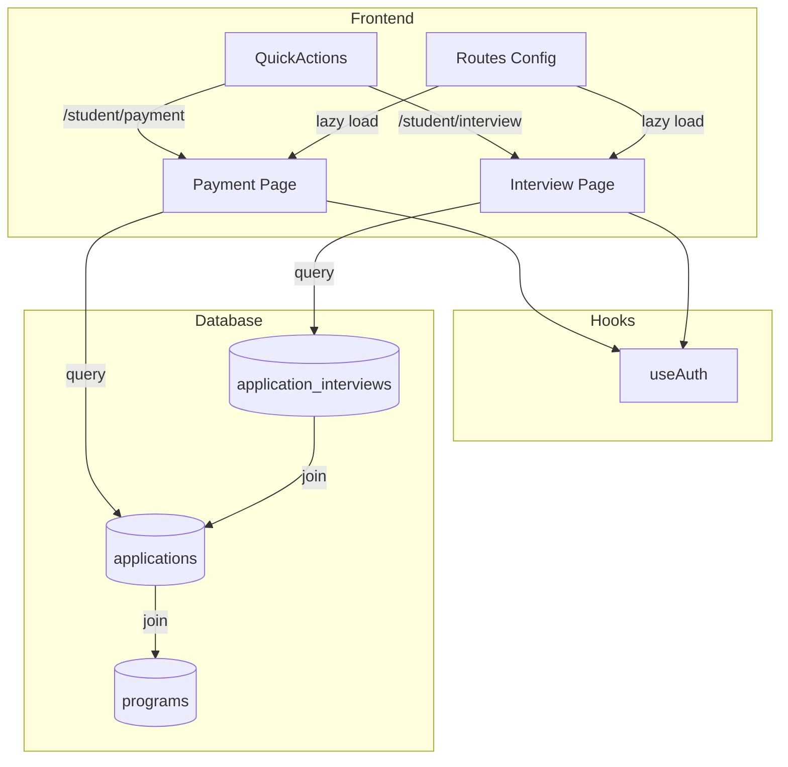
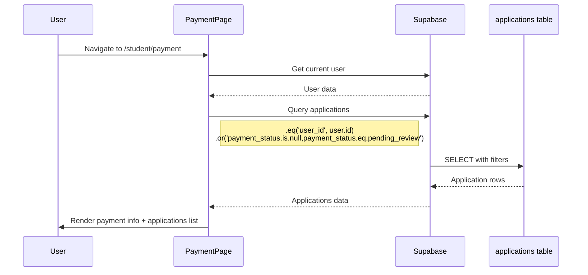
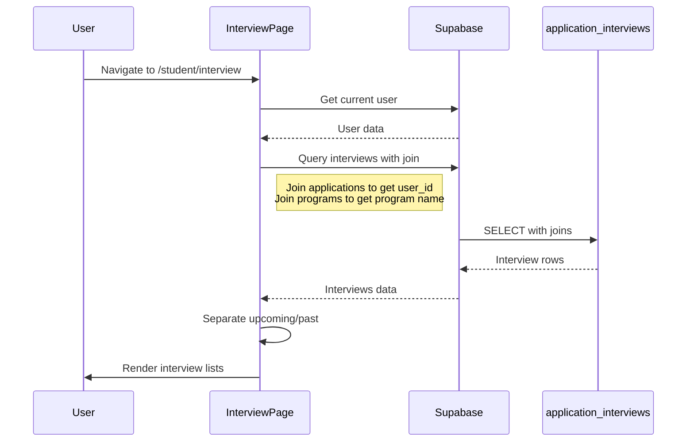

# Design Document: Student Payment and Interview Pages

## Overview

This design creates two new student-facing pages to resolve 404 errors when clicking "Complete Payment" and "View Interview Details" quick actions. The pages integrate with existing Supabase tables (`applications` and `application_interviews`) and follow the established React patterns in the codebase.

**Key Design Decisions:**
1. Create standalone pages rather than modifying the Application Wizard
2. Use existing Supabase client and AuthContext for data fetching
3. Follow established UI patterns with Card, Button, and Container components
4. Implement lazy loading for code splitting
5. Query data using Supabase's foreign key relationships for joins

## Architecture



## Components and Interfaces

### 1. Payment Page Component

**File:** `src/pages/student/Payment.tsx`

**Purpose:** Display payment information and list applications with pending payments.

```typescript
interface ApplicationWithPayment {
  id: string
  status: string
  payment_status: string | null
  payment_method: string | null
  amount: number | null
  momo_ref: string | null
  created_at: string
  program: string | null
}

interface PaymentPageState {
  loading: boolean
  error: string | null
  pendingApplications: ApplicationWithPayment[]
}
```

**Data Flow:**


**Query Implementation:**
```typescript
const { data, error } = await supabase
  .from('applications')
  .select(`
    id,
    status,
    payment_status,
    payment_method,
    amount,
    momo_ref,
    created_at,
    program
  `)
  .eq('user_id', user.id)
  .or('payment_status.is.null,payment_status.eq.pending_review')
  .order('created_at', { ascending: false })
```

### 2. Interview Page Component

**File:** `src/pages/student/Interview.tsx`

**Purpose:** Display scheduled interviews for the student's applications.

```typescript
interface Interview {
  id: string
  scheduled_at: string
  mode: 'in_person' | 'virtual' | 'phone'
  location: string | null
  status: 'scheduled' | 'rescheduled' | 'completed' | 'cancelled'
  notes: string | null
  application_id: string
  program_name: string | null
}

interface InterviewPageState {
  loading: boolean
  error: string | null
  upcomingInterviews: Interview[]
  pastInterviews: Interview[]
}
```

**Data Flow:**


**Query Implementation:**
```typescript
const { data, error } = await supabase
  .from('application_interviews')
  .select(`
    id,
    scheduled_at,
    mode,
    location,
    status,
    notes,
    application_id,
    applications!inner (
      user_id,
      program
    )
  `)
  .eq('applications.user_id', user.id)
  .order('scheduled_at', { ascending: true })
```

### 3. Route Configuration Updates

**File:** `src/routes/config.tsx`

**Changes:**
```typescript
// Add lazy imports
const StudentPayment = React.lazy(() => import('@/pages/student/Payment'))
const StudentInterview = React.lazy(() => import('@/pages/student/Interview'))

// Add routes
{ path: '/student/payment', element: StudentPayment, guard: 'student', lazy: true },
{ path: '/student/interview', element: StudentInterview, guard: 'student', lazy: true },
```

## Data Models

### Applications Table (Existing)
```sql
applications (
  id uuid PRIMARY KEY,
  user_id uuid REFERENCES auth.users,
  status varchar CHECK (status IN ('draft', 'submitted', 'under_review', 'approved', 'rejected')),
  payment_status varchar CHECK (payment_status IN ('pending_review', 'verified', 'rejected')),
  payment_method varchar,
  amount numeric,
  momo_ref varchar,
  pop_url varchar,
  program varchar,
  created_at timestamptz
)
```

### Application Interviews Table (Existing)
```sql
application_interviews (
  id uuid PRIMARY KEY,
  application_id uuid REFERENCES applications,
  scheduled_at timestamptz,
  mode text CHECK (mode IN ('in_person', 'virtual', 'phone')),
  location text,
  status text CHECK (status IN ('scheduled', 'rescheduled', 'completed', 'cancelled')),
  notes text,
  created_at timestamptz
)
```

## Correctness Properties

*A property is a characteristic or behavior that should hold true across all valid executions of a system—essentially, a formal statement about what the system should do. Properties serve as the bridge between human-readable specifications and machine-verifiable correctness guarantees.*

### Property 1: Pending Applications Display Completeness

*For any* user with N applications where payment_status is null or 'pending_review', the Payment_Page SHALL display exactly N applications in the pending list, each showing the program name and payment status.

**Validates: Requirements 1.4, 2.1, 2.2, 2.5**

### Property 2: Interview Data Display Completeness

*For any* interview record associated with the current user's applications, the Interview_Page SHALL display the scheduled_at date/time, mode, and status. Additionally, interviews SHALL be correctly categorized as upcoming (scheduled_at >= now) or past (scheduled_at < now).

**Validates: Requirements 3.2, 4.1, 4.2, 4.5, 4.6**

### Property 3: Route Guard Enforcement

*For any* unauthenticated request to /student/payment or /student/interview, the system SHALL redirect to the sign-in page without rendering the protected content.

**Validates: Requirements 1.5, 3.3, 5.4, 6.4**

## Error Handling

### Payment Page Errors
- **Network failure:** Display error card with "Failed to load payment information" message
- **No user session:** Redirect to sign-in page via route guard
- **Empty results:** Display informational message "No pending payments"

### Interview Page Errors
- **Network failure:** Display error card with "Failed to load interview information" message
- **No user session:** Redirect to sign-in page via route guard
- **Empty results:** Display empty state with calendar icon and "No scheduled interviews" message

### Loading States
- Both pages display a centered loading spinner during data fetch
- Loading state prevents interaction until data is ready

## Testing Strategy

### Dual Testing Approach

This feature requires both unit tests and property-based tests:

**Unit Tests:** Verify specific examples, edge cases, and error conditions
**Property Tests:** Verify universal properties across all inputs

### Property-Based Testing Configuration

- **Framework:** fast-check (TypeScript property-based testing library)
- **Minimum iterations:** 100 per property test
- **Tag format:** `Feature: student-payment-interview-pages, Property {number}: {property_text}`

### Test Categories

#### Unit Tests
1. Payment page renders without error
2. Payment page displays K153 fee amount
3. Payment page shows "Continue to Wizard" button
4. Interview page renders without error
5. Interview page shows empty state when no interviews
6. Interview page shows "Join Meeting" button for virtual interviews
7. Routes are correctly configured with student guard

#### Property Tests
1. **Property 1:** All pending applications displayed with required fields
2. **Property 2:** All interviews displayed with correct categorization
3. **Property 3:** Route guards redirect unauthenticated users

#### Integration Tests
1. End-to-end navigation from QuickActions to Payment page
2. End-to-end navigation from QuickActions to Interview page
3. Data fetching with real Supabase queries

### Test File Locations
- Unit tests: `tests/unit/student-pages/`
- Property tests: `tests/property/student-pages/`
- Integration tests: `tests/integration/student-pages/`

