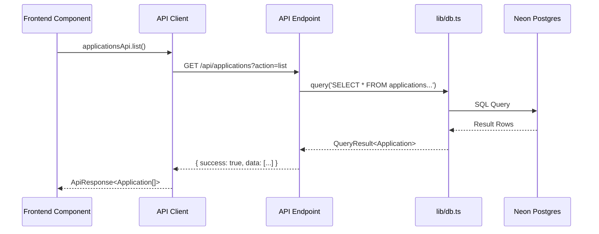

# Design Document: Supabase Complete Removal

## Overview

This design document outlines the technical approach for completing the Supabase removal migration in the MIHAS admissions system. The migration follows a systematic approach: replace direct Supabase client calls with API endpoint calls, add missing API endpoints, migrate backend code from `supabaseAdmin` to direct SQL, and remove legacy compatibility layers.

The migration preserves all existing functionality while achieving complete separation between frontend and backend data access patterns.

## Architecture

### Current State (Before Migration)

```
┌─────────────────────────────────────────────────────────────────┐
│                         Frontend                                 │
├─────────────────────────────────────────────────────────────────┤
│  Payment.tsx ──────┐                                            │
│  Interview.tsx ────┼──► supabase.from() ──► Supabase Stub      │
│  Dashboard.tsx ────┤         │                    │             │
│  SignUpPage.tsx ───┘         │                    ▼             │
│                              │              Returns Error       │
│  Other Components ───────────┘                                  │
└─────────────────────────────────────────────────────────────────┘
                                    │
                                    ▼
┌─────────────────────────────────────────────────────────────────┐
│                         Backend API                              │
├─────────────────────────────────────────────────────────────────┤
│  api-src/admin.ts ──► supabaseAdmin ──► MockQueryBuilder        │
│                              │                    │             │
│                              │                    ▼             │
│                              │              lib/db.ts           │
│                              │                    │             │
│                              └────────────────────┼─────────────┤
│                                                   ▼             │
│                                            Neon Postgres        │
└─────────────────────────────────────────────────────────────────┘
```

### Target State (After Migration)

```
┌─────────────────────────────────────────────────────────────────┐
│                         Frontend                                 │
├─────────────────────────────────────────────────────────────────┤
│  Payment.tsx ──────┐                                            │
│  Interview.tsx ────┼──► apiClient.ts ──► fetch('/api/...')     │
│  Dashboard.tsx ────┤                                            │
│  SignUpPage.tsx ───┘                                            │
│                                                                 │
│  All Components ──► Services Layer ──► apiClient.ts            │
└─────────────────────────────────────────────────────────────────┘
                                    │
                                    ▼
┌─────────────────────────────────────────────────────────────────┐
│                         Backend API                              │
├─────────────────────────────────────────────────────────────────┤
│  api-src/admin.ts ──────┐                                       │
│  api-src/applications.ts┼──► lib/db.ts ──► query()             │
│  api-src/auth.ts ───────┘         │                             │
│                                   ▼                             │
│                            Neon Postgres                        │
└─────────────────────────────────────────────────────────────────┘
```

### Data Flow



## Components and Interfaces

### 1. API Client Extensions

The existing `src/lib/apiClient.ts` will be extended with new methods:

```typescript
// New methods to add to applicationsApi
export const applicationsApi = {
  // ... existing methods ...

  /**
   * Get interviews for the current user's applications
   */
  async getInterviews(): Promise<ApiResponse<ApplicationInterview[]>> {
    return request<ApplicationInterview[]>('/applications?action=interviews');
  },

  /**
   * Get application statistics for analytics
   */
  async getStats(): Promise<ApiResponse<ApplicationStats>> {
    return request<ApplicationStats>('/applications?action=stats');
  },
};

// New auth API method
export const authApi = {
  /**
   * Check if email is available for registration
   */
  async checkEmail(email: string): Promise<ApiResponse<{ available: boolean }>> {
    return request<{ available: boolean }>(`/auth?action=check-email&email=${encodeURIComponent(email)}`);
  },
};
```

### 2. New API Endpoint Actions

#### Applications API - Interviews Action

```typescript
// api-src/applications.ts - New action
case 'interviews':
  if (req.method !== 'GET') {
    return sendError(res, 'Method not allowed', 405);
  }
  const auth = await requireAuth(req);
  const interviews = await query<ApplicationInterview>(`
    SELECT ai.id, ai.application_id, ai.scheduled_at, ai.mode, 
           ai.location, ai.status, ai.notes,
           a.program, a.application_number
    FROM application_interviews ai
    INNER JOIN applications a ON ai.application_id = a.id
    WHERE a.user_id = $1
    AND ai.status IN ('scheduled', 'rescheduled')
    ORDER BY ai.scheduled_at ASC
  `, [auth.userId]);
  return sendSuccess(res, { interviews: interviews.rows });
```

#### Auth API - Check Email Action

```typescript
// api-src/auth.ts - New action
case 'check-email':
  if (req.method !== 'GET') {
    return sendError(res, 'Method not allowed', 405);
  }
  const email = req.query.email as string;
  if (!email) {
    return sendError(res, 'Email is required', 400);
  }
  const existing = await query<{ id: string }>(
    'SELECT id FROM profiles WHERE email = $1 LIMIT 1',
    [email.toLowerCase()]
  );
  return sendSuccess(res, { available: existing.rows.length === 0 });
```

### 3. Frontend Component Migrations

#### Payment.tsx Migration

```typescript
// Before
import { supabase } from '@/lib/supabase';

const { data, error } = await supabase
  .from('applications')
  .select('id, status, payment_status, ...')
  .eq('user_id', user.id);

// After
import { applicationsApi } from '@/lib/apiClient';

const response = await applicationsApi.list({ mine: true });
if (!response.success) {
  setError(response.error || 'Failed to load applications');
  return;
}
const applications = response.data || [];
```

#### Interview.tsx Migration

```typescript
// Before
import { supabase } from '@/lib/supabase';

const { data, error } = await supabase
  .from('application_interviews')
  .select('..., applications!inner(...)')
  .eq('applications.user_id', user.id);

// After
import { applicationsApi } from '@/lib/apiClient';

const response = await applicationsApi.getInterviews();
if (!response.success) {
  setState(prev => ({ ...prev, error: response.error }));
  return;
}
const interviews = response.data || [];
```

#### Dashboard.tsx Migration

```typescript
// Before
const { data: interviewData } = await supabase
  .from('application_interviews')
  .select('...')
  .eq('applications.user_id', user.id)
  .in('status', ['scheduled', 'rescheduled']);

// After
const interviewResponse = await applicationsApi.getInterviews();
if (interviewResponse.success) {
  setScheduledInterviews(interviewResponse.data || []);
}
```

#### SignUpPage.tsx Migration

```typescript
// Before
import { getSupabaseClient } from '@/lib/supabase';

const supabase = getSupabaseClient();
const { data, error } = await supabase
  .from('profiles')
  .select('id')
  .eq('email', email.toLowerCase())
  .maybeSingle();

// After
import { authApi } from '@/lib/apiClient';

const response = await authApi.checkEmail(email);
if (response.success) {
  setEmailAvailable(response.data?.available ?? null);
}
```

### 4. Backend Admin API Migration

The `api-src/admin.ts` file will be migrated from `supabaseAdmin` to direct SQL:

```typescript
// Before
import { supabaseAdmin } from '../lib/supabaseClient';

const { data, error } = await supabaseAdmin
  .from('system_settings')
  .select('*')
  .order('setting_key', { ascending: true });

// After
import { query } from '../lib/db';

const result = await query<SystemSetting>(
  'SELECT * FROM system_settings ORDER BY setting_key ASC'
);
const settings = result.rows;
```

### 5. Type Definitions

```typescript
// Types to add/update in apiClient.ts

export interface ApplicationInterview {
  id: string;
  application_id: string;
  scheduled_at: string;
  mode: 'in_person' | 'virtual' | 'phone';
  location: string | null;
  status: 'scheduled' | 'rescheduled' | 'completed' | 'cancelled';
  notes: string | null;
  program?: string;
  application_number?: string;
}

export interface ApplicationStats {
  total_drafts: number;
  completed_applications: number;
  avg_time_per_step: number;
  most_common_drop_off_step: string | null;
}
```

## Data Models

### Database Tables (Existing)

The migration does not change the database schema. The following tables are accessed:

| Table | Purpose | Access Pattern |
|-------|---------|----------------|
| `applications` | Student applications | Read/Write via API |
| `application_interviews` | Interview schedules | Read via API |
| `profiles` | User profiles | Read/Write via API |
| `system_settings` | System configuration | Admin API only |
| `audit_logs` | Audit trail | Write via API |

### API Response Structures

```typescript
// Standard API response wrapper
interface ApiResponse<T> {
  success: boolean;
  data?: T;
  error?: string;
  code?: string;
}

// Applications list response
interface ApplicationsListResponse {
  applications: Application[];
  meta?: {
    page: number;
    limit: number;
    total: number;
  };
}

// Interviews response
interface InterviewsResponse {
  interviews: ApplicationInterview[];
}

// Email check response
interface EmailCheckResponse {
  available: boolean;
}
```


## Correctness Properties

*A property is a characteristic or behavior that should hold true across all valid executions of a system—essentially, a formal statement about what the system should do. Properties serve as the bridge between human-readable specifications and machine-verifiable correctness guarantees.*

Based on the prework analysis, the following properties have been identified and consolidated to eliminate redundancy:

### Property 1: API Endpoint Correctness

*For any* frontend component that previously used direct Supabase calls, when it fetches data, it SHALL call the correct API endpoint with proper query parameters.

**Validates: Requirements 1.1, 2.1, 3.1, 4.1, 5.1**

This property ensures that:
- Payment.tsx calls `/api/applications?action=list&mine=true`
- Interview.tsx calls `/api/applications?action=interviews`
- Dashboard.tsx calls `/api/applications?action=interviews` for interview data
- AnalyticsDashboard.tsx calls `/api/applications?action=stats`
- SignUpPage.tsx calls `/api/auth?action=check-email`

### Property 2: API Response Structure Validity

*For any* API response from the migrated endpoints, the response SHALL match the expected TypeScript interface and contain all required fields.

**Validates: Requirements 1.2, 2.2, 5.2, 10.4**

This property ensures that:
- Applications list response contains `{ success: boolean, data: Application[] }`
- Interviews response contains `{ success: boolean, data: ApplicationInterview[] }`
- Email check response contains `{ success: boolean, data: { available: boolean } }`
- No additional user data is leaked in responses

### Property 3: User Data Isolation

*For any* authenticated user requesting their data, the API SHALL return only data belonging to that user and no other user's data.

**Validates: Requirements 2.3, 10.3**

This property ensures that:
- Interview queries filter by `user_id` from the authenticated JWT
- Application queries filter by `user_id` from the authenticated JWT
- No cross-user data leakage occurs

### Property 4: SQL Parameterization Safety

*For any* database query in the admin API, the query SHALL use parameterized SQL via `lib/db.ts` to prevent SQL injection.

**Validates: Requirements 8.1, 8.2, 8.3**

This property ensures that:
- All `supabaseAdmin.from()` calls are replaced with `query()` calls
- All user-provided values are passed as parameters, not interpolated
- The `$1, $2, ...` placeholder syntax is used consistently

### Property 5: Analytics Calculation Correctness

*For any* valid application statistics response, the Analytics Dashboard SHALL correctly calculate completion rate as `(completed / total) * 100` and display accurate metrics.

**Validates: Requirements 4.2**

This property ensures that:
- Completion rate calculation is mathematically correct
- Average time calculation handles edge cases (zero applications)
- Display values match the underlying data

## Error Handling

### Frontend Error Handling Strategy

| Scenario | Handling | User Experience |
|----------|----------|-----------------|
| API timeout | Retry with exponential backoff | Show loading, then error with retry button |
| API 401 | Redirect to login | Session expired message |
| API 403 | Show permission error | Access denied message |
| API 500 | Show generic error | "Something went wrong" with retry |
| Network offline | Use cached data if available | Offline indicator, queue actions |

### Component-Specific Error Handling

```typescript
// Payment.tsx error handling
try {
  const response = await applicationsApi.list({ mine: true });
  if (!response.success) {
    setError(response.error || 'Failed to load payment information');
    return;
  }
  setApplications(response.data || []);
} catch (err) {
  setError('Network error. Please check your connection.');
}

// Interview.tsx error handling - graceful degradation
try {
  const response = await applicationsApi.getInterviews();
  if (!response.success) {
    // Log error but don't block page
    console.warn('Could not fetch interviews:', response.error);
    setScheduledInterviews([]);
    return;
  }
  setScheduledInterviews(response.data || []);
} catch (err) {
  // Silently fail - interviews are not critical for dashboard
  setScheduledInterviews([]);
}
```

### Backend Error Handling

```typescript
// API endpoint error handling pattern
try {
  const result = await query<T>(sql, params);
  return sendSuccess(res, { data: result.rows });
} catch (error) {
  if (error instanceof DatabaseError) {
    // Log without PII
    console.error(`[API] Database error: ${error.code}`);
    return sendError(res, 'Database operation failed', 500);
  }
  // Generic error
  return sendError(res, 'Internal server error', 500);
}
```

### Graceful Degradation Rules

1. **Interview data failure**: Dashboard continues to load, interview section shows empty state
2. **Analytics failure**: Analytics component hides itself, no error shown to user
3. **Email check failure**: Allow registration to proceed, server will validate
4. **Settings fetch failure**: Show cached settings or defaults

## Testing Strategy

### Dual Testing Approach

This migration requires both unit tests and property-based tests:

- **Unit tests**: Verify specific migration examples, edge cases, error conditions
- **Property tests**: Verify universal properties across all inputs

### Property-Based Testing Configuration

- **Library**: fast-check (already in project)
- **Minimum iterations**: 100 per property test
- **Tag format**: `Feature: supabase-complete-removal, Property {N}: {description}`

### Test Categories

#### 1. API Endpoint Tests (Property 1)

```typescript
// tests/property/supabase-complete-removal/api-endpoints.property.test.ts
import fc from 'fast-check';

describe('Feature: supabase-complete-removal, Property 1: API Endpoint Correctness', () => {
  it('should call correct endpoint for applications list', async () => {
    await fc.assert(
      fc.asyncProperty(
        fc.record({ mine: fc.boolean() }),
        async (params) => {
          const mockFetch = vi.fn().mockResolvedValue({ ok: true, json: () => ({ success: true, data: [] }) });
          global.fetch = mockFetch;
          
          await applicationsApi.list(params);
          
          expect(mockFetch).toHaveBeenCalledWith(
            expect.stringContaining('/api/applications'),
            expect.any(Object)
          );
        }
      ),
      { numRuns: 100 }
    );
  });
});
```

#### 2. Response Structure Tests (Property 2)

```typescript
// tests/property/supabase-complete-removal/response-structure.property.test.ts
describe('Feature: supabase-complete-removal, Property 2: API Response Structure', () => {
  it('should return valid interview response structure', async () => {
    await fc.assert(
      fc.asyncProperty(
        arbitraryInterviewResponse(),
        async (mockResponse) => {
          // Verify response matches interface
          expect(mockResponse).toHaveProperty('success');
          if (mockResponse.success) {
            expect(mockResponse.data).toBeInstanceOf(Array);
            mockResponse.data.forEach(interview => {
              expect(interview).toHaveProperty('id');
              expect(interview).toHaveProperty('application_id');
              expect(interview).toHaveProperty('scheduled_at');
              expect(interview).toHaveProperty('status');
            });
          }
        }
      ),
      { numRuns: 100 }
    );
  });
});
```

#### 3. User Data Isolation Tests (Property 3)

```typescript
// tests/property/supabase-complete-removal/data-isolation.property.test.ts
describe('Feature: supabase-complete-removal, Property 3: User Data Isolation', () => {
  it('should only return interviews for authenticated user', async () => {
    await fc.assert(
      fc.asyncProperty(
        fc.uuid(), // userId
        fc.array(arbitraryInterview(), { minLength: 0, maxLength: 10 }),
        async (userId, allInterviews) => {
          // Filter to user's interviews
          const userInterviews = allInterviews.filter(i => i.user_id === userId);
          
          // Mock API response
          const response = await getInterviewsForUser(userId, allInterviews);
          
          // Verify only user's interviews returned
          expect(response.data.length).toBe(userInterviews.length);
          response.data.forEach(interview => {
            expect(interview.user_id).toBe(userId);
          });
        }
      ),
      { numRuns: 100 }
    );
  });
});
```

#### 4. SQL Parameterization Tests (Property 4)

```typescript
// tests/property/supabase-complete-removal/sql-safety.property.test.ts
describe('Feature: supabase-complete-removal, Property 4: SQL Parameterization', () => {
  it('should use parameterized queries for all user inputs', async () => {
    await fc.assert(
      fc.asyncProperty(
        fc.string(), // potentially malicious input
        async (userInput) => {
          const mockQuery = vi.fn();
          
          // Call admin API with user input
          await handleSettingsQuery(userInput, mockQuery);
          
          // Verify parameterized query was used
          expect(mockQuery).toHaveBeenCalledWith(
            expect.stringContaining('$'), // Has parameter placeholder
            expect.arrayContaining([userInput]) // Value passed as parameter
          );
        }
      ),
      { numRuns: 100 }
    );
  });
});
```

#### 5. Analytics Calculation Tests (Property 5)

```typescript
// tests/property/supabase-complete-removal/analytics-calculation.property.test.ts
describe('Feature: supabase-complete-removal, Property 5: Analytics Calculation', () => {
  it('should correctly calculate completion rate', async () => {
    await fc.assert(
      fc.property(
        fc.nat(1000), // total
        fc.nat(1000), // completed (will be clamped to <= total)
        (total, completed) => {
          const actualCompleted = Math.min(completed, total);
          const expectedRate = total > 0 ? Math.round((actualCompleted / total) * 100) : 0;
          
          const stats = { total_drafts: total - actualCompleted, completed_applications: actualCompleted };
          const calculatedRate = calculateCompletionRate(stats);
          
          expect(calculatedRate).toBe(expectedRate);
        }
      ),
      { numRuns: 100 }
    );
  });
});
```

### Unit Test Examples

```typescript
// tests/unit/supabase-complete-removal/payment-migration.test.ts
describe('Payment.tsx Migration', () => {
  it('should not import from @/lib/supabase', async () => {
    const fileContent = await fs.readFile('src/pages/student/Payment.tsx', 'utf-8');
    expect(fileContent).not.toContain("from '@/lib/supabase'");
  });

  it('should handle empty applications list', async () => {
    mockApiResponse({ success: true, data: [] });
    render(<PaymentPage />);
    expect(screen.getByText(/No Applications Yet/i)).toBeInTheDocument();
  });

  it('should display error on API failure', async () => {
    mockApiResponse({ success: false, error: 'Network error' });
    render(<PaymentPage />);
    expect(screen.getByText(/Failed to load/i)).toBeInTheDocument();
  });
});
```

### Integration Test Strategy

```typescript
// tests/integration/supabase-complete-removal/api-endpoints.test.ts
describe('API Endpoint Integration', () => {
  it('GET /api/applications?action=interviews returns user interviews', async () => {
    const response = await fetch('/api/applications?action=interviews', {
      headers: { Cookie: `auth_token=${validToken}` }
    });
    const data = await response.json();
    
    expect(response.status).toBe(200);
    expect(data.success).toBe(true);
    expect(Array.isArray(data.data)).toBe(true);
  });

  it('GET /api/auth?action=check-email returns availability', async () => {
    const response = await fetch('/api/auth?action=check-email&email=test@example.com');
    const data = await response.json();
    
    expect(response.status).toBe(200);
    expect(data.success).toBe(true);
    expect(typeof data.data.available).toBe('boolean');
  });
});
```

### Test File Organization

```
tests/
├── property/
│   └── supabase-complete-removal/
│       ├── api-endpoints.property.test.ts
│       ├── response-structure.property.test.ts
│       ├── data-isolation.property.test.ts
│       ├── sql-safety.property.test.ts
│       └── analytics-calculation.property.test.ts
├── unit/
│   └── supabase-complete-removal/
│       ├── payment-migration.test.ts
│       ├── interview-migration.test.ts
│       ├── dashboard-migration.test.ts
│       ├── signup-migration.test.ts
│       └── admin-api-migration.test.ts
└── integration/
    └── supabase-complete-removal/
        ├── api-endpoints.test.ts
        └── component-rendering.test.ts
```
