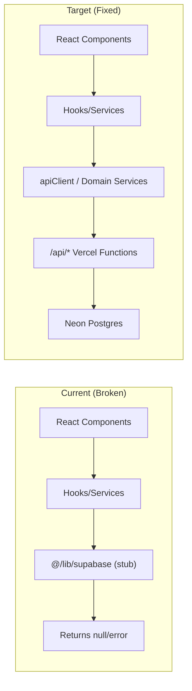

# Design Document: Supabase Remnant Purge

## Overview

This design covers the systematic removal of all Supabase client remnants from the MIHAS frontend codebase. The project has fully migrated to Neon Postgres with Vercel Serverless Functions, but ~30 frontend files still import from the deprecated `src/lib/supabase.ts` stub module. The stub returns `{ data: null, error: Error }` for all queries, causing silent failures, infinite re-render loops in polling hooks, and broken functionality across services.

The migration strategy is file-by-file replacement: each `supabase.from()` call is replaced with the corresponding `apiClient` or domain service call. Type imports are relocated to `src/types/`. Once all imports are removed, the stub file is deleted.

## Architecture

The existing architecture already has the correct target state — API client → Vercel Functions → Neon Postgres. The problem is that many frontend files bypass this architecture by importing the deprecated stub.



### Migration Categories

Files fall into three categories:

1. **Type-only imports** (~10 files): Import interfaces like `Application`, `UserProfile`, `Program` from the stub. Fix: move types to `src/types/database.ts`, update imports.

2. **Active `supabase.from()` calls** (~15 files): Make direct query builder calls that return null/error. Fix: replace with `apiClient.request()` or domain service methods.

3. **Mixed** (~5 files): Both type imports and active calls. Fix: apply both strategies.

### Replacement Mapping

| Supabase Pattern | Replacement |
|---|---|
| `supabase.from('applications').select(...)` | `applicationService.list(...)` or `apiClient.request('/applications?...')` |
| `supabase.from('programs').select(...)` | `catalogService.getPrograms()` |
| `supabase.from('institutions').select(...)` | `apiClient.request('/catalog?type=institutions')` |
| `supabase.from('subjects').select(...)` | `apiClient.request('/catalog?type=subjects')` |
| `supabase.from('user_profiles').select(...)` | `apiClient.request('/auth?action=session')` |
| `supabase.from('notifications').select(...)` | `notificationService.getPreferences()` |
| `supabase.from('application_analytics').insert(...)` | `apiClient.request('/applications?action=analytics', { method: 'POST', ... })` |
| `supabase.from('error_logs').insert(...)` | `apiClient.request('/admin?action=errors', { method: 'POST', ... })` or silent no-op |
| `supabase.from('application_drafts').select(...)` | `applicationService.list({ status: 'draft', mine: true })` |
| `supabase.rpc(...)` | `apiClient.request('/api/...')` |
| `import { Application } from '@/lib/supabase'` | `import type { Application } from '@/types/database'` |

## Components and Interfaces

### New: `src/types/database.ts`

Centralized type definitions extracted from the supabase stub. All files that currently import types from `@/lib/supabase` will import from here instead.

```typescript
// src/types/database.ts
export interface Application {
  id: string;
  user_id: string;
  application_number?: string;
  tracking_code?: string;
  status: string;
  program?: string;
  intake?: string;
  full_name?: string;
  email?: string;
  phone?: string;
  nrc?: string;
  date_of_birth?: string;
  gender?: string;
  nationality?: string;
  address?: string;
  city?: string;
  province?: string;
  country?: string;
  postal_code?: string;
  result_slip_url?: string;
  created_at?: string;
  updated_at?: string;
  submitted_at?: string;
  payment_status?: string;
  payment_verified_at?: string;
  review_started_at?: string;
  decision_date?: string;
  decision_reason?: string;
  admin_feedback?: string;
  [key: string]: unknown;
}

export interface ApplicationInterview { /* ... same shape ... */ }
export interface Program { /* ... */ }
export interface Intake { /* ... */ }
export interface UserProfile { /* ... */ }
export interface Subject { /* ... */ }
export interface ApplicationDocument { /* ... */ }
export interface ApplicationGrade { /* ... */ }
export interface ApplicationWithDetails extends Application { /* ... */ }
export interface Institution { /* ... */ }
```

### Modified: `src/hooks/queries/useSupabaseQuery.ts`

The `useTableQuery`, `useTableMutation`, and `useRpcQuery` hooks use `supabase.from()` directly. These are generic CRUD wrappers.

**Strategy**: Keep `CACHE_CONFIG` and the auth-based hooks (`useAuthSession`, `useAuthUser`, `useOptimisticMutation`) which already use `fetch`. Remove or deprecate `useTableQuery`, `useTableMutation`, and `useRpcQuery` since they are generic Supabase wrappers with no direct API equivalent — callers should use domain services instead.

### Modified: `src/hooks/queries/useApplicationQueries.ts`

Replace `supabase.from('application_drafts')` and `supabase.from('application_analytics')` with API calls.

```typescript
// Before
const { data, error } = await supabase.from('application_drafts').select('*').eq('user_id', userId)

// After
const result = await applicationService.list({ mine: true, status: 'draft' })
return result?.applications ?? []
```

### Modified: `src/data/applications.ts`

The `useStats` and `useRecentActivity` functions use `supabase.from('applications')`. Replace with `apiClient.request('/admin?action=stats')` for stats and `applicationService.list()` for recent activity.

### Modified: `src/services/offlineDataManager.ts`

Replace `supabase.from('programs')`, `supabase.from('institutions')`, `supabase.from('subjects')`, `supabase.from('user_profiles')` with `catalogService` and `apiClient` calls. The `syncForm` method replaces `supabase.from('applications').upsert()` with `applicationService.create()` or `applicationService.update()`.

### Modified: `src/services/offlineSync.ts`

Replace `supabase` import with `apiClient`. The sync logic already has a `syncQueueItem` that uses `fetch` — extend this pattern.

### Modified: Wizard Hooks

- `useWizardController.ts`: Replace `supabase` calls with `applicationService`
- `useAnalytics.ts`: Replace `supabase.from('application_analytics').insert()` with a no-op or `apiClient` POST (analytics tracking is non-critical)
- `useMultiDraft.ts`: Replace `supabase.from('application_drafts')` with `applicationService.list({ status: 'draft' })`

### Modified: Library Utilities

- `errorHandling.ts`: Replace `supabase.from('error_logs').insert()` with `console.error()` (error logging to DB is non-critical, can be a fire-and-forget API call)
- `adminNotifications.ts`: Replace with `notificationService`
- `applicationSession.ts`: Replace cleanup calls with `applicationService.delete()`
- `networkDiagnostics.ts`: Replace `supabase.from('institutions').select('count')` with `apiClient.request('/health?action=ping')`
- `maintenance.ts`: Replace with `apiClient` calls or no-ops for non-critical logging
- `multiChannelNotifications.ts`: Replace with `notificationService`
- `authDebug.ts`: Replace with `apiClient` calls
- `regulatoryGuidelines.ts`: Replace with `apiClient` calls

### Modified: Page Components

- `useApplicationTracker.ts`: Replace `supabase.from('applications')` with `apiClient.request('/applications?tracking_code=...')`
- `useEmailNotifications.ts`: Replace with `notificationService`

### Deleted: `src/lib/supabase.ts`

Once all imports are migrated, this file is deleted entirely.

## Data Models

No new data models are introduced. The existing types from `src/lib/supabase.ts` are relocated to `src/types/database.ts` with identical shapes. The API endpoints already return data matching these interfaces.

### Type Re-export Strategy

To minimize import changes, `src/types/database.ts` exports all the same interfaces. Files update their import path from `@/lib/supabase` to `@/types/database`.

For backward compatibility constants:
- `isSupabaseConfigured` → removed (always true, not needed)
- `SUPABASE_STATUS_EVENT` → removed
- `SUPABASE_MISSING_CONFIG_MESSAGE` → removed

</text>
</invoke>

## Correctness Properties

*A property is a characteristic or behavior that should hold true across all valid executions of a system — essentially, a formal statement about what the system should do. Properties serve as the bridge between human-readable specifications and machine-verifiable correctness guarantees.*

### Property 1: Error propagation stability

*For any* API error response received by a migrated hook, the hook SHALL propagate the error to the caller and reach a stable state (no additional state updates) within one render cycle, preventing infinite re-render loops.

**Validates: Requirements 1.8**

### Property 2: Offline sync routes through API

*For any* queued offline sync item (form submission, profile update, or file upload), when connectivity is restored and sync is triggered, the sync operation SHALL make an HTTP request via `apiClient` or `fetch` to a `/api/*` endpoint rather than calling `supabase.from()`.

**Validates: Requirements 3.2**

### Property 3: Application tracker search via API

*For any* valid search term (application number or tracking code), the application tracker hook SHALL delegate the search to `apiClient.request()` targeting the `/api/applications` endpoint, and the returned results SHALL only contain applications matching the search term.

**Validates: Requirements 5.3**

### Property 4: Type compatibility with API responses

*For any* API response from the applications, catalog, or auth endpoints, the response data SHALL be assignable to the corresponding TypeScript interface in `src/types/database.ts` without type errors.

**Validates: Requirements 6.4**

### Property 5: Polling deduplication

*For any* dashboard data payload, if the polling hook receives an identical payload on two consecutive polls (same application IDs, same statuses), the `onDataChange` callback SHALL fire exactly once (on the first receipt), not on the duplicate.

**Validates: Requirements 8.2**

## Error Handling

### Strategy

All migrated code follows the existing `apiClient` error handling pattern:

1. **Network errors**: `apiClient` throws enhanced errors via `ApiErrorHandler`. Hooks catch and expose via React Query's `error` state.
2. **401 Unauthorized**: `apiClient` detects 401 and throws "Authentication required". The `AuthContext` handles session refresh.
3. **Non-critical failures** (analytics tracking, error logging, maintenance logs): Use fire-and-forget `apiClient` calls wrapped in try/catch that silently swallow errors. These must never block user workflows.
4. **Offline fallback**: `offlineDataManager` falls back to localStorage cache when API calls fail. The sync queue retries on reconnection.

### Specific Error Handling by Category

| Category | On Error | User Impact |
|---|---|---|
| Dashboard polling | Return cached data, retry next interval | None — stale data shown |
| Application wizard auto-save | Queue to localStorage, retry | None — auto-save is silent |
| Analytics tracking | Silently swallow | None — analytics is non-critical |
| Offline sync | Increment retry counter, re-queue | Sync badge shows pending count |
| Application tracker search | Show "not found" message | User sees clear error state |
| Error logging to DB | `console.error()` fallback | None — developer-only |

## Testing Strategy

### Unit Tests (Vitest)

- Verify each migrated file no longer imports from `@/lib/supabase`
- Verify `src/types/database.ts` exports all required interfaces
- Verify `useStats` and `useRecentActivity` call `apiClient` or `applicationService`
- Verify `offlineDataManager.initializeOfflineCache` calls `catalogService`
- Verify `networkDiagnostics.testSupabaseConnection` calls the health endpoint
- Verify the build completes with zero errors after stub deletion

### Property-Based Tests (fast-check)

- Each correctness property is implemented as a single property-based test
- Minimum 100 iterations per property
- Tests use `fast-check` (already in project dependencies per `tests/property/` directory)
- Each test is tagged with: **Feature: supabase-remnant-purge, Property N: {title}**

### Integration Tests

- Test that the student dashboard renders without infinite loops after migration
- Test that the application wizard auto-save continues working
- Test that offline mode still caches and syncs data
- Test that the application tracker returns results via the API

### Build Verification

- Run `bun run build` after all migrations to confirm zero import errors
- Run `bun run lint` to confirm no ESLint issues
- Grep codebase for `@/lib/supabase` imports — must return zero results
