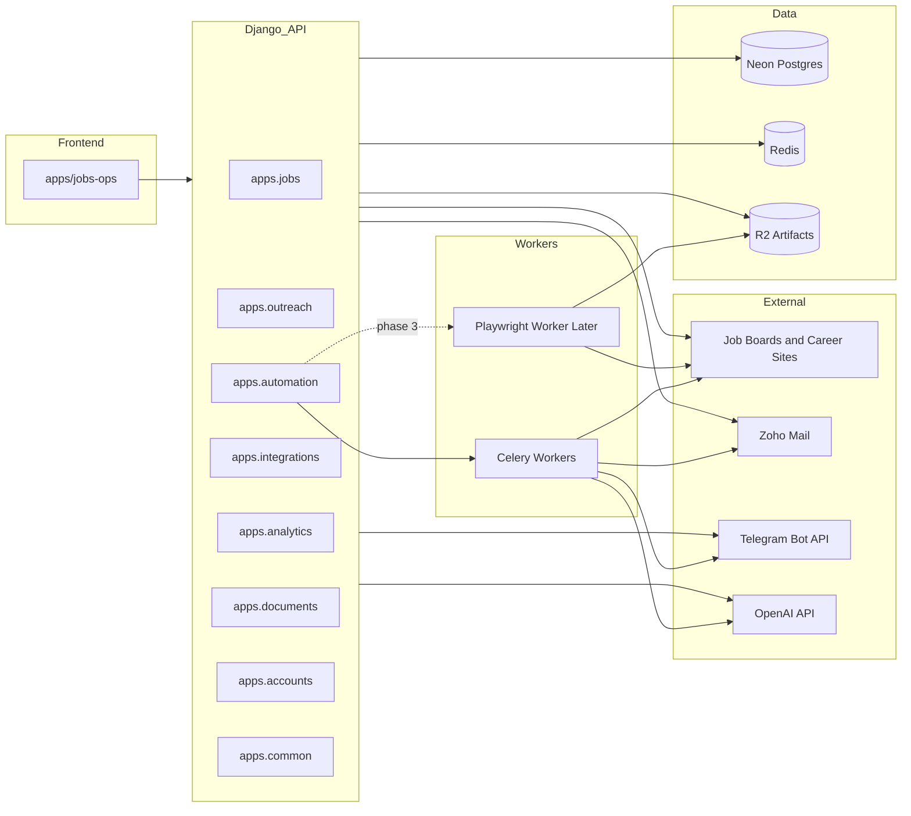

# AI Job Hunting Platform Architecture

Creator: Cosmas Kanchepa  
Developed by: Beanola Technologies (<https://beanola.com>)  
Document status: Proposed system architecture only.

## 1. Repo Fit

This monorepo already contains:

- Bun workspaces rooted at `apps/*`
- a Django backend rooted at `backend/`
- `/api/v1/...` route conventions in [backend/config/urls.py](../../backend/config/urls.py)
- Celery and Redis configuration in [backend/config/settings/base.py](../../backend/config/settings/base.py)

The design should extend those conventions instead of creating a second application platform.

## 2. Proposed Monorepo Additions

### Frontend

- `apps/jobs-ops/` as the primary operator dashboard
- optional later `apps/jobs-portal/` for a simplified candidate-facing view
- optional later `apps/browser-agent-extension/` for assisted browser workflows

### Backend

- `backend/apps/jobs/`
- `backend/apps/outreach/`
- `backend/apps/automation/`
- `backend/apps/integrations/`
- `backend/apps/analytics/`

### Reused existing backend domains

- `apps.accounts` for auth and sessions
- `apps.documents` for shared document storage and extraction primitives where appropriate
- `apps.common` for audit, notifications, envelope responses, health checks, and shared middleware

## 3. Critical Naming Decisions

These are required to avoid collisions with the existing admissions system.

- Use `JobApplication`, not `Application`.
- Use `/api/v1/job-applications/`, not `/api/v1/applications/`.
- Extend `documents` and `email` carefully instead of replacing or shadowing their current namespaces.

## 4. High-Level Architecture



## 5. Domain Responsibilities

| Domain | Responsibilities |
| --- | --- |
| `apps.jobs` | Source registry, discovery runs, adapters, canonical job postings, job snapshots, match scores, company intelligence, job decisions, job applications. |
| `apps.outreach` | Contacts, campaigns, message drafts, follow-up cadence, relationship CRM, referral workflows. |
| `apps.automation` | Rules, approval thresholds, automation runs, step execution, evidence artifacts, retries, pause and resume checkpoints. |
| `apps.integrations` | Zoho, Telegram, OpenAI, webhook endpoints, encrypted credentials, provider-specific status normalization. |
| `apps.analytics` | Funnel metrics, source analytics, reporting endpoints, digests, materialized summaries, strategic insights. |
| `apps.documents` | Resume master, resume variants, cover letter assets, generated outputs, extraction, storage, versioning primitives. |

## 6. Backend Route Integration

Illustrative `urlpatterns` change:

```python
# illustrative only, not implementation code
urlpatterns += [
    path("api/v1/jobs/", include("apps.jobs.urls")),
    path("api/v1/job-applications/", include("apps.jobs.application_urls")),
    path("api/v1/outreach/", include("apps.outreach.urls")),
    path("api/v1/automation/", include("apps.automation.urls")),
    path("api/v1/integrations/", include("apps.integrations.urls")),
    path("api/v1/analytics/", include("apps.analytics.urls")),
]
```

The current `api/v1/documents/` and `api/v1/email/` namespaces should be extended deliberately rather than duplicated.

## 7. Core Workflows

### Discovery workflow

1. Scheduler creates a `DiscoveryRun`.
2. Adapter fetches raw listings from a source.
3. Raw results are normalized into `JobPosting` plus `JobSnapshot`.
4. Deduplication resolves canonical job identity.
5. AI enrichment extracts skills, work mode, salary, deadlines, and fit signals.
6. Matching creates or updates `JobMatchScore`.
7. Policy engine creates a `ReviewTask`, `WatchDecision`, or auto-ready document task.
8. Telegram and digest pipelines receive summary events.

### Application workflow

1. Operator or rule creates `JobApplication`.
2. Document engine selects or generates the required package.
3. Preflight validation checks factual integrity, completeness, and policy.
4. Automation run attempts email submit, ATS submit, or guided/manual handoff.
5. Evidence bundle stores screenshots, traces, payload summaries, and provider IDs.
6. Outcome updates the application timeline and notifications.

### Outreach workflow

1. Contact is discovered or added manually.
2. Enrichment resolves role, company, and relationship context.
3. AI generates message options bounded by approved facts and tone presets.
4. Send policy validates pacing, duplication, and contact cooldown.
5. Outbound send creates thread tracking state.
6. Replies update contact status, opportunity linkage, and next actions.

## 8. Orchestration Pattern

Use Celery and Redis for:

- scheduled discovery
- AI enrichment
- scoring
- document generation
- email send queues
- webhook fan-out
- Telegram digests
- stale follow-up reminders
- source health diagnostics

Orchestration rules:

- tasks must be idempotent
- each task must record a durable run state
- retries use bounded exponential backoff
- permanent adapter failures raise health events and auto-disable the adapter

## 9. Adapter Architecture

Adapters should isolate source-specific scraping and parsing logic from core business rules.

```python
# illustrative interface only
class BaseJobSourceAdapter:
    source_key: str
    supports_browser: bool = False

    def discover(self, cursor: str | None) -> list[dict]:
        ...

    def normalize(self, raw_job: dict) -> dict:
        ...

    def extract_apply_flow(self, raw_job: dict) -> dict:
        ...
```

Adapter rules:

- one adapter per source family
- normalization output must map to a shared canonical contract
- browser-heavy adapters must remain isolated from the main Django request path
- every adapter exposes health, freshness, and trust metrics

## 10. Data Ownership Boundaries

### Jobs domain owns

- job sources
- discovery runs
- job postings and snapshots
- match scores
- job decisions
- companies and employer research
- job applications and stage history

### Outreach domain owns

- contacts
- campaigns
- messages
- sequences
- referrals

### Automation domain owns

- rules
- approvals
- run history
- artifacts
- blocker events

### Integrations domain owns

- provider accounts
- webhook verification
- credential metadata
- provider sync cursors

## 11. Storage Strategy

| Store | Purpose |
| --- | --- |
| Neon Postgres | Primary relational state, candidate profile, jobs, applications, contacts, runs, analytics summaries. |
| Redis | Celery broker and result backend, locks, throttles, short-lived cursors, dedupe helpers. |
| Cloudflare R2 | Resume masters, generated documents, screenshots, traces, email attachments, automation evidence. |

## 12. Security And Risk Controls

- Encrypt provider credentials and highly sensitive tokens at rest.
- Mask secrets and PII in logs and exception traces.
- Separate draft, approved, and sent communication states.
- Apply per-domain automation policies and daily caps.
- Never allow the AI layer to invent facts about the candidate.
- Require manual approval for ambiguous screening questions, high-risk domains, or borderline outreach.
- Preserve a full audit trail for state changes and outbound actions.

## 13. Observability

Track:

- adapter freshness
- adapter failure rate
- discovery throughput
- dedupe rate
- AI task latency
- send success and bounce rate
- application funnel conversion
- Telegram delivery failures
- manual review backlog age

## 14. Recommended Build Order

1. `apps/jobs-ops`
2. `backend/apps/jobs`
3. `backend/apps/outreach`
4. `backend/apps/integrations`
5. `backend/apps/analytics`
6. `backend/apps/automation`
7. later Playwright worker runtime

This order keeps the first release valuable before browser automation exists.

