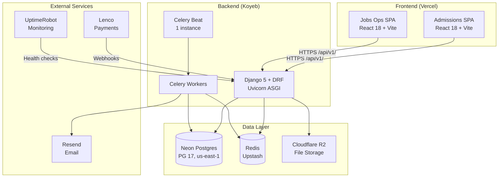

# Full System Audit — April 12, 2026

Architecture, frontend, backend, and database audit using Senior Architect, Senior Frontend, Senior Backend, Senior Fullstack skills + Neon MCP database inspection.

---

## Architecture Assessment

Pattern detected: Modular Monolith (backend) + Multi-SPA Frontend (confidence: 92%)

The architecture is well-suited for the current team size and product stage. The Django backend acts as a modular monolith with 11 domain apps under `backend/apps/`, each with clear boundaries. Two independent React SPAs consume the same REST API.

### Architecture Diagram

### Architecture Strengths

1. Clean domain separation: 11 backend apps with explicit boundaries (accounts, applications, documents, catalog, jobs, outreach, automation, integrations, analytics, common)
2. Shared database with proper indexing (100+ indexes across 30 tables)
3. Independent frontend deploys — admissions and jobs-ops can ship separately
4. Async task processing via Celery for email, payment polling, cleanup
5. Forward-only payment state machine with row-level locking
6. Comprehensive middleware chain (security headers → CORS → rate limiting → JWT → CSRF → audit)

### Architecture Risks

1. `useWizardController.ts` at 1,905 lines is a god-file — it handles auth recovery, draft management, grade hydration, file uploads, payment, submission, and slip generation all in one hook
2. `applications/views.py` at 1,723 lines contains 15+ view classes — should be split into focused modules
3. No service layer abstraction in most backend apps — views contain business logic directly
4. Single Neon compute (0.25 CU) with scale-to-zero — cold starts may affect first requests after idle

---

## Database Audit (via Neon MCP)

Project: `mihasApplication` (wild-bar-37055823)
Region: aws-us-east-1, PG 17
Storage: ~38MB

### Tables (30 public tables)

Core domain: `applications`, `application_documents`, `application_grades`, `application_interviews`, `application_status_history`, `application_drafts`
Auth: `profiles`, `csrf_tokens`, `device_sessions`, `login_attempts`, `password_reset_tokens`
Catalog: `programs`, `intakes`, `institutions`, `subjects`, `course_requirements`, `program_intakes`, `program_fees`
Payments: `payments`, `webhook_event_logs`
Operations: `audit_logs`, `email_queue`, `error_logs`, `notifications`, `user_notification_preferences`, `sse_events`, `settings`, `idempotency_keys`, `migration_history`, `user_permission_overrides`

### Index Coverage: Excellent

100+ indexes across all tables. Key highlights:
- `applications`: 8 indexes (user_id, status, program, intake, tracking_code, payment_status+updated_at, created_at, application_number unique)
- `payments`: 5 indexes (application_id, status, transaction_reference, user_id, app+status composite)
- `audit_logs`: 6 indexes including partial index for payment entities and retention-based cleanup
- `csrf_tokens`: 3 indexes (token_hash, user_id, user_id+expires_at composite)
- `sse_events`: 3 partial indexes for cleanup and delivery queries
- `notifications`: 4 indexes including partial index for unread notifications

### Slow Queries: None

No application queries exceeded 100ms. All slow queries in `pg_stat_statements` are Neon internal operations (migration triggers, health checks). This indicates the indexing strategy is effective.

### Database Recommendations

1. Consider adding a composite index on `applications(user_id, status)` for the common student dashboard query pattern
2. The `webhook_event_logs` table only has a `reference` index — add `(reference, event_type, processed)` composite for the dedup check in `WebhookProcessor`
3. No table partitioning needed at current scale (~38MB), but `audit_logs` and `sse_events` should be candidates if they grow past 1M rows

---

## Backend Audit

### Code Quality Score: 82/100 (Grade: B)

| Category | Score | Notes |
|----------|-------|-------|
| Security | 88 | Strong auth, CSRF, rate limiting, body size limits, HTML escaping |
| Architecture | 78 | Good domain separation, but views are too large |
| Testing | 80 | Property tests + unit tests + contract tests; some gaps in jobs-ops |
| API Design | 88 | Consistent REST, envelope format, OpenAPI docs |
| Performance | 75 | Good indexing, but synchronous priority scoring is a risk |

### Large File Analysis

| File | Lines | Issue | Recommendation |
|------|-------|-------|----------------|
| `applications/views.py` | 1,723 | 15+ view classes in one file | Split into `list_views.py`, `detail_views.py`, `admin_views.py`, `slip_views.py` |
| `accounts/views.py` | 784 | Auth + session + profile in one file | Acceptable for now, but monitor growth |
| `accounts/admin_views.py` | 775 | Admin user management | Acceptable |
| `documents/views.py` | 665 | Upload + extract + receipt + payment views | Consider splitting payment views |

### Backend Findings

1. `FunnelAnalyticsView` was using `AllowAny` with real database queries — FIXED (changed to `IsAuthenticated`)
2. Several jobs-ops scaffold views still use `AllowAny` — acceptable while returning seed data, but must be gated before real data flows through
3. No `Cache-Control: no-store` header on authenticated API responses
4. The `ApplicationExportView` CSV export includes sensitive fields (NRC, passport) without redaction
5. `verify_migration.py` had SQL injection via f-string — FIXED (using `psycopg2.sql.Identifier`)

---

## Frontend Audit

### Code Quality Score: 79/100 (Grade: C+)

| Category | Score | Notes |
|----------|-------|-------|
| Component Architecture | 75 | Good separation, but wizard controller is a god-hook |
| Performance | 82 | Lazy loading, code splitting, deferred hydration, optimized images |
| Accessibility | 80 | ARIA labels, focus management, skip links, screen reader announcements |
| Testing | 78 | 268 test files, property tests, but some pre-existing failures |
| Bundle Optimization | 80 | Manual chunk splitting, terser, no heavy deps detected |

### Large File Analysis

| File | Lines | Issue | Recommendation |
|------|-------|-------|----------------|
| `useWizardController.ts` | 1,905 | God-hook: auth, drafts, grades, uploads, payment, submission, slips | Extract into focused hooks: `useWizardAuth`, `useWizardDraft`, `useWizardGrades`, `useWizardPayment`, `useWizardSubmission` |
| `client.ts` | 1,117 | API client with retry, refresh, CSRF, cache invalidation | Acceptable — single responsibility (HTTP client) |
| `index.tsx` (wizard) | 815 | Wizard page with all step rendering | Consider extracting step rendering into a `WizardStepRenderer` component |
| `exportUtils.ts` | 833 | PDF/CSV export utilities | Acceptable — utility module |

### Frontend Findings

1. The wizard controller manages too many concerns — auth recovery, draft persistence, grade hydration, file uploads, payment status, submission, and slip generation. This makes it hard to test and reason about.
2. Vite build is well-configured: `assetsInlineLimit: 0`, `cssCodeSplit: true`, terser with `drop_console`, manual chunk splitting for heavy vendors (excel, pdf, ocr, charts)
3. CSP still has `unsafe-inline` for scripts — nonce-based CSP would be stronger
4. Good use of `React.lazy` + `Suspense` for deferred section loading on the landing page
5. The `fetchWithCache` utility has proper SSRF protection (hostname allowlist)
6. CSRF token stored in module-level variable — acceptable given same-origin policy

---

## Cross-Cutting Concerns

### Deployment Topology

| Service | Platform | Scaling | Notes |
|---------|----------|---------|-------|
| Backend API | Koyeb (Docker) | Manual | Single instance likely |
| Celery Worker | Koyeb (Docker) | Manual | Separate service |
| Celery Beat | Koyeb (1 instance) | Fixed | Must be exactly 1 |
| Admissions | Vercel | Auto (edge) | Serverless |
| Neon Postgres | Neon | Auto (0.25 CU) | Scale-to-zero enabled |
| Redis | Upstash | Auto | Free tier |

### Monitoring Coverage

| Layer | Tool | Status |
|-------|------|--------|
| Uptime | Internal Celery task + UptimeRobot | Active |
| Errors | Self-hosted ErrorLog + throttled email alerts | Active |
| Frontend errors | errorReporter.ts → /api/v1/errors/report/ | Active |
| Audit trail | AuditMiddleware → audit_logs table | Active |
| APM/Tracing | None | Missing — consider adding OpenTelemetry |
| Log aggregation | None | Missing — logs are per-container only |

---

## Prioritized Recommendations

### P0 — Fix This Week

1. Rotate hardcoded secrets in `.kiro/mcp.json` and `.kiro/settings/mcp.json` (Supabase keys, Context7 API key)
2. Add `.kiro/settings/mcp.json` to `.gitignore` or replace secrets with placeholders

### P1 — Fix This Sprint

3. Replace CSP `unsafe-inline` with nonce-based CSP for scripts
4. Add `Cache-Control: no-store, private` header to all authenticated API responses
5. Gate remaining jobs-ops scaffold views behind `IsAuthenticated` before real data flows through

### P2 — Next Sprint

6. Split `useWizardController.ts` (1,905 lines) into focused hooks
7. Split `applications/views.py` (1,723 lines) into focused view modules
8. Add composite index on `webhook_event_logs(reference, event_type, processed)` for dedup queries
9. Restrict Django admin to VPN/IP allowlist or non-standard URL
10. Gate OpenAPI schema/docs endpoints behind admin auth in production

### P3 — Backlog

11. Add OpenTelemetry for distributed tracing across Django + Celery
12. Add centralized log aggregation (Loki, CloudWatch, or similar)
13. Pre-compute priority scores in background task instead of synchronous scoring in list view
14. Consider Neon branching for staging environment
15. Add E2E tests with Playwright for critical flows (application wizard, payment, submission)
